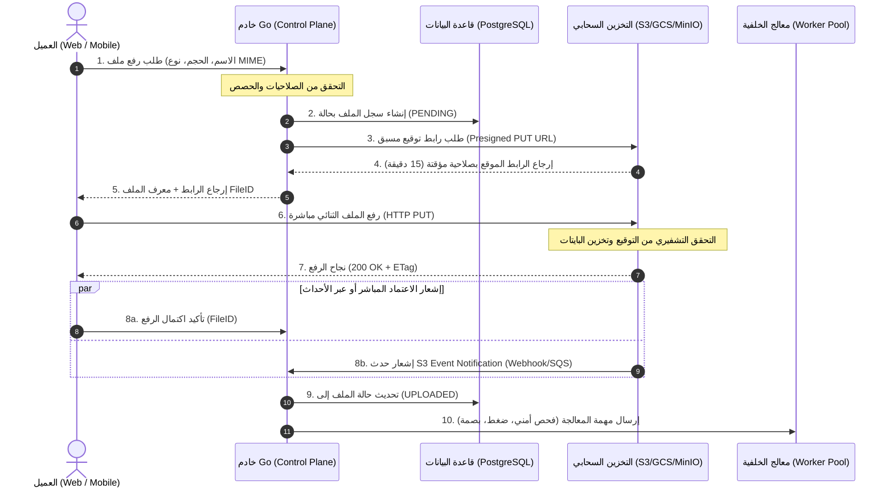

# أفضل الممارسات العالمية للتعامل مع تخزين الملفات (File Storage) في مشاريع Go الكبيرة

> **تاريخ البحث والتوثيق:** 2026-09-25  
> **المصادر الرسمية والمعايير المعتمدة:**  
>
> - **المراجع الرسمية للغة Go (The Go Authors & Google):**
>   - [pkg.go.dev/os](https://pkg.go.dev/os) — العمليات التأسيسية على نظام الملفات وإدارة الواصفات (`File`, `OpenFile`, `CreateTemp`, `Rename`, `Sync`)
>   - [pkg.go.dev/os#Root](https://pkg.go.dev/os#Root) — معيار الأمان الصارم المضاف في **Go 1.24+** لعزل المسارات ومنع هجمات Path Traversal (`os.OpenRoot`)
>   - [pkg.go.dev/io/fs](https://pkg.go.dev/io/fs) — معيار التجريد الافتراضي لنظام الملفات في Go 1.16+ (`fs.FS`, `fs.File`, `fs.ReadDirFS`, `fs.StatFS`)
>   - [pkg.go.dev/testing/fstest](https://pkg.go.dev/testing/fstest) — أدوات اختبار وتدقيق أنظمة الملفات في الذاكرة (`MapFS`, `TestFS`)
>   - [pkg.go.dev/embed](https://pkg.go.dev/embed) — تضمين الأصول والملفات الثابتة داخل الثنائي التنفيذي للبرنامج
>   - [pkg.go.dev/sync#Pool](https://pkg.go.dev/sync#Pool) — إدارة الذاكرة وتخفيف ضغط جامع القمامة (GC) عند معالجة التدفقات والمخازن
>   - [Go Official Blog: Organizing a Go Module](https://go.dev/doc/modules/layout) — التنظيم المعياري للمشاريع وهيكلة حزم الدخل والخرج
> - **المعايير السحابية والمكتبات القياسية الصناعية:**
>   - [Go Cloud Development Kit (Go CDK) - gocloud.dev/blob](https://gocloud.dev/howto/blob/) — معيار Google الموحد لتجريد التخزين السحابي والمحلي عبر واجهة `*blob.Bucket`
>   - [TUS Protocol Specification v1.0.0](https://tus.io/protocols/resumable-upload.html) & [tusd (Go Implementation)](https://github.com/tus/tusd) — البروتوكول العالمي المعياري للرفع القابل للاستئناف والتجزئة
>   - [Google renameio](https://github.com/google/renameio) — المعيار المعتمد للكتابة الذرية المقاومة للانهيار (Atomic File Writes)
>   - [AWS S3 & Google Cloud Storage Presigned URLs Documentation](https://docs.aws.amazon.com/AmazonS3/latest/userguide/PresignedUrlUploadObject.html) — معايير فصل مسار التحكم عن مسار البيانات (Direct-to-Storage Architecture)
>   - [OWASP File Upload Cheat Sheet](https://cheatsheetseries.owasp.org/cheatsheets/File_Upload_Cheat_Sheet.html) — المعايير الدولية لحماية أنظمة الملفات من الهجمات الخبيثة

---

## جدول المحتويات

1. [الفلسفة المعمارية لتخزين الملفات في المشاريع الكبيرة (Architectural Philosophy & Storage Hierarchy)](#1-الفلسفة-المعمارية-لتخزين-الملفات-في-المشاريع-الكبيرة-architectural-philosophy--storage-hierarchy)
   - [1.1 التخزين المحلي (Local Disk) مقابل التخزين السحابي للكائنات (Object Storage)](#11-التخزين-المحلي-local-disk-مقابل-التخزين-السحابي-للكائنات-object-storage)
   - [1.2 فصل مستوى التحكم عن مستوى البيانات (Control Plane vs Data Plane Separation)](#12-فصل-مستوى-التحكم-عن-مستوى-البيانات-control-plane-vs-data-plane-separation)
   - [1.3 حظر تخزين الملفات الثنائية داخل قواعد البيانات (BLOB Anti-Pattern)](#13-حظر-تخزين-الملفات-الثنائية-داخل-قواعد-البيانات-blob-anti-pattern)
   - [1.4 هرم وسائط التخزين في بيئات الإنتاج](#14-هرم-وسائط-التخزين-في-بيئات-الإنتاج)
2. [التعامل التأسيسي مع نظام الملفات في Go (Low-Level File System & Standard Library)](#2-التعامل-التأسيسي-مع-نظام-الملفات-في-go-low-level-file-system--standard-library)
   - [2.1 إدارة دورة حياة واصفات الملفات (File Descriptors) وحتمية فحص أخطاء الإغلاق](#21-إدارة-دورة-حياة-واصفات-الملفات-file-descriptors-وحتمية-فحص-أخطاء-الإغلاق)
   - [2.2 الكتابة الذرية للملفات (Atomic Writes: Write-to-Temp-and-Rename)](#22-الكتابة-الذرية-للملفات-atomic-writes-write-to-temp-and-rename)
   - [2.3 تجريد نظام الملفات عبر `io/fs` (Go 1.16+) لفك الارتباط بنظام التشغيل](#23-تجريد-نظام-الملفات-عبر-iofs-go-116-لفك-الارتباط-بنظام-التشغيل)
   - [2.4 تضمين الأصول الثابتة عبر `embed.FS` ودعم بيئات التطوير والإنتاج الهجينة](#24-تضمين-الأصول-الثابتة-عبر-embedfs-ودعم-بيئات-التطوير-والإنتاج-الهجينة)
3. [كفاءة الأداء وإدارة الذاكرة (Performance & Memory Engineering)](#3-كفاءة-الأداء-وإدارة-الذاكرة-performance--memory-engineering)
   - [3.1 التدفق (Streaming) كعقيدة حتمية: حظر `os.ReadFile` للملفات الحرة](#31-التدفق-streaming-كعقيدة-حتمية-حظر-osreadfile-للملفات-الحرة)
   - [3.2 تقنية النسخ الصفري (Zero-Copy) والمسارات السريعة في النواة عبر `io.Copy`](#32-تقنية-النسخ-الصفري-zero-copy-والمسارات-السريعة-في-النواة-عبر-iocopy)
   - [3.3 إدارة الذاكرة وتخفيف ضغط جامع القمامة عبر `sync.Pool` و `io.CopyBuffer`](#33-إدارة-الذاكرة-وتخفيف-ضغط-جامع-القمامة-عبر-syncpool-و-iocopybuffer)
   - [3.4 التحكم في استهلاك الذاكرة عند استقبال طلبات Multipart HTTP](#34-التحكم-في-استهلاك-الذاكرة-عند-استقبال-طلبات-multipart-http)
4. [طبقة التجريد الموحدة للتخزين (Storage Abstraction Layer)](#4-طبقة-التجريد-الموحدة-للتخزين-storage-abstraction-layer)
   - [4.1 تصميم واجهة برمجية متماسكة (Cohesive Storage Interface)](#41-تصميم-واجهة-برمجية-متماسكة-cohesive-storage-interface)
   - [4.2 المعيار الذهبي: استخدام Go CDK (`gocloud.dev/blob`)](#42-المعيار-الذهبي-استخدام-go-cdk-goclouddevblob)
   - [4.3 التبديل السلس بين الموفرين بدون تعديل المنطق (S3, GCS, Azure, Local, Memory)](#43-التبديل-السلس-بين-الموفرين-بدون-تعديل-المنطق-s3-gcs-azure-local-memory)
5. [أنماط المعمارية الموزعة ورفع الملفات العملاقة (Distributed Upload Architectures)](#5-أنماط-المعمارية-الموزعة-ورفع-الملفات-العملاقة-distributed-upload-architectures)
   - [5.1 معمارية الروابط الموقعة مسبقاً (Presigned URLs / Direct-to-Storage Architecture)](#51-معمارية-الروابط-الموقعة-مسبقاً-presigned-urls--direct-to-storage-architecture)
   - [5.2 الرفع المقسم والقابل للاستئناف: معيار بروتوكول TUS وخادم `tusd`](#52-الرفع-المقسم-والقابل-للاستئناف-معيار-بروتوكول-tus-وخادم-tusd)
   - [5.3 خطوط المعالجة غير المتزامنة للملفات بعد الرفع (Post-Processing Pipelines)](#53-خطوط-المعالجة-غير-المتزامنة-للملفات-بعد-الرفع-post-processing-pipelines)
6. [الحماية والأمان الصارم في بيئات الإنتاج (Enterprise Storage Security)](#6-الحماية-والأمان-الصارم-في-بيئات-الإنتاج-enterprise-storage-security)
   - [6.1 الوقاية من هجمات مسار المجلدات (Path Traversal): ثورة `os.Root` في Go 1.24+](#61-الوقاية-من-هجمات-مسار-المجلدات-path-traversal-ثورة-osroot-في-go-124)
   - [6.2 التحقق الحتمي من نوع المحتوى (Magic Bytes Sniffing) بدلاً من الامتداد](#62-التحقق-الحتمي-من-نوع-المحتوى-magic-bytes-sniffing-بدلاً-من-الامتداد)
   - [6.3 عزل أسماء الملفات وتوليد معرّفات مشفرة وفريدة (UUIDv4/ULID)](#63-عزل-أسماء-الملفات-وتوليد-معرّفات-مشفرة-وفريدة-uuidv4ulid)
   - [6.4 التحصين ضد قنابل فك الضغط (Zip Bombs) وهجمات حجب الخدمة (DoS)](#64-التحصين-ضد-قنابل-فك-الضغط-zip-bombs-وهجمات-حجب-الخدمة-dos)
   - [6.5 مبدأ الأذونات الدنيا وصلاحيات الملفات (`0644`, `0755`, Non-Root Execution)](#65-مبدأ-الأذونات-الدنيا-وصلاحيات-الملفات-0644-0755-non-root-execution)
7. [استراتيجيات الاختبار والمحاكاة (Testing & Mocking Strategies)](#7-استراتيجيات-الاختبار-والمحاكاة-testing--mocking-strategies)
   - [7.1 اختبارات الوحدة في الذاكرة عبر `fstest.MapFS` و `fstest.TestFS`](#71-اختبارات-الوحدة-في-الذاكرة-عبر-fstestmapfs-و-fstesttestfs)
   - [7.2 محاكاة التخزين السحابي بالكامل في الذاكرة عبر `memblob`](#72-محاكاة-التخزين-السحابي-بالكامل-في-الذاكرة-عبر-memblob)
   - [7.3 اختبارات التكامل المحلية المعزولة عبر `t.TempDir()` و Testcontainers (MinIO)](#73-اختبارات-التكامل-المحلية-المعزولة-عبر-ttempdir-و-testcontainers-minio)
8. [مصفوفة الأنماط المضادة الشائعة في تخزين الملفات (Anti-Patterns Matrix)](#8-مصفوفة-الأنماط-المضادة-الشائعة-في-تخزين-الملفات-anti-patterns-matrix)
9. [قائمة فحص الجاهزية للإنتاج (Production Readiness Checklist)](#9-قائمة-فحص-الجاهزية-للإنتاج-production-readiness-checklist)
10. [المصادر والمراجع الرسمية والمعايير الصناعية](#10-المصادر-والمراجع-الرسمية-والمعايير-الصناعية)

---

## 1. الفلسفة المعمارية لتخزين الملفات في المشاريع الكبيرة (Architectural Philosophy & Storage Hierarchy)

في النظم المؤسسية والمشاريع الكبيرة المبنية بلغة Go، يُمثل التعامل مع الملفات تحدياً متعدد الأبعاد يمس الأداء، واستهلاك الذاكرة العشوائية (RAM)، واستنزاف واصفات الملفات في النواة (File Descriptors Exhaustion)، وأمان بيئة التشغيل ضد الثغرات البرمجية وحجب الخدمة (DoS).

### 1.1 التخزين المحلي (Local Disk) مقابل التخزين السحابي للكائنات (Object Storage)

في البنى التحتية الحديثة (Cloud-Native & Containerized Systems مثل Kubernetes):

- **حاويات التطبيقات عديمة الحالة (Stateless Containers):** تُعتبر أنظمة الملفات المحلية داخل الحاويات عابرة وزائلة (Ephemeral). كتابة الملفات على القرص المحلي للحاوية يعني ضياعها فور إعادة تشغيل الحاوية أو ترقيتها أو تغيير حجم النشر (Auto-scaling).
- **التخزين السحابي للكائنات (Object Storage - S3 / GCS / Azure Blob / MinIO):** هو الوجهة الطبيعية والوحيدة للملفات الدائمة في المشاريع الكبيرة. يتميز بالتوسع اللانهائي، وتعدد النسخ المتماثلة جغرافياً، وتوفير دورات حياة آلية للملفات (Lifecycle Policies).
- **دور التخزين المحلي:** ينحصر حصرياً في التخزين المؤقت العابر (Scratch / Temp Processing)، وتخزين الذاكرة المخبئية المؤقتة للأداء (Local Caching)، ومعالجة التدفقات المرحلية قبل الترحيل، واستضافة الثنائيات والملفات التأسيسية.

### 1.2 فصل مستوى التحكم عن مستوى البيانات (Control Plane vs Data Plane Separation)

أهم خطأ هندسي يرتكبه مطورو Go في المشاريع الناشئة هو تحويل خادم التطبيق (API Gateway / Go Backend) إلى وسيط لنقل بايتات الملفات (Proxy Data Pipe):

```text
[النمط الخاطئ والمهلك للذاكرة - تمرير البايتات عبر الخادم]:
العميل (Client) ──[رفع 2GB عبر HTTP]──► خادم Go ──[إعادة رفع 2GB]──► S3 / GCS
(النتيجة: استهلاك مضاعف لعرض النطاق، استنزاف ذاكرة الخادم، حجز قنوات التزامن والمهل الزمنية)

[المعيار العالمي للمشاريع الضخمة - فصل التحكم عن البيانات]:
1. العميل ──[طلب إذن رفع + Metadata]──► خادم Go (Control Plane)
2. خادم Go ◄──[التحقق والحصص + توليد Presigned URL]── خادم Go
3. خادم Go ──[إرجاع Presigned URL مؤقت وموقع]──► العميل
4. العميل ───────────[رفع الملف مباشرة عبر HTTP PUT]──────────► S3 / GCS (Data Plane)
5. S3/GCS ──[إشعار اكتمال الرفع عبر Webhook/Event]──► خادم Go (اعتماد الملف)
```

بهذا الفصل:

1. تصبح خوادم Go قادرة على خدمة مئات الآلاف من طلبات الرفع في الثانية الواحدة دون أن تلمس بايتات الملفات الفعلية.
2. يتولى التخزين السحابي الموزع التعامل مع اتصالات العملاء البطيئة (Slowloris)، واستئناف النقل، والتحقق من التوقيعات.

### 1.3 حظر تخزين الملفات الثنائية داخل قواعد البيانات (BLOB Anti-Pattern)

تخزين محتوى الملفات كحقول ثنائية كبيرة (`BYTEA` في PostgreSQL أو `BLOB` في MySQL):

- **يُدمر أداء الذاكرة المخبئية لقاعدة البيانات (Buffer Pool / Shared Buffers):** حيث تُزاح الفهارس وبيانات الجداول لصالح قراءة ملفات ثنائية ضخمة.
- **يُضخم حجم النسخ الاحتياطية (WAL & Backups):** فتصبح استعادة قاعدة البيانات في حالات الكوارث عملية تستغرق ساعات طويلة بدلاً من دقائق.
- **القاعدة الذهبية:** تُخزن البيانات الوصفية (المعرف الفريد، المالك، الحجم، نوع الوسائط MIME، المسار أو المفتاح `Storage Key`، حالة المعالجة، البصمة `SHA-256`) في قاعدة البيانات العلائقية، بينما يُخزن الملف الفعلي ككائن (Object) في موفر التخزين.

### 1.4 هرم وسائط التخزين في بيئات الإنتاج

```text
┌────────────────────────────────────────────────────────────────────────┐
│                        هرم وسائط التخزين في لغة Go                      │
├────────────────────────────────────────────────────────────────────────┤
│                                                                        │
│   [المستوى 5] التخزين السحابي للكائنات (S3, GCS, Azure Blob, MinIO)   │
│                                  ▲                                     │
│   [المستوى 4] أنظمة التخزين الموزعة (NFS, Ceph, CSI Persistent Volumes)│
│                                  ▲                                     │
│   [المستوى 3] نظام التخزين المحلي المؤقت (Local NVMe / /tmp Scratch)   │
│                                  ▲                                     │
│   [المستوى 2] أنظمة الملفات الافتراضية والذاكرة (io/fs, MemFS, RAM)     │
│                                  ▲                                     │
│   [المستوى 1] الأصول المضمنة داخل الثنائي (go:embed, Binary Assets)     │
└────────────────────────────────────────────────────────────────────────┘
```

---

## 2. التعامل التأسيسي مع نظام الملفات في Go (Low-Level File System & Standard Library)

عندما يتطلب التطبيق التعامل المباشر مع القرص المحلي (مثل معالجة الملفات المؤقتة، كتابة ملفات التكوين، أو معالجة التحويلات)، يجب الالتزام بالقواعد الصارمة لحزمة `os`.

### 2.1 إدارة دورة حياة واصفات الملفات (File Descriptors) وحتمية فحص أخطاء الإغلاق

في أنظمة Linux/Unix، يمتلك كل نظام تشغيل حداً أقصى لواصفات الملفات المفتوحة لكل عملية (`ulimit -n`). عدم إغلاق الملفات يؤدي سريعاً إلى خطأ `too many open files` وانهيار التطبيق.

#### الفخ الشائع: تجاهل خطأ `file.Close()` عند الكتابة

عند **القراءة** فقط، يكفي استخدام `defer file.Close()`.  
أما عند **الكتابة**، فإن نظام التشغيل يقوم بتخزين البيانات في ذاكرة تخزين وسيطة للنواة (Kernel Page Cache). إذا حدث خطأ أثناء تفريغ هذه الذاكرة إلى القرص الفعلي (مثل امتلاء القرص `Disk Full` أو حدوث عطل في وسيط التخزين I/O Error)، فإن الخطأ **لا يظهر أثناء استدعاء `file.Write()`، بل يظهر حصرياً عند استدعاء `file.Close()` أو `file.Sync()`**.

```go
//a النمط المعياري للإنتاج للكتابة الآمنة مع فحص خطأ الإغلاق
func WriteSecureFile(path string, data io.Reader) (err error) {
    // فتح الملف بصلاحيات صارمة 0644 وبطراز الإنشاء الحصري
    f, err := os.OpenFile(path, os.O_CREATE|os.O_WRONLY|os.O_TRUNC, 0644)
    if err != nil {
        return fmt.Errorf("open file failed: %w", err)
    }

    // إغلاق احترازي في defer في حال حدوث panic أو خطأ مبكر
    defer func() {
        closeErr := f.Close()
        if closeErr != nil && !errors.Is(closeErr, os.ErrClosed) {
            // دمج خطأ الإغلاق مع خطأ الوظيفة الأصلي باستخدام errors.Join (Go 1.20+)
            err = errors.Join(err, fmt.Errorf("closing file failed: %w", closeErr))
        }
    }()

    // نسخ البيانات بتدفق مستمر
    if _, err = io.Copy(f, data); err != nil {
        return fmt.Errorf("writing data failed: %w", err)
    }

    // إجبار النواة على تفريغ الذاكرة الوسيطة إلى القرص الفيزيائي
    if err = f.Sync(); err != nil {
        return fmt.Errorf("flushing to disk failed: %w", err)
    }

    // إغلاق صريح قبل الخروج لالتقاط أي خطأ أخير
    if err = f.Close(); err != nil {
        return fmt.Errorf("explicit close failed: %w", err)
    }

    return nil
}
```

### 2.2 الكتابة الذرية للملفات (Atomic Writes: Write-to-Temp-and-Rename)

في الأنظمة الموزعة ومتعددة الخيوط، يؤدي فتح ملف وتعديله مباشرة إلى مخاطر جسيمة:

1. إذا توقفت الخدمة أو تعطلت الحاوية في منتصف عملية الكتابة، يصبح الملف تالفاً أو مبتوراً (Corrupted / Half-written).
2. إذا حاولت خدمة أخرى (أو Goroutine متزامنة) قراءة الملف أثناء كتابته، ستقرأ بيانات جزئية غير متسقة.

#### القاعدة الهندسية

لا تقم أبداً بالكتابة فوق الملف الأصلي مباشرة. اكتب دائماً في ملف مؤقت في **نفس الدليل ونفس نقطة التوصيل (Mount Point)**، ثم استخدم استدعاء النظام `os.Rename` الذي يضمن استبدالاً ذرياً (Atomic Swap) على مستوى نواة نظام التشغيل (POSIX Atomic Rename).

```text
[خطوات الكتابة الذرية]:
1. os.CreateTemp(dir, "upload-*.tmp") ──► إنشاء ملف مؤقت في نفس المجلد
2. io.CopyBuffer(...)                 ──► كتابة المحتوى في الملف المؤقت
3. tmpFile.Sync()                     ──► تفريغ البيانات للقرص الصلب
4. tmpFile.Close()                    ──► إغلاق واصف الملف المؤقت
5. os.Rename(tmpPath, finalPath)      ──► استبدال ذري فوري غير قابل للتجزئة
```

```go
package storage

import (
    "fmt"
    "io"
    "os"
    "path/filepath"
)

// WriteFileAtomic يقوم بكتابة محتوى متدفق إلى مسار محدد بشكل ذري تماماً
func WriteFileAtomic(destPath string, src io.Reader, perm os.FileMode) error {
    dir := filepath.Dir(destPath)

    // التأكد من وجود الدليل الوجهة
    if err := os.MkdirAll(dir, 0755); err != nil {
        return fmt.Errorf("failed to create directory: %w", err)
    }

    // إنشاء ملف مؤقت في نفس الدليل لضمان وجوده على نفس الـ Filesystem/Mount
    tmpFile, err := os.CreateTemp(dir, "atomic-*.tmp")
    if err != nil {
        return fmt.Errorf("failed to create temp file: %w", err)
    }
    tmpPath := tmpFile.Name()

    // تنظيف وقائي: إذا لم نصل إلى خطوة Rename بنجاح، يتم حذف الملف المؤقت
    defer func() {
        if tmpPath != "" {
            _ = os.Remove(tmpPath)
        }
    }()

    // نسخ البيانات المتدفقة
    if _, err = io.Copy(tmpFile, src); err != nil {
        _ = tmpFile.Close()
        return fmt.Errorf("failed to write data: %w", err)
    }

    // إجبار النواة على كتابة البيانات إلى القرص الفعلي
    if err = tmpFile.Sync(); err != nil {
        _ = tmpFile.Close()
        return fmt.Errorf("failed to sync temp file: %w", err)
    }

    // تعيين الصلاحيات المطلوبة
    if err = tmpFile.Chmod(perm); err != nil {
        _ = tmpFile.Close()
        return fmt.Errorf("failed to chmod temp file: %w", err)
    }

    if err = tmpFile.Close(); err != nil {
        return fmt.Errorf("failed to close temp file: %w", err)
    }

    // عملية الاستبدال الذري على مستوى النواة
    if err = os.Rename(tmpPath, destPath); err != nil {
        return fmt.Errorf("failed to atomically rename file: %w", err)
    }

    // تم التبديل بنجاح، نلغي تفعيل الحذف الاحترازي
    tmpPath = ""
    return nil
}
```

> **ملاحظة إنتاجية:** في بيئات الإنتاج المعقدة أو عند الحاجة إلى معالجة الفروقات الدقيقة بين Linux و Windows، يُوصى باستخدام مكتبة **`github.com/google/renameio`** المعتمدة رسمياً في مشاريع Google الداخلية.

### 2.3 تجريد نظام الملفات عبر `io/fs` (Go 1.16+) لفك الارتباط بنظام التشغيل

منذ إصدار Go 1.16، قدمت اللغة حزمة `io/fs` التي توفر واجهة قراءة مجردة لنظام الملفات:

```go
type FS interface {
    Open(name string) (File, error)
}
```

#### لماذا تعتبر `io/fs` من أهم ركائز البنى النظيفة (Clean Architecture)؟

1. **فصل منطق الأعمال عن نظام التشغيل:** بدلاً من أن تستقبل دوال الأعمال مسارات نصية كـ `string` وتستدعي `os.Open` مباشرة، تستقبل الدالة واجهة `fs.FS`.
2. **اختبارات وحدة فائقة السرعة بدون أقراص (Zero Disk I/O Testing):** يمكن تمرير `fstest.MapFS` في الاختبارات، مما يجعلها تعمل في الذاكرة بالكامل وتتجنب أي تلوث للبيئة.
3. **التكامل الشفاف مع التضمين والشبكات:** يمكن أن تكون الـ `fs.FS` نظام ملفات حقيقي عبر `os.DirFS`، أو ملفات مضمنة عبر `embed.FS`، أو ملفات مؤرشفة `zip.Reader`، أو حتى موفر سحابي.

```go
//a منطق أعمال نقي يعتمد كلياً على التجريد fs.FS
func LoadApplicationConfig(fsys fs.FS, filename string) (*Config, error) {
    file, err := fsys.Open(filename)
    if err != nil {
        return nil, fmt.Errorf("could not open config: %w", err)
    }
    defer file.Close()

    data, err := io.ReadAll(file)
    if err != nil {
        return nil, fmt.Errorf("could not read config data: %w", err)
    }

    var cfg Config
    if err := json.Unmarshal(data, &cfg); err != nil {
        return nil, fmt.Errorf("unmarshal config failed: %w", err)
    }

    return &cfg, nil
}
```

### 2.4 تضمين الأصول الثابتة عبر `embed.FS` ودعم بيئات التطوير والإنتاج الهجينة

تتيح حزمة `embed` المدمجة في Go تجميع القوالب (HTML Templates)، ومخططات قواعد البيانات (SQL Migrations)، والأصول الثابتة (Static Assets) داخل الثنائي التنفيذي للبرنامج، مما يتيح نشر تطبيق Go كملف ثنائي أحادي مستقل (`single self-contained binary`) دون الحاجة لنقل مجلدات خارجية.

#### أفضل ممارسات استخدام `go:embed`

1. **إعادة توجيه المسارات عبر `fs.Sub`:** عند تضمين مجلد `//go:embed assets/*`، تظل مسارات الملفات تبدأ بـ `assets/`. استخدام `fs.Sub(assetsFS, "assets")` يجرد هذا الدليل لتصبح المسارات نسبية ونظيفة.
2. **النمط الهجين (Hybrid Dev/Prod Switch):** أثناء التطوير المحلي، قد ترغب في تعديل ملفات HTML أو CSS ورؤية النتيجة دون إعادة بناء الثنائي.

```go
package web

import (
    "embed"
    "io/fs"
    "net/http"
    "os"
)

//go:embed static/*
var embeddedStatic embed.FS

// GetStaticFileSystem يُرجع نظام ملفات هجين يراعي بيئة التشغيل
func GetStaticFileSystem(isDevelopment bool) (http.FileSystem, error) {
    if isDevelopment {
        // في بيئة التطوير: نقرأ مباشرة من القرص الصلب لرؤية التعديلات الحية فوراً
        return http.Dir("./web/static"), nil
    }

    // في بيئة الإنتاج: نعتمد على الثنائي المضمن لحماية الملفات وسرعة الأداء
    subFS, err := fs.Sub(embeddedStatic, "static")
    if err != nil {
        return nil, err
    }
    return http.FS(subFS), nil
}
```

---

## 3. كفاءة الأداء وإدارة الذاكرة (Performance & Memory Engineering)

في المشاريع الكبيرة ذات الحمولات العالية (High-Throughput Services)، يُعد التخصيص السيئ للذاكرة أثناء التعامل مع الملفات السبب الرئيسي في بطء الخوادم وانهيارات الذاكرة (OOM Crashes).

### 3.1 التدفق (Streaming) كعقيدة حتمية: حظر `os.ReadFile` للملفات الحرة

- **القاعدة الحتمية:** يُحظر تماماً استخدام `os.ReadFile`، أو `io.ReadAll`، أو تخزين الملف كاملاً في شريحة بايتات `[]byte` لأي ملف وارد من المستخدم أو ذي حجم غير مقيد مسبقاً.
- **العلة الهندسية:** استدعاء `io.ReadAll` على ملف بحجم 500MB يعني تخصيص 500MB فورية على الـ Heap لكل طلب متزامن. وإذا قام 20 عميلاً برفع ملفات في نفس اللحظة، سيحتاج الخادم إلى 10GB من الذاكرة، مما يؤدي فوراً إلى تفعيل قاتل العمليات في النواة (Linux OOM Killer).
- **البديل القياسي:** التعامل الحصري عبر واجهات التدفق `io.Reader` و `io.Writer`.

### 3.2 تقنية النسخ الصفري (Zero-Copy) والمسارات السريعة في النواة عبر `io.Copy`

تتميز دالة `io.Copy(dst, src)` في مكتبة Go القياسية بذكاء استثنائي داخلي. عند نسخ البيانات بين ملفات محلية أو بين ملف ومقبس شبكة (Network Socket):

1. تتحقق الدالة تلقائياً مما إذا كان الكاتب والقارئ يدعمان استدعاءات النواة المباشرة:
   - **`sendfile(2)` على أنظمة Linux:** لنقل البيانات مباشرة من ذاكرة التخزين المؤقت للنواة (Page Cache) إلى واصف مقبس الشبكة دون المرور بمساحة المستخدم (User-Space Context Switch).
   - **`splice(2)` أو `copy_file_range(2)`:** لنقل البيانات بين ملفين داخل نفس نظام الملفات على مستوى الكتل الفيزيائية في النواة.
2. إذا كان أحدهما لا يدعم ذلك، تتراجع الدالة بسلاسة إلى مخزن مؤقت داخلي بحجم ثابت (عادة 32KB).

### 3.3 إدارة الذاكرة وتخفيف ضغط جامع القمامة عبر `sync.Pool` و `io.CopyBuffer`

عند معالجة آلاف التدفقات المتزامنة للملفات وتجزئتها، يؤدي التخصيص المتكرر لمخازن القراءة (`make([]byte, 32*1024)`) إلى إغراق جامع القمامة (GC Trashing).  
الحل الهندسي الأفضل هو إعادة تدوير المخازن باستخدام `sync.Pool` جنباً إلى جنب مع `io.CopyBuffer`.

```text
               طلب نقل بيانات جديد
                       │
                       ▼
          ┌─────────────────────────┐
          │   bufferPool.Get()      │ ◄── جلب مخزن جاهز بحجم 32KB دون تخصيص
          └────────────┬────────────┘
                       │
                       ▼
          ┌─────────────────────────┐
          │ io.CopyBuffer(w, r, buf)│ ──► تدفق البيانات بكفاءة عالية
          └────────────┬────────────┘
                       │
                       ▼
          ┌─────────────────────────┐
          │   bufferPool.Put(buf)   │ ──► إعادة المخزن للحوض لاستخدامه لاحقاً
          └─────────────────────────┘
```

#### التنفيذ البرمجي المقاوم للتضخم الذاكري (Anti-Bloat Buffer Pool)

```go
package storage

import (
    "io"
    "sync"
)

const defaultBufferSize = 32 * 1024 // 32KB هو الحجم المثالي لتوازن I/O و L3 Cache

// حوض آمن تزامناً لإعادة تدوير مخازن البايتات
var copyBufPool = sync.Pool{
    New: func() any {
        b := make([]byte, defaultBufferSize)
        return &b
    },
}

// StreamDataWithPool ينقل البيانات من القارئ إلى الكاتب دون أي تخصيصات ديناميكية للذاكرة
func StreamDataWithPool(dst io.Writer, src io.Reader) (int64, error) {
    bufPtr := copyBufPool.Get().(*[]byte)
    defer copyBufPool.Put(bufPtr)

    // نمرر المخزن المستعاد إلى io.CopyBuffer
    // هذا يلغي أي تخصيص ذاكرة على مستوى الـ Heap
    return io.CopyBuffer(dst, src, *bufPtr)
}
```

### 3.4 التحكم في استهلاك الذاكرة عند استقبال طلبات Multipart HTTP

عند استقبال ملفات عبر استمارات الويب (`multipart/form-data`):

1. **استخدام `http.MaxBytesReader` أولاً وبشكل إلزامي:** لقطع الاتصال فوراً إذا تجاوز حجم الطلب الكلي السقف المسموح به لمنع هجمات الإغراق.
2. **ضبط معامل `maxMemory` في `r.ParseMultipartForm`:** هذا المعامل لا يمثل الحد الأقصى للملف، بل يمثل **أقصى حجم مسموح به للاحتفاظ بالبيانات في الذاكرة العشوائية (RAM)**؛ وأي بايتات تزيد عن هذا الحد يتم تحويلها تلقائياً وبشكل شفاف إلى ملفات مؤقتة على القرص الصلب.

```go
func HandleUpload(w http.ResponseWriter, r *http.Request) {
    const (
        maxUploadSize = 50 * 1024 * 1024 // 50MB الحد الأقصى المسموح به للملف
        maxMemoryInRAM = 5 * 1024 * 1024  // 5MB فقط في الذاكرة، وما زاد يُكتب في /tmp
    )

    // حماية الخادم من قراءة أكثر من 50MB
    r.Body = http.MaxBytesReader(w, r.Body, maxUploadSize)

    // تحليل الاستمارة مع تقييد الذاكرة
    if err := r.ParseMultipartForm(maxMemoryInRAM); err != nil {
        http.Error(w, "File exceeds maximum permitted size or invalid form", http.StatusBadRequest)
        return
    }
    // تنظيف جميع الملفات المؤقتة المنشأة على القرص بعد انتهاء معالجة الطلب
    defer func() {
        _ = r.MultipartForm.RemoveAll()
    }()

    file, header, err := r.FormFile("document")
    if err != nil {
        http.Error(w, "Missing file parameter", http.StatusBadRequest)
        return
    }
    defer file.Close()

    // معالجة الملف كتدفق مستمر...
}
```

---

## 4. طبقة التجريد الموحدة للتخزين (Storage Abstraction Layer)

في الأنظمة الموزعة والمؤسسية، لا يجوز لكود الأعمال والـ Domain Layer استدعاء مكتبة AWS S3 SDK أو Google Cloud Storage SDK بشكل مباشر. الربط المباشر بموفر معين (Vendor Lock-in) يُصعّب الانتقال بين السحب، ويمنع الاختبار المحلي، ويجعل صيانة التطبيق مكلفة للغاية.

### 4.1 تصميم واجهة برمجية متماسكة (Cohesive Storage Interface)

يجب أن تعكس واجهة التخزين عمليات الكائنات الأساسية مع دعم كامل لـ `context.Context` للتحكم في المهل الزمنية والإلغاء:

```go
package storage

import (
    "context"
    "io"
    "time"
)

// ObjectMetadata يمثل البيانات الوصفية للكائن المخزن
type ObjectMetadata struct {
    Key          string            `json:"key"`
    Size         int64             `json:"size"`
    ContentType  string            `json:"content_type"`
    ETag         string            `json:"etag"`
    LastModified time.Time         `json:"last_modified"`
    UserMetadata map[string]string `json:"user_metadata,omitempty"`
}

// StorageService الواجهة الموحدة التي يحق لطبقة الأعمال التعامل معها
type StorageService interface {
    // Upload يرفع تدفقاً إلى وسيط التخزين مع البيانات الوصفية
    Upload(ctx context.Context, key string, r io.Reader, size int64, contentType string) (*ObjectMetadata, error)

    // Download يسترجع تدفق القراءة للكائن (المستدعي مسؤول عن إغلاقه)
    Download(ctx context.Context, key string) (io.ReadCloser, *ObjectMetadata, error)

    // Delete يحذف الكائن من وسيط التخزين
    Delete(ctx context.Context, key string) error

    // Exists يتحقق من وجود الكائن دون تحميل محتواه
    Exists(ctx context.Context, key string) (bool, error)

    // PresignPut يولد رابطاً مؤقتاً وموقعاً للرفع المباشر من العميل
    PresignPut(ctx context.Context, key string, expiry time.Duration, contentType string) (string, error)

    // PresignGet يولد رابطاً مؤقتاً وموقعاً للتحميل المباشر الآمن
    PresignGet(ctx context.Context, key string, expiry time.Duration) (string, error)
}
```

### 4.2 المعيار الذهبي: استخدام Go CDK (`gocloud.dev/blob`)

بدلاً من كتابة كود مخصص لكل مزود خدمة سحابية وإعادة اختراع العجلة، فإن **Go Cloud Development Kit (Go CDK)** التي أنشأها فريق Google ومهندسو Go توفر حزمة `gocloud.dev/blob`، وهي المعيار الذهبي العالمي المعتمد في كبرى مشاريع Go لتجريد عمليات تخزين الكائنات.

#### مزايا Go CDK الموثقة

1. **واجهة موحدة `*blob.Bucket`:** تدعم القراءة والكتابة والتدفق والحذف والبحث والروابط الموقعة.
2. **تبديل السحابة عبر سلاسل الاتصال (Connection URLs):** نفس الكود يعمل مع AWS S3، Google Cloud Storage (GCS)، Azure Blob Storage، أو نظام الملفات المحلي `fileblob`، أو الذاكرة في الاختبارات `memblob`.
3. **التكامل الطبيعي مع Go الإيديوماسية:** تدعم واجهات `io.Reader` و `io.Writer` بشكل أصيل.

### 4.3 التبديل السلس بين الموفرين بدون تعديل المنطق (S3, GCS, Azure, Local, Memory)

```go
package storage

import (
    "context"
    "fmt"
    "io"

    "gocloud.dev/blob"
    _ "gocloud.dev/blob/azureblob" // مشغل Azure Blob Storage
    _ "gocloud.dev/blob/fileblob"  // مشغل نظام الملفات المحلي
    _ "gocloud.dev/blob/gcsblob"   // مشغل Google Cloud Storage
    _ "gocloud.dev/blob/memblob"   // مشغل الذاكرة العشوائية للاختبارات
    _ "gocloud.dev/blob/s3blob"    // مشغل AWS S3 و MinIO
)

// CDKStorageProvider تنفيذ عملي عالي الجودة للواجهة باستخدام Go CDK
type CDKStorageProvider struct {
    bucket *blob.Bucket
}

// NewStorageProvider ينشئ مزود التخزين اعتماداً على الرابط التكويني (URL)
// أمثلة لعناوين الروابط المدعومة:
// - محلي: "file:///var/data/uploads"
// - اختبار: "mem://"
// - أمازون: "s3://my-enterprise-bucket?region=eu-central-1"
// - جوجل: "gs://my-enterprise-bucket"
// - أزور: "azblob://my-container"
func NewStorageProvider(ctx context.Context, bucketURL string) (*CDKStorageProvider, error) {
    bucket, err := blob.OpenBucket(ctx, bucketURL)
    if err != nil {
        return nil, fmt.Errorf("failed to open cloud bucket (%s): %w", bucketURL, err)
    }
    return &CDKStorageProvider{bucket: bucket}, nil
}

// UploadStream يرفع البيانات باستخدام NewWriter المتدفق
func (s *CDKStorageProvider) UploadStream(ctx context.Context, key string, src io.Reader, contentType string) error {
    w, err := s.bucket.NewWriter(ctx, key, &blob.WriterOptions{
        ContentType: contentType,
    })
    if err != nil {
        return fmt.Errorf("failed to initialize blob writer: %w", err)
    }

    // نسخ البيانات بتدفق مستمر
    if _, err := io.Copy(w, src); err != nil {
        _ = w.Close()
        return fmt.Errorf("failed during blob write copy: %w", err)
    }

    // إغلاق الكاتب ضروري جداً لإنهاء الرفع وتثبيت الكائن
    if err := w.Close(); err != nil {
        return fmt.Errorf("failed to commit blob upload: %w", err)
    }

    return nil
}

// DownloadStream يُرجع ReadCloser لقراءة الملف كتدفق
func (s *CDKStorageProvider) DownloadStream(ctx context.Context, key string) (io.ReadCloser, error) {
    r, err := s.bucket.NewReader(ctx, key, nil)
    if err != nil {
        return nil, fmt.Errorf("failed to open blob reader for key %q: %w", key, err)
    }
    return r, nil
}

// Close تحرير الموارد والاتصالات السحابية
func (s *CDKStorageProvider) Close() error {
    return s.bucket.Close()
}
```

---

## 5. أنماط المعمارية الموزعة ورفع الملفات العملاقة (Distributed Upload Architectures)

### 5.1 معمارية الروابط الموقعة مسبقاً (Presigned URLs / Direct-to-Storage Architecture)

في منصات مثل YouTube أو Dropbox أو الأنظمة المصرفية التي تستقبل ملفات بحجم مئات الميجابايتات أو الجيجابايتات، يُعتبر توجيه حركة المرور مباشرة إلى التخزين السحابي هو المعيار الصناعي الوحيد المقبول هندسياً.



#### توليد الرابط الموقع في Go باستخدام Go CDK

```go
func (s *CDKStorageProvider) GeneratePresignedUploadURL(ctx context.Context, key string, expiry time.Duration) (string, error) {
    opts := &blob.SignedURLOptions{
        Expiry: expiry,
        Method: http.MethodPut,
    }
    
    signedURL, err := s.bucket.SignedURL(ctx, key, opts)
    if err != nil {
        return "", fmt.Errorf("failed to sign url: %w", err)
    }
    return signedURL, nil
}
```

### 5.2 الرفع المقسم والقابل للاستئناف: معيار بروتوكول TUS وخادم `tusd`

عندما يرفع المستخدم ملفات كبيرة عبر شبكات غير مستقرة (مثل الهواتف المحمولة)، يؤدي أي انقطاع في الشبكة عند وصول الرفع إلى 95% إلى فشل العملية بالكامل واضطرار العميل للبدء من الصفر.

#### بروتوكول TUS المفتوح (TUS Open Protocol)

هو المعيار المعتمد عالمياً (تتبناه شركات مثل Vimeo، Cloudflare، GitHub) لحل هذه المعضلة عبر الرفع المقسم القابل للاستئناف عبر بروتوكول HTTP.

```text
1. POST /files ────────► إنشاء جلسة رفع وتحديد الحجم الإجمالي للملف
   ◄──────── 201 Created (Upload-Offset: 0, Location: /files/upload-xyz)

2. PATCH /files/upload-xyz ──► إرسال الشريحة الأولى (من البايت 0 إلى 5MB)
   ◄──────── 204 No Content (Upload-Offset: 5242880)

[انقطاع اتصال الشبكة]

3. HEAD /files/upload-xyz ──► العميل يستعلم: "كم بايت تم استلامه لديك؟"
   ◄──────── 200 OK (Upload-Offset: 5242880)

4. PATCH /files/upload-xyz ──► استئناف مباشر من البايت 5242880 دون إعادة إرسال ما سبق!
```

#### تكامل Go: استخدام `tusd` (`github.com/tus/tusd`)

توفر مكتبة `tusd` المكتوبة بلغة Go محركاً عالي الأداء يمكن تضمينه مباشرة داخل تطبيق Go الخاص بك كـ `http.Handler` مع دعم كامل لتخزين الأجزاء في S3 أو القرص المحلي.

```go
package main

import (
    "log"
    "net/http"

    "github.com/tus/tusd/v2/pkg/filestore"
    tusd "github.com/tus/tusd/v2/pkg/handler"
)

func SetupTUSDHandler() http.Handler {
    // استخدام تخزين محلي أو S3Store
    store := filestore.FileStore{
        Path: "./uploads_temp",
    }
    composer := tusd.NewStoreComposer()
    store.UseIn(composer)

    handler, err := tusd.NewHandler(tusd.Config{
        BasePath:              "/files/",
        StoreComposer:         composer,
        NotifyCompleteUploads: true, // إطلاق تنبيه عند اكتمال كامل الأجزاء
    })
    if err != nil {
        log.Fatalf("unable to create tus handler: %s", err)
    }

    // الاستماع لحدث اكتمال الملف لبدء معالجته
    go func() {
        for {
            event := <-handler.CompleteUploads
            log.Printf("Upload finished: ID=%s, Size=%d bytes", event.Upload.ID, event.Upload.Size)
        }
    }()

    return http.StripPrefix("/files/", handler)
}
```

### 5.3 خطوط المعالجة غير المتزامنة للملفات بعد الرفع (Post-Processing Pipelines)

بعد اكتمال رفع الملف، يجب أن تبدأ معالجة متزامنة في الخلفية (Background Workers) عبر وسيط رسائل (NATS / Kafka / Redis Streams):

1. **الفحص الأمني (Security Scanning):** إرسال تدفق الملف إلى محرك مكافحة فيروسات (مثل ClamAV Daemon) لفحص الحمولة الخبيثة.
2. **توليد التوقيع الرقمي والتشفير (Hashing & Integrity):** حساب بصمة `SHA-256` أو `Blake3` للتحقق من تكامل الملف وعدم تكراره (Deduplication).
3. **المعالجة والتحويل (Transformation):** ضغط الصور، وتوليد المقاسات المتعددة (Thumbnails)، واستخراج البيانات الوصفية (EXIF Data)، أو تجزئة الفيديو (HLS Transcoding).

---

## 6. الحماية والأمان الصارم في بيئات الإنتاج (Enterprise Storage Security)

يُعتبر نظام الملفات من أكثر النواقل استهدافاً في الهجمات السيبرانية. التساهل في التحقق من صحة المدخلات يقود مباشرة إلى ثغرات تنفيذ الأوامر عن بُعد (RCE) واختراق كامل للبنية التحتية.

### 6.1 الوقاية من هجمات مسار المجلدات (Path Traversal): ثورة `os.Root` في Go 1.24+

تحدث هجمة قفز المسارات (Directory / Path Traversal) عندما يرسل المهاجم مساراً خبيثاً مثل:
`../../../../etc/passwd` أو استخدام روابط رمزية (Symlinks) تقفز خارج المجلد المصرح به.

#### تاريخياً (قبل Go 1.24): الطرق التقليدية والمخاطر الكامنة

كان المطورون يعتمدون على دوال مثل `filepath.Clean` و `filepath.Join` والتحقق من البادئة عبر `strings.HasPrefix`. هذه المقاربات كانت عرضة لهجمات معقدة تعتمد على الروابط الرمزية (Symlink Races) وحالات التسابق الزمني بين الفحص والاستخدام (Time-of-Check to Time-of-Use - TOCTOU).

#### الثورة الهندسية في Go 1.24+: حزمة `os.Root` (`os.OpenRoot`)

أضافت لغة Go 1.24 واجهة أمان ثورية على مستوى نظام التشغيل: `os.Root`.  
تقوم دالة `os.OpenRoot(dirPath)` بحجز المجلد كبيئة مغلقة ومحصنة (Chrooted-like sandbox). أي عملية فتح، أو إنشاء، أو قراءة، أو فحص معلومات تتم عبر كائن `*os.Root`، تمنع نظام التشغيل **قطعياً وبأمر من النواة** من الخروج خارج حدود هذا المجلد، حتى لو تضمن المسار `../` أو روابط رمزية خبيثة تشير إلى الخارج!

```go
package storage

import (
    "fmt"
    "io"
    "os"
)

// SecureLocalReader يقرأ الملفات بأمان تام باستخدام Go 1.24+ os.Root
func SecureLocalReader(baseDir, userProvidedPath string) ([]byte, error) {
    // 1. إنشاء الحاوية الآمنة للمجلد الجذري
    root, err := os.OpenRoot(baseDir)
    if err != nil {
        return nil, fmt.Errorf("failed to open root boundary: %w", err)
    }
    defer root.Close() // تحرير واصف الجذر

    // 2. فتح الملف من خلال الجذر المغلق
    // إذا كان userProvidedPath يحتوي على "../../etc/passwd" سيفشل الاستدعاء حتمياً
    f, err := root.Open(userProvidedPath)
    if err != nil {
        return nil, fmt.Errorf("access denied or file not found: %w", err)
    }
    defer f.Close()

    return io.ReadAll(f)
}
```

> **ملاحظة أمنية بالغة الأهمية:** في الإصدارات الأولى لـ Go 1.24 ظهرت ثغرة تم تتبعها تحت المعرف (CVE-2025-22873)، لذا **يجب دائماً استخدام Go 1.24.3 أو أحدث** لضمان تطبيق هذه الحماية بأقصى درجات الإحكام.

### 6.2 التحقق الحتمي من نوع المحتوى (Magic Bytes Sniffing) بدلاً من الامتداد

- **القاعدة الذهبية:** لا تثق مطلقاً بامتداد الملف (`avatar.png`) أو بترويسة `Content-Type` القادمة في طلب الـ HTTP؛ فالمهاجم يستطيع إرسال ملف تنفيذي خبيث أو سكربت PHP مع ترويسة مزيفة تدعي أنه `image/png`.
- **الحل:** فحص البايتات السحرية الأولى (Magic Bytes) للملف عبر الدالة القياسية `http.DetectContentType` (التي تقرأ أول 512 بايت).

```go
package security

import (
    "errors"
    "fmt"
    "io"
    "net/http"
)

var allowedMimeTypes = map[string]bool{
    "image/jpeg": true,
    "image/png":  true,
    "image/webp": true,
    "application/pdf": true,
}

// ValidateFileHeader يفحص أول 512 بايت للتأكد من نوع الملف الحقيقي
// ويُرجع io.Reader متكاملاً يدمج البايتات المفحوصة مع باقي الملف دون ضياع أي بيانات
func ValidateFileHeader(r io.Reader) (io.Reader, string, error) {
    // قراءة أول 512 بايت لاكتشاف البصمة السحرية
    headerBuf := make([]byte, 512)
    n, err := io.ReadAtLeast(r, headerBuf, len(headerBuf))
    if err != nil && !errors.Is(err, io.ErrUnexpectedEOF) && !errors.Is(err, io.EOF) {
        return nil, "", fmt.Errorf("failed to read file header: %w", err)
    }

    // كشف النوع الحقيقي للمحتوى
    detectedType := http.DetectContentType(headerBuf[:n])

    if !allowedMimeTypes[detectedType] {
        return nil, "", fmt.Errorf("unsupported or malicious media type detected: %s", detectedType)
    }

    // إعادة دمج الـ 512 بايت الأولى مع بقية التدفق باستخدام io.MultiReader
    // لكي يتمكن الكاتب اللاحق من حفظ الملف كاملاً دون بتر أوله
    combinedReader := io.MultiReader(bytes.NewReader(headerBuf[:n]), r)
    return combinedReader, detectedType, nil
}
```

### 6.3 عزل أسماء الملفات وتوليد معرّفات مشفرة وفريدة (UUIDv4/ULID)

- **القاعدة الصارمة:** يُحظر حفظ الملف على القرص أو في التخزين السحابي باسمه الأصلي الذي أرسله المستخدم (`resume.pdf`).
- **المخاطر:** التداخل بين ملفات المستخدمين المختلفين، وهجمات حقن الأوامر وتشويه محارف الترميز (Null Bytes / Unicode Injection / Shell Metacharacters).
- **المعيار القياسي:**
  1. توليد معرّف عشوائي آمن تشفيرياً (UUID v4 أو ULID زمني).
  2. تجزئة التخزين في مجلدات هرمية لتجنب بطء أنظمة الملفات المحلية (مثل `uploads/ab/cd/abcd1234-uuid.bin`).
  3. حفظ الاسم الأصلي في قاعدة البيانات كـ Metadata فقط لاستخدامه كـ `Content-Disposition: attachment; filename="original_name.pdf"` عند التحميل.

### 6.4 التحصين ضد قنابل فك الضغط (Zip Bombs) وهجمات حجب الخدمة (DoS)

عند قبول ملفات مضغوطة (`.zip`, `.tar.gz`):
يقوم المهاجم برفع ملف بحجم 5MB، ولكنه عند فك الضغط يتضخم إلى 500GB، مما يؤدي لامتلاء القرص فوراً وتوقف كافة خوادم الشركة.

#### تدابير الحماية

1. **التقييد الصارم للحجم بعد فك الضغط عبر `io.LimitReader`:** حظر قراءة أكثر من سقف محدد مسبقاً (مثلاً 100MB لكل ملف مضغوط).
2. **التحقق من معامل التضخم (Compression Ratio):** إذا تجاوزت نسبة الحجم المفكوك إلى الحجم المضغوط أكثر من 100:1، يتم إيقاف العملية واعتبارها هجمة عدائية.
3. **الحد من عدد الملفات:** تقييد إجمالي الملفات داخل الأرشيف لتفادي استنزاف واصفات الملفات (Inodes Exhaustion).

```go
func SafeExtractZip(file *zip.File, destDir string) error {
    const maxFileSize = 50 * 1024 * 1024 // 50MB حد أقصى للملف الواحد المفكوك

    rc, err := file.Open()
    if err != nil {
        return err
    }
    defer rc.Close()

    // تغليف القارئ بـ io.LimitReader لمنع قنبلة فك الضغط
    limitedReader := io.LimitReader(rc, maxFileSize+1)

    // قراءة البيانات حتى الحد المسموح
    buf := new(bytes.Buffer)
    n, err := io.Copy(buf, limitedReader)
    if err != nil {
        return err
    }
    if n > maxFileSize {
        return errors.New("zip decompression bomb detected: file exceeded maximum safe limit")
    }

    // استكمال الحفظ الآمن...
    return nil
}
```

### 6.5 مبدأ الأذونات الدنيا وصلاحيات الملفات (`0644`, `0755`, Non-Root Execution)

- **أذونات الملفات:**
  - الملفات العادية: `0644` (قراءة وكتابة للمالك، وقراءة فقط للبقية) أو `0600` للملفات الحساسة والتكوين.
  - المجلدات: `0755` (تنفيذ وقراءة ودخول للمجلد) أو `0700`.
  - **حظر تام لصلاحيات `0777`:** يُعد استخدامها جريمة معمارية في بيئات الإنتاج.
- **عزل وسائط التخزين المحلية (Mount Flags):**
  - يجب توصيل المجلدات المؤقتة (`/tmp` أو مجلد رفع الملفات) بخاصية **`noexec,nosuid,nodev`** على مستوى نظام Linux. حتى لو تمكن مهاجم من رفع ملف تنفيذي خبيث، فلن يتمكن نظام التشغيل من تشغيله إطلاقاً.
- **تشغيل الحاويات بغير المستخدم الجذري (Run as Non-Root):**
  - تشغيل حاوية Go بمستخدم مخصص (مثل `UID 10001: appuser`) بدون أي امتيازات على مستوى الخادم.

---

## 7. استراتيجيات الاختبار والمحاكاة (Testing & Mocking Strategies)

تعتمد جودة البنية التحتية لتخزين الملفات في Go على سهولة كتابة اختبارات آلية موثوقة وسريعة دون الحاجة إلى الاتصال بالإنترنت أو المساس بالأقراص الفيزيائية لنظام التطوير.

### 7.1 اختبارات الوحدة في الذاكرة عبر `fstest.MapFS` و `fstest.TestFS`

تقدم حزمة `testing/fstest` القياسية حلولاً مثالية لاختبار الأكواد التي تعتمد على `io/fs.FS`:

- **`fstest.MapFS`:** نظام ملفات وهمي وسريع جداً يعيش بالكامل في الذاكرة العشوائية.
- **`fstest.TestFS`:** أداة تدقيق تفحص ما إذا كان تطبيقك لواجهة `fs.FS` ممتثلاً لكافة العقود والمعايير الرسمية لنظام الملفات في Go.

```go
package storage_test

import (
    "testing"
    "testing/fstest"

    "myapp/storage"
)

func TestLoadConfiguration(t *testing.T) {
    // إنشاء نظام ملفات وهمي في الذاكرة للاختبار
    mockFS := fstest.MapFS{
        "configs/app.json": &fstest.MapFile{
            Data: []byte(`{"app_name": "enterprise-go", "port": 8080}`),
            Mode: 0644,
        },
    }

    // تمرير النظام الوهمي لدالة منطق الأعمال
    cfg, err := storage.LoadApplicationConfig(mockFS, "configs/app.json")
    if err != nil {
        t.Fatalf("unexpected error: %v", err)
    }

    if cfg.AppName != "enterprise-go" {
        t.Errorf("got %q, want %q", cfg.AppName, "enterprise-go")
    }
}
```

### 7.2 محاكاة التخزين السحابي بالكامل في الذاكرة عبر `memblob`

عند استخدام Go CDK (`gocloud.dev/blob`)، يمكنك اختبار منطق التخزين السحابي دون الحاجة لحساب AWS أو Google Cloud:

```go
package storage_test

import (
    "context"
    "strings"
    "testing"

    "myapp/storage"
)

func TestStorageWithInMemoryBlob(t *testing.T) {
    ctx := context.Background()

    // فتح مخزن كائنات في الذاكرة العشوائية فقط
    provider, err := storage.NewStorageProvider(ctx, "mem://")
    if err != nil {
        t.Fatalf("failed to create memory blob: %v", err)
    }
    defer provider.Close()

    // اختبار الرفع
    content := "test payload"
    err = provider.UploadStream(ctx, "test-key.txt", strings.NewReader(content), "text/plain")
    if err != nil {
        t.Fatalf("upload failed: %v", err)
    }

    // اختبار التحميل
    reader, err := provider.DownloadStream(ctx, "test-key.txt")
    if err != nil {
        t.Fatalf("download failed: %v", err)
    }
    defer reader.Close()
}
```

### 7.3 اختبارات التكامل المحلية المعزولة عبر `t.TempDir()` و Testcontainers (MinIO)

1. **`t.TempDir()`:** دالة مدمجة في مكتبة الاختبار القياسية `testing`. تقوم بإنشاء مجلد مؤقت فريد للاختبار، وتضمن **حذفه تلقائياً بالكامل** فور انتهاء الاختبار أو فشله، مما يمنع تراكم الملفات الميتة على أجهزة المطورين أو خوادم الـ CI/CD.
2. **Testcontainers-Go لتشغيل MinIO:** في اختبارات التكامل الشاملة (Integration Tests)، يُفضل تشغيل حاوية Docker حقيقية تحاكي واجهة AWS S3 API عبر Testcontainers للتحقق من السلوك الفعلي للتخزين السحابي:

```go
func TestS3IntegrationWithMinIO(t *testing.T) {
    if testing.Short() {
        t.Skip("skipping integration test in short mode")
    }

    ctx := context.Background()
    // تشغيل حاوية MinIO تلقائياً عبر Testcontainers واختبار التوافق الحقيقي
    // ...
}
```

---

## 8. مصفوفة الأنماط المضادة الشائعة في تخزين الملفات (Anti-Patterns Matrix)

| # | النمط المضاد (Anti-Pattern) | العواقب الكارثية في الإنتاج | النمط المعياري البديل (Recommended Practice) |
| --- | --- | --- | --- |
| **1** | استخدام `os.ReadFile` أو `io.ReadAll` لتحميل الملفات | استهلاك هائل للذاكرة العشوائية، وانهيار الخادم بـ OOM عند تزامن الطلبات | استخدام التدفق المستمر حصرياً عبر `io.Reader` و `io.Writer` |
| **2** | تمرير بايتات الملفات الضخمة عبر خوادم التطبيق | اختناق خوادم الـ API، استنزاف عرض النطاق والـ CPU، وبطء الاستجابة | استخدام نمط الروابط الموقعة مسبقاً (**Presigned URLs**) للرفع المباشر إلى S3/GCS |
| **3** | الكتابة المباشرة فوق الملفات الموجودة على القرص | تلف الملفات وبتر البيانات (Data Corruption) في حال انقطاع الخدمة أو التسابق | الكتابة الذرية عبر نمط **Write-to-Temp-and-Rename** مع استدعاء `Sync()` |
| **4** | تجاهل فحص خطأ `file.Close()` عند الكتابة | فقدان صامت للبيانات وعدم اكتشاف أخطاء امتلاء القرص أو فشل وسيط التخزين | التحقق الإلزامي من خطأ `Close()` عند الكتابة ودمجه عبر `errors.Join` |
| **5** | الاعتماد على اسم الملف وامتداده الوارد من المستخدم | هجمات اختراق المجلدات (Path Traversal)، وحقن الأوامر، وتداخل الملفات | توليد معرفات عشوائية (UUID/ULID) واستخدام **`os.Root` (Go 1.24+)** |
| **6** | التحقق من نوع الملف عبر ترويسة `Content-Type` القادمة من العميل | رفع سكربتات تنفيذية وملفات خبيثة متخفية بهيئة صور أو مستندات | فحص البايتات السحرية الفعلية (**Magic Bytes Sniffing**) عبر `http.DetectContentType` |
| **7** | تخزين الملفات الثنائية (BLOBs) داخل قواعد البيانات العلائقية | تضخم حجم النسخ الاحتياطية (WAL/Backups)، وإفساد الذاكرة المخبئية (Buffer Pool) | تخزين البيانات الوصفية فقط في DB، والملف الثنائي في موفر تخزين كائنات مخصص |
| **8** | تخصيص مخازن قراءة جديدة في كل استدعاء تدفق | ضغط شديد ومستمر على جامع القمامة (GC Thrashing) وتوقفات زمنية | إعادة تدوير المخازن ذات الحجم المقنن عبر **`sync.Pool`** و `io.CopyBuffer` |
| **9** | منح أذونات متساهلة للملفات مثل `0777` | تمكين أي عملية مخترقة من تعديل وتنفيذ ملفات حساسة | تطبيق مبدأ الأذونات الدنيا الصارمة (`0644` للملفات، `0755` للمجلدات، `0600` للأسرار) |
| **10** | فك ضغط ملفات الأرشيف (Zip/Tar) دون وضع سقف للمخرجات | انهيار الخادم بفعل قنابل فك الضغط (Zip Bombs) واستنزاف الـ Inodes والقرص | تقييد حجم القراءة الصارم باستخدام **`io.LimitReader`** والتحقق من نسب الضغط |

---

## 9. قائمة فحص الجاهزية للإنتاج (Production Readiness Checklist)

قبل إطلاق أي خدمة تعتمد على تخزين ومعالجة الملفات في بيئة الإنتاج، يجب التأكد من استيفاء المعايير التالية:

### المعمارية وتجريد التخزين

- [ ] يتم فصل مسار التحكم عن مسار البيانات؛ حيث تُرفع الملفات الكبيرة مباشرة إلى التخزين السحابي عبر **Presigned URLs**.
- [ ] تُخزن البيانات الوصفية فقط في قاعدة البيانات العلائقية، وتُمنع حقول الـ BLOB الثنائية الكبيرة.
- [ ] منطق الأعمال في طبقة الـ Domain مفصول تماماً عن مشغلي السحابة عبر واجهة تخزين موحدة (مثل Go CDK `gocloud.dev/blob`).

### كفاءة الأداء والموارد

- [ ] تُعالج كافة عمليات القراءة والكتابة كتدفقات (`io.Reader` / `io.Writer`) دون أي استخدام لـ `os.ReadFile` أو `io.ReadAll`.
- [ ] يتم إعادة استخدام مخازن القراءة المؤقتة (32KB) عبر `sync.Pool` لتقليل ضغط جامع القمامة في المسارات النشطة.
- [ ] يتم استخدام `http.MaxBytesReader` في خوادم الويب لتقييد الحجم الأقصى للطلبات الواردة قبل قراءة محتواها.
- [ ] يتم إغلاق كافة واصفات الملفات في كتل `defer`، مع التحقق الإلزامي من خطأ `Close()` و `Sync()` عند الكتابة.
- [ ] عمليات الكتابة والتحديث على الأقراص المحلية تتم بشكل ذري (Atomic Rename).

### الأمان والتحصين السيبراني

- [ ] استخدام ميزة **`os.Root` (`os.OpenRoot`)** في بيئات **Go 1.24+** لعزل مسارات المجلدات ومنع هجمات Path Traversal.
- [ ] فحص نوع المحتوى عبر البايتات السحرية (`http.DetectContentType`) لأول 512 بايت وعدم الاعتماد على امتداد الملف أو ترويسة العميل.
- [ ] استبدال أسماء الملفات الأصلية بمعرفات عشوائية (UUIDv4 أو ULID) وتخزين الاسم الأصلي كـ Metadata فقط.
- [ ] تحصين معالجات فك الضغط ضد الـ Zip Bombs عبر `io.LimitReader` ومراقبة نسب التضخم.
- [ ] ضبط أذونات الملفات بصرامة (`0644` للملفات، `0755` للمجلدات)، وتشغيل الخدمة بمستخدم غير جذري (Non-root).
- [ ] حظر تنفيذ السكربتات (`noexec`) على أقسام المجلدات المؤقتة المستخدمة للرفع.

### المراقبة واختبارات الجودة

- [ ] وجود اختبارات وحدة تعمل بالكامل في الذاكرة باستخدام `fstest.MapFS` أو `memblob`.
- [ ] تنظيف مجلدات الاختبارات المحلية تلقائياً باستخدام `t.TempDir()`.
- [ ] مراقبة وتسجيل معدلات استهلاك واصفات الملفات (File Descriptors Gauge)، ومعدلات الإنتاجية (I/O Throughput)، وأخطاء امتلاء القرص في لوحات المراقبة (Prometheus / Grafana).

---

## 10. المصادر والمراجع الرسمية والمعايير الصناعية

1. **التوثيق الرسمي للغة Go:**
   - [Go Documentation: Package os](https://pkg.go.dev/os) — التوثيق القياسي لعمليات الملفات.
   - [Go Documentation: os.Root and Directory Sandboxing (Go 1.24)](https://pkg.go.dev/os#Root) — حماية المسارات المحدثة.
   - [Go Documentation: Package io/fs](https://pkg.go.dev/io/fs) — معايير تجريد أنظمة الملفات.
   - [Go Documentation: Package testing/fstest](https://pkg.go.dev/testing/fstest) — اختبارات أنظمة الملفات.
   - [Go Documentation: Package embed](https://pkg.go.dev/embed) — تضمين الأصول في الثنائي.
   - [Go Modules Layout Guidelines](https://go.dev/doc/modules/layout) — التوجيهات الرسمية لهيكلة المشاريع.

2. **المعايير المفتوحة والمكتبات السحابية:**
   - [Go Cloud Development Kit (Go CDK) Documentation](https://gocloud.dev/howto/blob/) — تجريد التخزين السحابي الموحد.
   - [TUS Protocol Specification v1.0.0](https://tus.io/protocols/resumable-upload.html) — بروتوكول الرفع المقسم القابل للاستئناف.
   - [tusd - Official Go TUS Server Implementation](https://github.com/tus/tusd) — الخادم المرجعي لبروتوكول TUS.
   - [Google renameio Library](https://github.com/google/renameio) — مكتبة الكتابة الذرية المعتمدة في مشاريع Google.

3. **معايير الأمان والتخزين السحابي:**
   - [OWASP File Upload Cheat Sheet](https://cheatsheetseries.owasp.org/cheatsheets/File_Upload_Cheat_Sheet.html) — المعايير الدولية لأمان رفع الملفات.
   - [AWS S3 Presigned URLs Documentation](https://docs.aws.amazon.com/AmazonS3/latest/userguide/PresignedUrlUploadObject.html) — معايير الروابط الموقعة مسبقاً.
   - [Google Cloud Storage Signed URLs Documentation](https://cloud.google.com/storage/docs/access-control/signed-urls) — معمارية فصل مستوى التحكم عن مستوى البيانات.
   - [RFC 7578: Returning Values from Forms: multipart/form-data](https://datatracker.ietf.org/doc/html/rfc7578) — معيار نقل الملفات عبر الويب.
