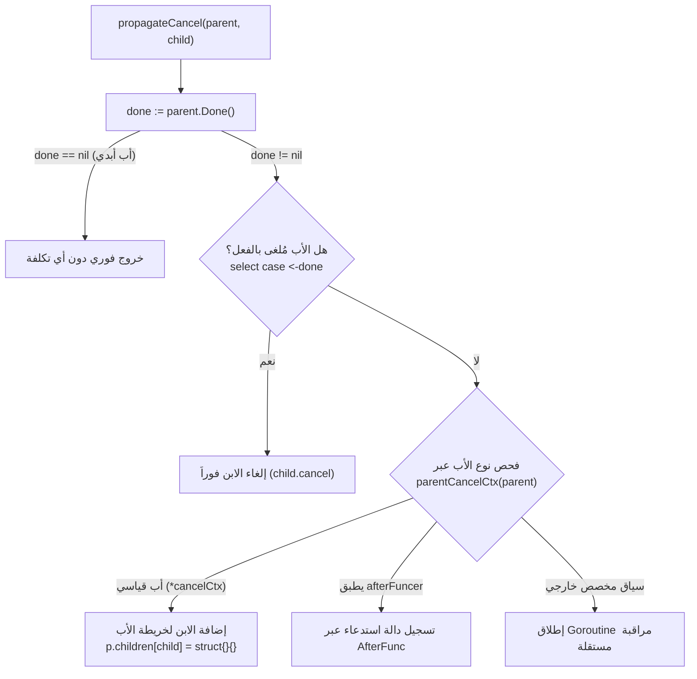

# 04. التشريح الداخلي وآليات الأداء الفائق لحزمة `context`

يُعد الكود المصدري لحزمة `context` في ملف [`/usr/local/go/src/context/context.go`](file:///usr/local/go/src/context/context.go) نموذجاً يُدرّس في هندسة النظم عالية الأداء؛ حيث يجمع بين البساطة الظاهرية والتعقيد الباطني المحسوب بدقة الميكروثانية وتوفير البايت الواحد.

---

## 🌳 1. ميكانيكية شجرة السياق والانتشار (Tree Propagation)

عند اشتقاق سياق جديد، تُبنى شجرة من العقد المترابطة. التحدي الأكبر هو: **كيف يضمن سياق الأب إلغاء أبنائه دون استهلاك مفرط للذاكرة ودون إطلاق Goroutines غير ضرورية؟**

يتم ذلك في دالة `propagateCancel(parent Context, child canceler)`:



### المسارات الأربعة لنشر الإلغاء

#### المسار الأول: الأب الأبدي (`done == nil`)

إذا كان الأب هو `Background()` أو `TODO()` أو مشتقاً من `WithoutCancel()`، فإن `Done()` تعيد `nil`.

- يتوقف الكود فوراً.
- **التكلفة:** صفر Goroutines، وصفر أقفال، وصفر تخصيصات ذاكرة!

#### المسار الثاني: الأب المُلغى مسبقاً (`case <-done:`)

قبل القيام بأي ربط، يتم تنفيذ فحص سريع عبر `select`:

```go
select {
case <-done:
    child.cancel(false, parent.Err(), Cause(parent))
    return
default:
}
```

إذا كان الأب قد أُلغي قبل إنشاء الابن، يُلغى الابن فوراً دون إضافته لأي شجرة.

#### المسار الثالث: الأب القياسي الداخلي (`parentCancelCtx`)

وهو المسار الأكثر شيوعاً في 99% من التطبيقات:

- تكتشف الحزمة أن الأب هو `*cancelCtx` أصيل (عبر المفتاح السري `&cancelCtxKey`).
- يتم قفل الأب `p.mu.Lock()`.
- يُضاف الابن إلى خريطة أبناء الأب: `p.children[child] = struct{}{}`.
- **النتيجة:** لا يتم إطلاق أي Goroutine إطلاقاً لمراقبة الأب! عندما يُلغى الأب، سيمر بحلقة تكرارية بسيطة على خريطة `children` ويلغيهم واحداً تلو الآخر.

#### المسار الرابع: السياقات المخصصة من مطوري الطرف الثالث (Custom Context)

إذا قام مطور خارجي بتطبيق واجهة `context.Context` الخاصة به، ولم تكن تنحدر من `cancelCtx`:

- لا تملك الحزمة وصولاً لخريطة الأبناء الخاصة به.
- هنا فقط تضطر الحزمة لإطلاق Goroutine حقيقية تراقب انتهاء أحدهما:

```go
goroutines.Add(1)
go func() {
    select {
    case <-parent.Done():
        child.cancel(false, parent.Err(), Cause(parent))
    case <-child.Done():
    }
}()
```

---

## 🔍 2. لغز المفتاح السري وفك الارتباط (`parentCancelCtx`)

كيف يعرف سياق الابن أن سياق الأب هو `*cancelCtx` حقيقي، حتى لو كان الأب مغلفاً بعدة طبقات من `WithValue`؟

الكود العبقري في المكتبة القياسية:

```go
var cancelCtxKey int // يتم استخدام عنوان هذا المتغير في الذاكرة كمفتاح فريد عالمياً

func (c *cancelCtx) Value(key any) any {
    if key == &cancelCtxKey {
        return c // يعيد المؤشر لنفسه!
    }
    return value(c.Context, key)
}
```

عند فحص الأب:

```go
func parentCancelCtx(parent Context) (*cancelCtx, bool) {
    done := parent.Done()
    if done == closedchan || done == nil {
        return nil, false
    }
    p, ok := parent.Value(&cancelCtxKey).(*cancelCtx)
    if !ok {
        return nil, false
    }
    pdone, _ := p.done.Load().(chan struct{})
    if pdone != done {
        return nil, false // تم تغليفه بسياق مخصص يوفر قناة Done مختلفة، لا تتجاوزه!
    }
    return p, true
}
```

> [!NOTE]
> هذا الفحص يحمي الحزمة من خرق أمني برمجي؛ فإذا قام تطبيق خارجي بإنشاء سياق يملك قناة `Done()` مخصصة، فإن مقارنة `pdone != done` تكتشف ذلك وتمنع تجاوز سياق الوسيط!

---

## 🧹 3. التفكيك الذاتي ومنع التسريب (`removeChild`)

عندما ينتهي عمل سياق فرعي ويستدعي المهندس `cancel()`، ماذا يحدث؟

```go
func removeChild(parent Context, child canceler) {
    if s, ok := parent.(stopCtx); ok {
        s.stop()
        return
    }
    p, ok := parentCancelCtx(parent)
    if !ok {
        return
    }
    p.mu.Lock()
    if p.children != nil {
        delete(p.children, child) // حذف الابن من خريطة الأب
    }
    p.mu.Unlock()
}
```

- يقوم الابن بحذف نفسه فوراً من خريطة الأب (`delete(p.children, child)`).
- هذا يقطع المؤشر المرجعي (Reference)، مما يتيح لجامع القمامة (Garbage Collector) تنظيف الابن وأي بيانات ضخمة متعلقة به فوراً، حتى لو ظل سياق الأب يعمل لعدة ساعات أو أيام!

---

## 🚀 4. خوارزمية البحث عن القيم المسطحة (`Flat Iterative value()`)

في الإصدارات الأولى، كانت الدالة `Value(key)` تستدعي نفسها عودياً (`Recursively`):
`return c.Context.Value(key)`

إذا كان لديك شجرة سياق عميقة (مثل 100 عملية معالجة وسيطة أو تتبع)، كان كل استعلام ينشئ 100 إطار في مكدس الذاكرة (Stack Frames)، مما قد يسبب استهلاكاً للذاكرة وتمدداً للـ Stack (`Stack Allocation Overhead`).

في الكود الحالي، تم تحويلها إلى حلقة تكرارية مسطحة مستوية (`Flat Iterative Loop`):

```go
func value(c Context, key any) any {
    for {
        switch ctx := c.(type) {
        case *valueCtx:
            if key == ctx.key {
                return ctx.val
            }
            c = ctx.Context
        case *cancelCtx:
            if key == &cancelCtxKey {
                return c
            }
            c = ctx.Context
        case withoutCancelCtx:
            if key == &cancelCtxKey {
                return nil
            }
            c = ctx.c
        case *timerCtx:
            if key == &cancelCtxKey {
                return &ctx.cancelCtx
            }
            c = ctx.Context
        case backgroundCtx, todoCtx:
            return nil
        default:
            return c.Value(key)
        }
    }
}
```

- **الفائدة:** استعلام القيم يتم بكفاءة عالية جداً وبصفر استهلاك إضافي لمكدس الاستدعاءات (`Zero Stack Overhead`).

---

## ⚡ 5. أسرار الأداء العالي والعمليات الذرية (`Low-Level Optimizations`)

### 1. التخصيص الكسول للقنوات (Lazy Channel Creation)

إنشاء قناة عبر `make(chan struct{})` يستهلك تخصيص ذاكرة في الـ Heap ويضيف حملاً على إدارة المزامنة.

- في `cancelCtx`، حقل `done` عبارة عن `atomic.Value` يبدأ بقيمة فارغة (`nil`).
- إذا لم يستدعِ الكود دالة `<-ctx.Done()`، فلن يتم إنشاء القناة إطلاقاً!
- وإذا أُلغي السياق قبل قراءة `Done()`، يتم تعيين `done` مباشرة إلى قناة جاهزة ومغلقة مسبقاً (`closedchan`)، مما يوفر تخصيص القنوات تماماً!

### 2. سرعة `Err()` الخارقة عبر الـ Atomic Load

في الحلقات التكرارية عالية التردد (High-throughput loops)، يستدعي المطور `ctx.Err()` في كل دورة.

```go
func (c *cancelCtx) Err() error {
    if err := c.err.Load(); err != nil {
        <-c.Done()
        return err.(error)
    }
    return nil
}
```

- قراءة `c.err.Load()` تتم بدون قفل (`Lock-free`).
- استهلاك الـ CPU في `atomic.Load` أسرع بـ **5 أضعاف** من حيازة `sync.Mutex` وإطلاقه، مما يمنع اختناق المعالجة (Lock Contention).

### 3. العزل التام عن حزمة `fmt`

تحتوي دالة `String()` الخاصة بكل سياق على دالة محلية مصغرة اسمها `stringify(v any) string`:

- بدلاً من استدعاء `fmt.Sprintf("%v", v)`، تقوم الدالة بفحص الأنواع يدوياً واستدعاء واجهة `stringer` المحلية.
- هذا يمنع حزمة `context` من سحب حزمة `fmt` ومكتبات التنسيق والجداول اليونيكودية، مما يبقي حجم التطبيق صغيراً جداً وأسرع في الإقلاع.
