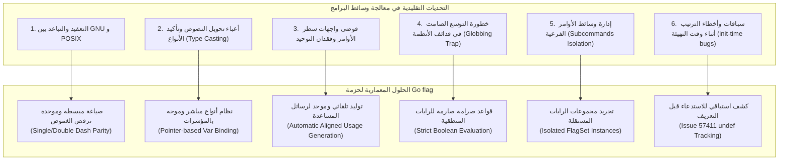

# 01. الفلسفة المعمارية ومبررات وجود حزمة `flag`

تُمثّل حزمة `flag` في لغة Go مكتبة الإدخال المعيارية لمعالجة وتحليل وسائط سطر الأوامر (Command-Line Arguments & Flags). بالرغم من صغر حجم شفرتها المصدرية (~1200 سطر برمجي في ملف واحد `flag.go`)، إلا أنها تعكس بدقة متناهية الفلسفة التصميمية العميقة التي قامت عليها لغة Go بأكملها: **البساطة، الصراحة، الأداء الفائق، ونبذ التعقيد المصطنع.**

---

## ⏳ السياق التاريخي: من Plan 9 إلى لغة Go

لفهم القرارات المعمارية لحزمة `flag`، يجب تتبع الخلفية الفكرية لمصمميها الأساسيين: **Ken Thompson** و**Rob Pike** و**Robert Griesemer**.

```
[عالم Unix المبكر] ──► [تعقيدات GNU & POSIX] ──► [تصحيح المسار: Plan 9] ──► [Go flag Package]
  getopt(3)               getopt_long               مبدأ الرايات الموحدة       البساطة الصريحة
  (خيارات حرفية قصيرة)      (خيارات طويلة ومعقدة)     (لا تمييز بين - و --)     (ربط المؤشرات المباشر)
```

1. **إرث Plan 9 من Bell Labs:**
   في نظام Plan 9 (الذي طوّره مبتكرو Unix لتصحيح أخطائه)، رأى المصممون أن التفرقة التاريخية بين الرايات القصيرة المكونة من حرف واحد (مثل `-v`) والرايات الطويلة المكونة من كلمة كاملة (مثل `--verbose`) كانت إضافة بيروقراطية سببتها رغبة GNU في التوافق العكسي مع دوال `getopt` القديمة.
   في Plan 9، اعتُمدت قاعدة بسيطة: **اسم الراية هو رمز دلالي، سواء كُتب مسبوقاً بشرطة واحدة `-` أو بشرطتين `--`، فالمعنى البرمجي واحد.**

2. **الرفض الصريح لتعقيدات POSIX و GNU getopt:**
   في أنظمة POSIX التقليدية:
   - الرايات القصيرة يمكن دمجها (Flag Clustering): أمر مثل `rm -rf` يعني في الحقيقة `rm -r -f`.
   - الرايات التي تقبل معاملاً قد تتطلب مسافة أو لا تتطلب: `-I/usr/include` أو `-I /usr/include`.
   - الرايات الطويلة تتبع أسلوب GNU: `--output=file` أو `--output file`.
   
   هذا التنوع الهائل في الصياغات جعل محللات سطر الأوامر (Parsers) هشة، صعبة الاختبار، وتؤدي إلى سلوكيات غامضة وسوء فهم أثناء التنفيذ التلقائي للسكربتات.

3. **القرار المعماري في Go:**
   قرر فريق Go عام 2009 تقديم حزمة نظيفة تماماً تتبع المبادئ التالية:
   - **الشرطة والشرطتان متساويتان تماماً:** `-flag` يطابق تماماً `--flag`.
   - **لا وجود لدمج الرايات (No Clustering):** الأمر `-v -f` يُكتب هكذا صراحة، ولا يُسمح بـ `-vf` لتجنب الغموض مع راية افتراضية اسمها `vf`.
   - **الربط المباشر بالذاكرة (Direct Memory Binding):** بدلاً من إرجاع خرائط عامة غير منمطة `map[string]any`، تقوم الدوال بحقن القيمة المحللة مباشرة داخل مؤشرات المتغيرات (`*T`) وقت استدعاء التحليل.

---

## 🛑 المشاكل الجوهرية الست التي تحلها حزمة `flag`



---

### 1. معضلة تحويل النصوص وإدارة الأنماط (Type-Safe Direct Binding)

#### المشكلة في اللغات التقليدية
في لغة C أو Python (عبر `sys.argv`) أو Node.js، يحصل المطور على مصفوفة نصوص خام `[]string`. يقع على عاتق المبرمج كتابة شفرة رتيبة (Boilerplate) لتحويل كل قيمة:
- قراءة القيمة كنص.
- استدعاء دوال التحويل (مثل `atoi` أو `strtod`).
- معالجة أخطاء الصياغة وفشل التحويل.
- إسناد القيمة للمتغير الهدف في نطاق البرنامج.

#### حل Go المعماري
ابتكرت الحزمة نمط **الربط المزدوج (Dual Registration Pattern)**:
1. **نمط تخصيص المؤشر الجديد (Pointer-returning Constructors):**
   ```go
   var timeout = flag.Duration("timeout", 30*time.Second, "request timeout duration")
   // timeout هو *time.Duration جاهز للاستخدام المباشر بعد Parse()
   ```
2. **نمط الربط بالمتغير القائم (Var Binding):**
   ```go
   var port int
   flag.IntVar(&port, "port", 8080, "server listening port")
   ```
بهذا الأسلوب، يتم التحقق من صحة القيمة وتفويضها لنوعها الأصلي مباشرة لحظة تنفيذ `flag.Parse()`، بحيث يضمن المبرمج أن المتغيرات تحتوي قيماً صحيحة منمطّة (Type-safe) بمجرد اكتمال دالة التحليل دون سطر برمجي إضافي للتحويل.

---

### 2. فخ توسيع الأسماء في قذائف التشغيل (The Shell Globbing Asterisk Trap)

#### المشكلة
في معظم المحللات التقليدية، يُسمح بتمرير الرايات المنطقية (Boolean Flags) بدون قيمة، أو مع قيمة مفصولة بمسافة:
```bash
cmd -verbose true
```
ماذا يحدث لو كان التطبيق يقبل راية `-verbose` ويقبل بعدها وسائط غير محددة (Positional Arguments) لمعالجة أسماء ملفات؟ لنفترض أن المستخدم نفذ الأمر:
```bash
mytool -verbose *
```
إذا توسعت النجمة `*` عبر الـ Shell (Globbing) وكان يوجد داخل المجلد ملف يحمل اسماً مثل `0` أو `false` أو `False`:
ستقوم بيئة Bash باستبدال `*` بقائمة الملفات:
```bash
mytool -verbose 0 report.pdf data.csv
```
إذا كان المحلل يسمح للراية المنطقية بأن تقرأ الوسيط اللاحق كقيمة لها، فستقرأ الراية `-verbose` القيمة `0` وتُطفئ نفسها (`verbose = false`)، في حين أن نية المستخدم كانت تفعيل الراية ومعالجة كافة ملفات المجلد!

#### حل Go المعماري
لحماية المطور والمستخدم من هذه الثغرة الشائعة في كتابة السكربتات، وضعت الحزمة **قاعدة صارمة لا استثناء فيها**:
> **الرايات المنطقية لا تقبل أبداً قيمة منفصلة بمسافة.**

الخيارات المسموحة حصراً للرايات المنطقية هي:
- `-flag` (تُعدّل القيمة تلقائياً إلى `true`).
- `-flag=true` أو `-flag=1` أو `-flag=t`.
- `-flag=false` أو `-flag=0` أو `-flag=f`.

أما الصياغة:
```bash
-flag false
```
فإن المحلل سيعامل `-flag` كراية تُضبط على `true`، بينما يعتبر `false` وسيطاً عادياً موضعياً (Positional Argument) يُتاح لاحقاً عبر `flag.Args()`.

---

### 3. استقلالية الأوامر وتعدد السياقات (FlagSet Decoupling)

#### المشكلة
كثير من البرامج المعاصرة لا تعمل كأداة أحادية الوظيفة، بل تعتمد معمارية **الأوامر الفرعية (Subcommands)** مثل:
```bash
git commit -m "msg"
docker run -d -p 80:80 nginx
kubectl get pods --namespace kube-system
```
إذا كانت مكتبة الرايات تعتمد فقط على مساحة أسماء عالمية موحدة (Global Namespace)، فسيستحيل بناء أدوات متعددة المستويات، لأن الراية `-p` في `docker run` قد تختلف تماماً في نوعها ووظيفتها عن الراية `-p` في `docker build`.

#### حل Go المعماري
فصلت الحزمة بين أمرين:
1. **المحرك المجرد (`FlagSet`):** كائن مكتمل بذاته يملك مساحة أسمائه الخاصة، وقواعد معالجة الأخطاء المستقلة، وقناة الإخراج المخصصة.
2. **المتغير العام الافتراضي (`CommandLine`):** هو مجرد كائن مهيأ سلفاً من `*FlagSet` مخصص لتسهيل الاستخدام في البرامج البسيطة.

هذا التجريد يسمح للمطور بإنشاء مئات من كائنات `FlagSet` المستقلة وتوجيه مصفوفات الوسائط إليها بناءً على الأمر الفرعي المطلوب بكل سلاسة وعزل كامل للذاكرة.

---

### 4. التوثيق الذاتي والمخرجات القياسية المحاذاة (Self-Documenting CLI)

#### المشكلة
في كثير من لغات البرمجة، يُطلب من المطور كتابة منطق معالجة الرايات في مكان، ثم كتابة دالة طباعة رسائل المساعدة (`--help`) يدوياً في مكان آخر، مما يؤدي دائماً إلى عدم اتساق التوثيق مع الشفرة الفعلية عند التعديل، أو تشوه تنسيق المسافات والجدولة.

#### حل Go المعماري
صُممت الحزمة لتكون **نظام توثيق ديناميكي ذاتي**:
- كل راية تُعرَّف مصحوبة بنص وصفي (`usage`).
- يتم استخراج نوع الراية تلقائياً من نوع بيانات المتغير.
- يتم التقاط القيمة الافتراضية نصياً وقت التسجيل وتضمينها تلقائياً بصيغة `(default "xyz")`.
- إذا احتوت رسالة الوصف على اسم محاط بـ Backticks (مثل `` `file` to read ``)، تستخرج دالة `UnquoteUsage` هذا الاسم لتعرضه كمعامل بدلاً من نوع البيانات الافتراضي:
  ```text
    -config file
      	path to configuration file (default "config.yaml")
  ```
- تحسب الحزمة المسافات البادئة والجدولة (Tabs) تلقائياً لضمان محاذاة عمودية مثالية للرسائل على الشاشات الطرفية.

---

### 5. قابلية التوسيع المفتوحة عبر الواجهات (Open Extensibility via Interfaces)

#### المشكلة
المكتبات الجامدة تدعم فقط الأنواع الأولية (الأرقام والنصوص والقيم البولينية). إذا أراد المطور تمرير قائمة عناوين IP، أو خريطة أزواج `key=value`، أو قيمة بصيغة JSON، تضطره المكتبات التقليدية لقراءة النص ثم تحليله لاحقاً يدوياً داخل منطق العمليات.

#### حل Go المعماري
بنت الحزمة نظامها بالكامل على واجهة بسيطة وعظيمة التأثير:
```go
type Value interface {
    String() string
    Set(string) error
}
```
أي نوع بيانات في مشروعك يحقق هاتين الدالتين يمكن تمريره مباشرة إلى `flag.Var()`، وسيتولى المحلل استدعاء دالة `Set` الخاصة بك تلقائياً، وتمرير أي خطأ يعود منها إلى منظومة أخطاء الحزمة. 

وفي الإصدارات الحديثة من Go، تم توسيع هذا المفهوم لدعم واجهات اللغة القياسية مثل `encoding.TextUnmarshaler` عبر الدالة العبقرية `TextVar`.

---

### 6. الأمان ومقاومة سباقات التهيئة (Catching Init-Time Bugs: Issue 57411)

#### المشكلة
في لغة Go، تُنفَّذ دوال `init()` في الحزم المختلفة وفق ترتيب اشتقاق واستيراد الاعتماديات. في المشاريع الضخمة التي تحتوي على مئات الحزم، قد يحاول كود في حزمة ما استدعاء:
```go
flag.Set("env", "production")
```
أثناء `init()`، بينما تكون الراية `"env"` مُعرفة في ملف آخر أو حزمة أخرى لم يتم استدعاء دالة `init()` الخاصة بها بعد. 

في الإصدارات القديمة، كانت `flag.Set` تُعيد خطأ `no such flag -env`، ولكن إذا تم تعريف الراية بعد جزء من الثانية في حزمة تالية، كان التطبيق يواصل العمل بقيمته الافتراضية القديمة دون أن يدري المطور أن محاولة التعديل قد فشلت تماماً!

#### حل Go المعماري
أضافت الحزمة بنية حماية استباقية متطورة في حقل `undef map[string]string`:
- عند استدعاء `Set` على راية غير موجودة، يتم تسجيل مسار الملف البرمجي ورقم السطر الفعلي الذي حاول التعديل عبر `runtime.Caller(2)`.
- عندما يقوم كود لاحق بتعريف نفس هذه الراية لاحقاً عبر `Var()`، تُطلق الحزمة فوراً هلعاً تقنياً صريحاً (Panic):
  ```text
  panic: flag env set at config.go:42 before being defined
  ```
هذا التصميم الصارم يمنع الثغرات المعقدة الناتجة عن تباين ترتيب استدعاءات `init()` ويجبر المطور على إصلاح هيكلية التطبيق فوراً.

---

## 🏛️ الملخص المعماري لحزمة `flag`

| المبدأ المعماري | التطبيق في حزمة `flag` | الفائدة الهندسية |
| :--- | :--- | :--- |
| **صراحة الصياغة** | مساواة الشرطة الفردية والمزدوجة ومنع دمج الرايات | منع الغموض تماماً وسهولة قراءة واستقرار السكربتات |
| **الحقن المباشر في الذاكرة** | ربط المؤشرات بالأنواع الأساسية | انعدام كود التحويل اليدوي وضمان الأمان النمطي |
| **التجريد عبر الواجهات** | واجهات `Value` و `Getter` و `encoding.TextUnmarshaler` | قابلية توسيع غير محدودة لدعم أي نوع بيانات مخصص |
| **العزل وتعدد السياقات** | بنية `FlagSet` المستقلة القابلة للتكرار | دعم الأوامر الهرمية المتداخلة (Subcommands) بسهولة |
| **التوثيق الذاتي** | استخراج التوثيق والأنواع والقيم الافتراضية آلياً | مخرجات مساعدة دقيقة ومحدثة دائماً ومتسقة في التنسيق |
| **المتانة والأمان** | كشف أخطاء التهيئة الصامتة (Issue 57411) | القضاء على الأخطاء الخفية في دورة حياة التطبيق |
