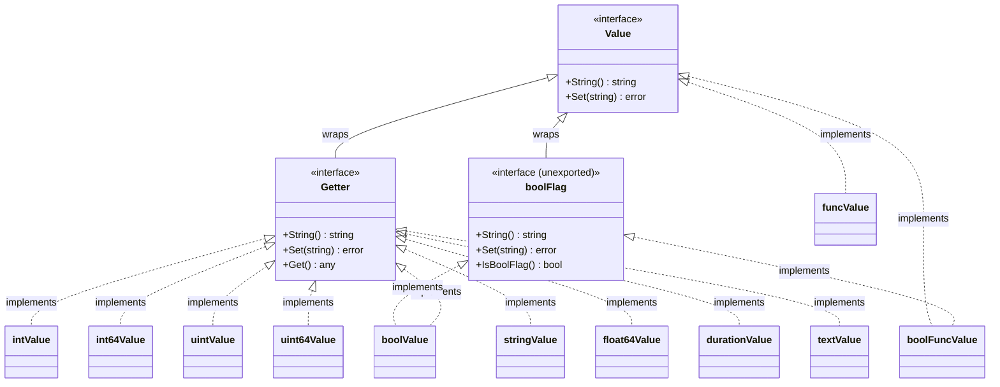

# 02. نظام الأنواع والواجهات (Interfaces & Type System)

يعتمد التصميم الداخلي لحزمة `flag` على نموذج تجريدي بالغ النقاء يستند إلى نظام الواجهات (Interfaces) في لغة Go. بالرغم من بساطة الواجهات، إلا أنها تمنح الحزمة مرونة هندسية استثنائية تجعلها قادرة على التعامل مع أي نوع بيانات، سواء كان نوعاً أولياً في اللغة (Primitive)، أو نوعاً مخصصاً (Custom Type)، أو دالة وظيفية، أو نوعاً يعتمد على ترميز نصي قياسي.

---

## 📐 خريطة الواجهات والأنواع الملموسة



---

## 1. الواجهة الأساسية: `flag.Value`

الواجهة `Value` هي حجر الزاوية الذي بُنيت عليه الحزمة بأكملها:

```go
type Value interface {
    String() string
    Set(string) error
}
```

### تشريح العقد البرمجي (The Interface Contract):
1. **`String() string`:**
   - يُعيد التمثيل النصي للقيمة الحالية للراية.
   - **الاستخدامات:**
     - يُستدعى أثناء بناء رسائل المساعدة التلقائية (`PrintDefaults`) لعرض القيمة الافتراضية للراية.
     - يُستدعى في دالة `isZeroValue` لمقارنة القيمة الحالية بالقيمة الصفرية للنوع للتأكد مما إذا كان يجب طباعة `(default ...)` أم إغفالها.
   - **قاعدة حرجة (Nil Receiver Safety):**
     تنص وثائق Go الصريحة على أن الحزمة قد تستدعي تابع `String()` على **مستقبل صفري (Zero-valued receiver)** مثل مؤشر فارغ (`nil`). لذا يجب أن يكون كود دالة `String()` الخاصة بك محصناً ضد حدوث `nil pointer dereference panic`.

2. **`Set(string) error`:**
   - يُستدعى هذا التابع مرة واحدة لكل ظهور للراية في سطر الأوامر، بالترتيب الذي وردت به.
   - يتلقى القيمة النصية الخام المكتوبة في سطر الأوامر (سواء بعد علامة المساواة `-flag=val` أو في الوسيط اللاحق `-flag val`).
   - يقوم بتحليل النص، والتحقق من صحته وقواعده، وتخزينه في المتغير الفعلي.
   - إذا كان الإدخال غير صالح، يُعيد التابع خطأً دلالياً (`error`). تتولى الحزمة التقاط هذا الخطأ وإلحاقه باسم الراية والقيمة المرفوضة عبر دالة `failf`.

---

## 2. الواجهة الممتدة: `flag.Getter`

```go
type Getter interface {
    Value
    Get() any
}
```

### سبب الوجود التاريخي (The Go 1 Compatibility Promise):
قد يتساءل مهندس البرمجيات: *لماذا لم تكن دالة `Get() any` جزءاً من واجهة `Value` الأساسية منذ البداية؟*
- **السبب التاريخي:** واجهة `Value` صدرت مع إطلاق Go الأولي واعتمدها آلاف المطورين في مشاريعهم.
- في إصدار Go 1.0، تم تقديم تعهد التوافقية العكسية الصارم (Go 1 Compatibility Promise)، والذي يمنع منعاً باتاً إضافة أي توابع جديدة إلى الواجهات العامة، لأن إضافة تابع لواجهة موجودة مسبقاً يكسر فوراً بناء كل شفرة برمجية حققت تلك الواجهة سابقاً!
- لحل مشكلة قراءة القيمة الحقيقية للراية برمجياً عبر الانعكاس (Reflection) أو الاستعلام المباشر من خلال كائن `*flag.Flag`، استحدث فريق Go واجهة جديدة مستقلة اسمها `Getter` تغلّف `Value`.
- **ملاحظة تطبيقية:** كافة الأنواع الافتراضية المضمنة في الحزمة تحقق واجهة `Getter`، باستثناء النوع الوظيفي الناتج عن `flag.Func`.

---

## 3. الواجهة الخفية: `boolFlag`

```go
type boolFlag interface {
    Value
    IsBoolFlag() bool
}
```

بالرغم من أن هذه الواجهة غير مُصدّرة (Unexported)، إلا أنها تلعب الدور الأكثر حساسية في منطق محلل سطر الأوامر بأكمله!

### كيف تعمل؟
عندما يقوم المحلل في دالة `parseOne()` بفحص راية ما:
```go
if fv, ok := flag.Value.(boolFlag); ok && fv.IsBoolFlag() {
    // هذه راية منطقية! لا تتطلب وسيطاً لاحقاً
    if hasValue {
        fv.Set(value)
    } else {
        fv.Set("true") // يتم ضبطها تلقائياً على true
    }
}
```

### كيف تستفيد منها في أنواعك المخصصة؟
بما أن الواجهات في Go تتحقق ضمنياً (Implicit Structural Typing)، فإن أي نوع مخصص تبنيه ويحتوي على دالة:
```go
func (m *MyType) IsBoolFlag() bool { return true }
```
سيحقق واجهة `boolFlag` تلقائياً عبر التحقق الديناميكي للأنواع (Type Assertion)، مما يجعل المحلل يعامل نوعك المخصص كراية ذاتية التفعيل مثل الرايات البولينية الأصلية دون الحاجة لتمرير وسيط!

---

## 4. تشريح الأنواع الملموسة المضمنة في Go

تضم الحزمة 11 نوعاً داخلياً ملموساً يحقق واجهة `Value` و `Getter` لتغطية كافة الاحتياجات. فيما يلي تشريح هندسي دقيق لكل نوع:

### 1. `boolValue`
```go
type boolValue bool

func (b *boolValue) Set(s string) error {
    v, err := strconv.ParseBool(s)
    if err != nil {
        err = errParse
    }
    *b = boolValue(v)
    return err
}
func (b *boolValue) Get() any { return bool(*b) }
func (b *boolValue) String() string { return strconv.FormatBool(bool(*b)) }
func (b *boolValue) IsBoolFlag() bool { return true }
```
- **القيم المقبولة:** تقبل أي قيمة تدعمها دالة `strconv.ParseBool`:
  `1, 0, t, f, T, F, true, false, TRUE, FALSE, True, False`.
- **السلوك التلقائي:** تُضبط على `true` إذا ذُكرت الراية بمفردها `-flag`.

---

### 2. `intValue` و `int64Value`
```go
type intValue int
type int64Value int64

func (i *intValue) Set(s string) error {
    v, err := strconv.ParseInt(s, 0, strconv.IntSize)
    if err != nil {
        err = numError(err)
    }
    *i = intValue(v)
    return err
}
```
- **الميزة المعمارية:** تمرير الأساس `0` إلى `strconv.ParseInt(s, 0, ...)` يتيح تلقائياً قبول الأرقام بعدة أنظمة عددية دون أي إعداد إضافي:
  - العشري التقليدي: `1234`
  - الثماني مسبوقاً بصفر: `0664`
  - الست عشري مسبوقاً بـ `0x`: `0x1A4F`
  - الأرقام السالبة: `-42`
- **حجم المنصة (IntSize):** تستخدم الحزمة `strconv.IntSize` للتكيف ديناميكياً مع معمارية المعالج (32 بت أو 64 بت).

---

### 3. `uintValue` و `uint64Value`
- تستخدم `strconv.ParseUint(s, 0, ...)` مع رفض الإشارات السالبة والتحقق من طفح السعة (Overflow) وتحويله لخطأ `errRange`.

---

### 4. `stringValue`
```go
type stringValue string

func (s *stringValue) Set(val string) error {
    *s = stringValue(val)
    return nil
}
func (s *stringValue) String() string { return string(*s) }
```
- أبسط تطبيق للواجهة: يقبل أي نص كما هو دون تحويل، ولا يمكن أن يُعيد خطأً أبداً أثناء التحليل.

---

### 5. `float64Value`
- تستخدم `strconv.ParseFloat(s, 64)`.
- تقبل الأعداد العشرية والصيغ العلمية مثل `3.14159` أو `1e-5`.
- عند تحويلها لنص في `String()`، تستخدم التنسيق `'g'` وبدقة كاملة `-1` لضمان طباعة الأرقام بأقصر وأدق تمثيل بصري ممكن:
  ```go
  strconv.FormatFloat(float64(*f), 'g', -1, 64)
  ```

---

### 6. `durationValue`
```go
type durationValue time.Duration

func (d *durationValue) Set(s string) error {
    v, err := time.ParseDuration(s)
    if err != nil {
        err = errParse
    }
    *d = durationValue(v)
    return err
}
```
- **التكامل العميق:** يرتبط مباشرة بدالة `time.ParseDuration`.
- يقبل الصيغ الزمنية الشائعة: `"10s"`, `"500ms"`, `"1h30m"`, `"2.5h"`.
- يلغي تماماً الحاجة لكتابة أدوات قراءة الثواني أو الميلي ثانية يدوياً.

---

### 7. `textValue` (تحفة Go 1.19 الهندسية)
```go
type textValue struct{ p encoding.TextUnmarshaler }

func newTextValue(val encoding.TextMarshaler, p encoding.TextUnmarshaler) textValue {
    ptrVal := reflect.ValueOf(p)
    if ptrVal.Kind() != reflect.Ptr {
        panic("variable value type must be a pointer")
    }
    defVal := reflect.ValueOf(val)
    if defVal.Kind() == reflect.Ptr {
        defVal = defVal.Elem()
    }
    if defVal.Type() != ptrVal.Type().Elem() {
        panic(fmt.Sprintf("default type does not match variable type: %v != %v", defVal.Type(), ptrVal.Type().Elem()))
    }
    ptrVal.Elem().Set(defVal)
    return textValue{p}
}

func (v textValue) Set(s string) error {
    return v.p.UnmarshalText([]byte(s))
}
```
- **العبقرية التصميمية:** بدلاً من إجبار كل نوع بيانات في منظومة Go على تطبيق واجهة `flag.Value` الخاصة بهذه الحزمة، اعتمدت Go واجهتي التفكيك النصي المعياريتين في المكتبة القياسية:
  - `encoding.TextMarshaler`
  - `encoding.TextUnmarshaler`
- أي نوع بيانات في مكتبات Go القياسية أو الخارجية يطبق هاتين الواجهتين (مثل `net.IP`, `net/url.URL`, `time.Time`, `net/netip.Addr`) يمكن استخدامه **مباشرة كراية** عبر دالة `flag.TextVar()` دون الحاجة لأي غلاف وسيط!

---

### 8. `funcValue` و `boolFuncValue` (توابع الإغلاق في Go 1.16 و Go 1.21)

```go
type funcValue func(string) error

func (f funcValue) Set(s string) error { return f(s) }
func (f funcValue) String() string { return "" }

type boolFuncValue func(string) error

func (f boolFuncValue) Set(s string) error { return f(s) }
func (f boolFuncValue) String() string { return "" }
func (f boolFuncValue) IsBoolFlag() bool { return true }
```

- **الغرض المعماري:** معالجة الإدخال التفاعلي عبر دوال الإغلاق (Anonymous Closures) دون الحاجة لتعريف متغير مسبق.
- **التطبيق العملي لـ `Func`:**
  - قراءة الرايات التي تتطلب تحليلاً معقداً أو تسجيلاً فورياً.
  - قراءة الرايات المتكررة (مثل `-header "A: B" -header "C: D"`).
- **التطبيق العملي لـ `BoolFunc`:**
  - تنفيذ إجراء فوري بمجرد ذكر الراية، مثل طباعة الإصدار أو تشغيل نمط التشخيص والتنقيح (Debug mode).

---

## 5. ميكانيكية توحيد الأخطاء العددية: دالة `numError`

تتعامل الحزمة داخلياً مع أخطاء مكتبة `strconv` بطريقة موحدة لتحسين تجربة المستخدم:

```go
func numError(err error) error {
    ne, ok := err.(*strconv.NumError)
    if !ok {
        return err
    }
    if ne.Err == strconv.ErrSyntax {
        return errParse
    }
    if ne.Err == strconv.ErrRange {
        return errRange
    }
    return err
}
```

- **التصنيف:**
  - إذا كان الخطأ ناتجاً عن خلل في الحروف المدخلة (`strconv.ErrSyntax` مثل كتابة `"abc"` في راية رقمية)، يُترجم إلى المتغير العام غير المصدر `errParse` وتتم طباعة `"invalid value ... for flag -x: parse error"`.
  - إذا كان الخطأ ناتجاً عن تجاوز حدود السعة العددية للنوع (`strconv.ErrRange` مثل إدخال `99999999999999999999` في `int`)، يُترجم إلى `errRange` وتتم طباعة `"invalid value ... for flag -x: value out of range"`.

---

## 📋 جدول المقارنة الشامل لكافة أنواع الحزمة

| النوع الملموس | الواجهات المحققة | الدالة البانية المباشرة | دالة الربط بالمتغير (Var) | سلوك القيمة الافتراضية |
| :--- | :--- | :--- | :--- | :--- |
| `boolValue` | `Getter`, `boolFlag` | `flag.Bool` | `flag.BoolVar` | `false` |
| `intValue` | `Getter` | `flag.Int` | `flag.IntVar` | `0` (يدعم 0x و 0) |
| `int64Value` | `Getter` | `flag.Int64` | `flag.Int64Var` | `0` |
| `uintValue` | `Getter` | `flag.Uint` | `flag.UintVar` | `0` |
| `uint64Value` | `Getter` | `flag.Uint64` | `flag.Uint64Var` | `0` |
| `stringValue` | `Getter` | `flag.String` | `flag.StringVar` | `""` |
| `float64Value`| `Getter` | `flag.Float64` | `flag.Float64Var` | `0.0` |
| `durationValue`| `Getter` | `flag.Duration` | `flag.DurationVar` | `0s` |
| `textValue` | `Getter` | - | `flag.TextVar` | قيمة الكائن الممرر |
| `funcValue` | `Value` | - | `flag.Func` | - |
| `boolFuncValue`| `Value`, `boolFlag` | - | `flag.BoolFunc` | - |
| **User Custom**| `Value` أو `Getter` | - | `flag.Var` | يحدده المطور |
