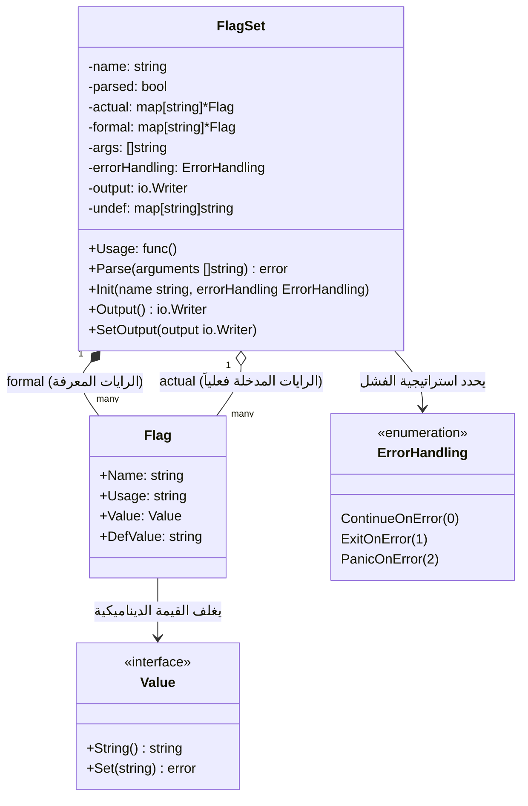
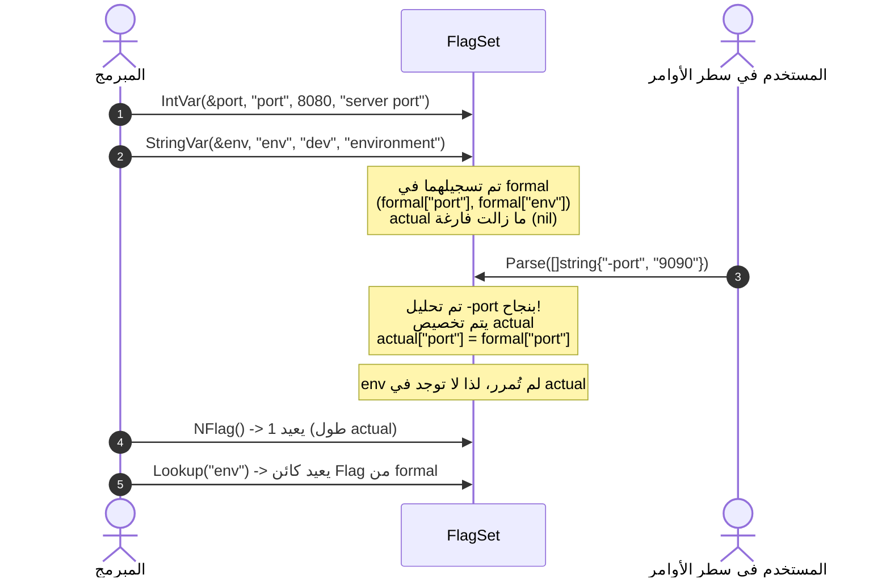
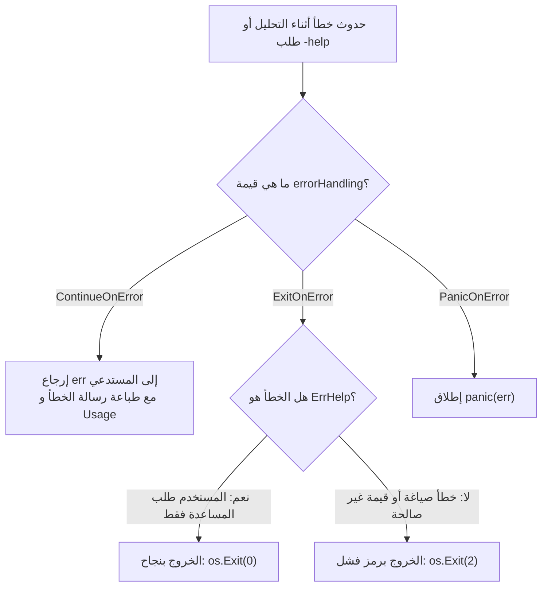

# 03. الهياكل الجوهرية وحالة النظام (`FlagSet` & Core Structures)

تعتمد إدارة الرايات في لغة Go على هيكلين محوريين يمثلان عمود الفقر لتخزين المعرّفات وحالة المعالجة:
1. **`Flag`**: يُمثل الكيان الفردي لكل راية مسجلة ومواصفاتها.
2. **`FlagSet`**: يُمثل الحاوية المعمارية والمحرك التنفيذي لمجموعة مترابطة من الرايات، بما يحويه من جداول رموز، وقواعد لمعالجة الأخطاء، ومجاري الإدخال والإخراج.

---

## 🏗️ المخطط البنيوي للعلاقات بين الهياكل



---

## 1. تشريح هيكل الراية الفردية: `flag.Flag`

يمثل هذا الهيكل الحالة الكاملة لأي راية مسجلة في التطبيق:

```go
type Flag struct {
    Name     string // اسم الراية كما يظهر في سطر الأوامر (مثل "port" أو "v")
    Usage    string // الرسالة الوصفية التوضيحية للمساعدة
    Value    Value  // كائن القيمة الديناميكي الذي يحقق واجهة Value
    DefValue string // القيمة الافتراضية ممثلة كنص ثابت
}
```

### التفاصيل الهندسية لحقول `Flag`:
1. **`Name`:**
   - اسم الراية النصي. يخضع لقواعد صارمة عند التسجيل:
     - **ممنوع أن يبدأ بشرطة `-`:** (مثل `-port`) حتى لا يلتبس مع صياغة سطر الأوامر.
     - **ممنوع أن يحتوي على علامة المساواة `=`:** حتى لا يلتبس مع صياغة الفصل بين الاسم والقيمة.
   - في حال مخالفة هذه الشروط، تُطلق الحزمة هلعاً فورياً (`panic`).

2. **`Usage`:**
   - النص الإرشادي الذي يوضح الغرض من الراية.
   - يدعم اصطلاح التنصيص المائل (Backticks) مثل:
     ```go
     "path to the `configuration file`"
     ```
     حيث تتولى دالة `UnquoteUsage` استخراج الكلمة المحاطة بـ Backtick لعرضها كاسم للمعامل البرمجي في رسائل المساعدة التلقائية.

3. **`Value`:**
   - واجهة تشير إلى الكائن الحقيقي المخزن في الذاكرة (سواء كان `*intValue` أو `*stringValue` أو نوعاً مخصصاً).
   - عند استدعاء `flag.Parse()`، يتم تمرير القيمة المحللة مباشرة إلى `Value.Set(...)`.

4. **`DefValue`:**
   - **قرار معماري حاسم:** تُخزن القيمة الافتراضية كـ `string` بمجرد تسجيل الراية عبر استدعاء `value.String()`.
   - **لماذا؟** حتى تظل القيمة الافتراضية ثابتة ولا تتأثر أبداً إذا تغيرت القيمة المخزنة في `Value` أثناء تنفيذ البرنامج أو تعديلها لاحقاً بواسطة المستخدم.

---

## 2. تشريح محرك الرايات: `flag.FlagSet`

الهيكل `FlagSet` هو الحاوية الشاملة لكافة عمليات تسجيل وتحليل واستعلام الرايات:

```go
type FlagSet struct {
    Usage func()

    name          string
    parsed        bool
    actual        map[string]*Flag
    formal        map[string]*Flag
    args          []string
    errorHandling ErrorHandling
    output        io.Writer
    undef         map[string]string
}
```

### التحليل العميق لكل حقل:

| الحقل الداخلي | النوع | المعنى والوظيفة المعمارية |
| :--- | :--- | :--- |
| **`Usage`** | `func()` | حقل دالي (Function Field وليس Method). يتيح للمطور استبدال دالة طباعة المساعدة الافتراضية بدالة مخصصة خاصة بهذا الـ `FlagSet`. |
| **`name`** | `string` | اسم مجموعة الرايات (مثل اسم الأداة أو الأمر الفرعي كـ `"build"` أو `"serve"`). يظهر في ترويسة رسائل المساعدة: `Usage of <name>:`. |
| **`parsed`** | `bool` | حالة منطقية تُصبح `true` بمجرد استدعاء دالة `Parse()`. تُستخدم للاستعلام عبر تابع `Parsed()`. |
| **`formal`** | `map[string]*Flag` | **جدول الرموز الرسمي:** يحتوي على كافة الرايات التي تم تعريفها برمجياً والمتاحة للاستخدام. مفتاحه اسم الراية. |
| **`actual`** | `map[string]*Flag` | **جدول الوقائع:** يحتوي **فقط** على الرايات التي مررها المستخدم فعلياً في سطر الأوامر أو تم ضبطها برمجياً عبر `Set()`. |
| **`args`** | `[]string` | شريحة تحتوي على المعاملات غير المنسوبة لرايات (Positional Arguments) المتبقية بعد اكتمال التحليل. |
| **`errorHandling`** | `ErrorHandling` | سياسة الاستجابة عند حدوث أخطاء تحليلية أو طلب المساعدة. |
| **`output`** | `io.Writer` | المجرى الذي تُطبع إليه رسائل الخطأ والمساعدة. إذا كان `nil`، تعود دالة `Output()` تلقائياً بـ `os.Stderr`. |
| **`undef`** | `map[string]string` | خريطة حماية استباقية تسجل محاولات تعديل رايات غير معرفة قبل إنشائها، لمنع أخطاء ترتيب `init()` (Issue 57411). |

---

### الفارق المعماري الجوهري بين `formal` و `actual`:



- **`formal`:** يمثل العقد البرمجي الكامل لما يمكن للتطبيق أن يستقبله. يُستخدم في:
  - البحث العام (`Lookup`).
  - المرور على جميع الرايات المتاحة وعرض توثيقها بالكامل (`VisitAll`).
- **`actual`:** يمثل ما حدث فعلاً في هذه الجلسة التشغيلية. يُستخدم في:
  - معرفة عدد الرايات التي حددها المستخدم صراحة (`NFlag()`).
  - المرور فقط على الرايات التي تم تعديلها أو تمريرها (`Visit`).

---

## 3. استراتيجيات معالجة الأخطاء: `flag.ErrorHandling`

تُعرّف الحزمة نوعاً مخصصاً يحدد تصرف المحلل عند حدوث خلل:

```go
type ErrorHandling int

const (
    ContinueOnError ErrorHandling = iota // 0: إعادة الخطأ إلى المستدعي دون إيقاف البرنامج
    ExitOnError                          // 1: إيقاف البرنامج فوراً واستدعاء os.Exit
    PanicOnError                         // 2: إطلاق هلع برمجي (panic) بالخطأ
)
```



### التفصيل العملي للاستراتيجيات:

1. **`ExitOnError` (الافتراضية للبرامج الرئيسية `CommandLine`):**
   - في حال وجود خطأ في الصياغة (مثل إدخال نص في راية رقمية أو تمرير راية غير معرفة):
     - تطبع الحزمة رسالة الخطأ متبوعة بـ `Usage()`.
     - تستدعي فوراً `os.Exit(2)` لإنهاء البرنامج وإشعار نظام التشغيل بالفشل.
   - في حال طلب المستخدم المساعدة فقط عبر `-h` أو `-help`:
     - تطبع رسالة المساعدة الكاملة.
     - تخرج بالرمز الناجح `os.Exit(0)` لأن طلب المساعدة ليس فشلاً تشغيلياً!

2. **`ContinueOnError` (المثالية للأوامر الفرعية ومكتبات الربط والاختبارات):**
   - لا تنهي العملية أبداً.
   - تُعيد الخطأ ككائن `error` عادي من دالة `f.Parse(args)`.
   - تسمح للمطور بفحص الخطأ عبر `errors.Is(err, flag.ErrHelp)` والتحكم بنفسه في تدفق التنفيذ.

3. **`PanicOnError`:**
   - تُطلق `panic(err)`.
   - تُستخدم في السيناريوهات الصارمة التي لا تقبل أي تساهل، أو أثناء مراحل التطوير لاكتشاف الأخطاء عبر مكدس الاستدعاءات (Stack Trace).

---

## 4. إدارة الحالة العامة: `flag.CommandLine`

لتسهيل بناء الأدوات البرمجية البسيطة التي لا تحتاج لتعقيدات كائنات متعددة، توفر الحزمة كائناً عالمياً مهيأً مسبقاً:

```go
// CommandLine هو الكائن الافتراضي لمجموعة رايات البرنامج الرئيسي،
// ويُحلل وسائط سطر الأوامر المستلمة من os.Args[1:]
var CommandLine *FlagSet

func init() {
    // معالجة حالة نادرة: قد تُمرر أنظمة تشغيل وسيطاً فارغاً تماماً في os.Args
    if len(os.Args) == 0 {
        CommandLine = NewFlagSet("", ExitOnError)
    } else {
        CommandLine = NewFlagSet(os.Args[0], ExitOnError)
    }

    // ربط دالة المساعدة العامة بالمتغير العام Usage
    CommandLine.Usage = commandLineUsage
}

func commandLineUsage() {
    Usage()
}
```

### المتغيرات العامة الأساسية في الحزمة:
- **`CommandLine`**: مؤشر من نوع `*FlagSet` يُستخدم كوجهة لكافة الدوال العامة في الحزمة مثل `flag.Int()` و `flag.StringVar()` و `flag.Parse()`.
- **`Usage`**: متغير دالي عام (`var Usage = func() { ... }`). يمثل دالة المساعدة الافتراضية لكائن `CommandLine`. يطبع ترويسة بسيطة متبوعة باستدعاء `PrintDefaults()`.
- **`ErrHelp`**:
  ```go
  var ErrHelp = errors.New("flag: help requested")
  ```
  الخطأ المعياري الذي يعود عند تمرير الرايات الخاصة بالمساعدة (`-h` أو `-help`) في حال لم تكن معرفة صراحة كرايات عادية.

---

## 5. ميكانيكية ترتيب الرايات الأبجدي: `sortFlags`

لضمان عرض رسائل مساعدة موحدة ومنظمة باستمرار، لا تعتمد Go على ترتيب إدخال الرايات في الخريطة (حيث أن خرائط Go عشوائية الترتيب بطبيعتها Random Iteration Order)، بل تقوم بترتيبها معجمياً:

```go
func sortFlags(flags map[string]*Flag) []*Flag {
    result := make([]*Flag, len(flags))
    i := 0
    for _, f := range flags {
        result[i] = f
        i++
    }
    slices.SortFunc(result, func(a, b *Flag) int {
        return strings.Compare(a.Name, b.Name)
    })
    return result
}
```

- **التكامل الحديث مع Go 1.21+:** تستخدم الحزمة دالة `slices.SortFunc` بالاشتراك مع `strings.Compare`، مما يحقق ترتيباً معجمياً مستقراً وخالياً من التخصيصات الزائدة للذاكرة أثناء المرور على الرايات في `Visit` و `VisitAll` و `PrintDefaults`.
