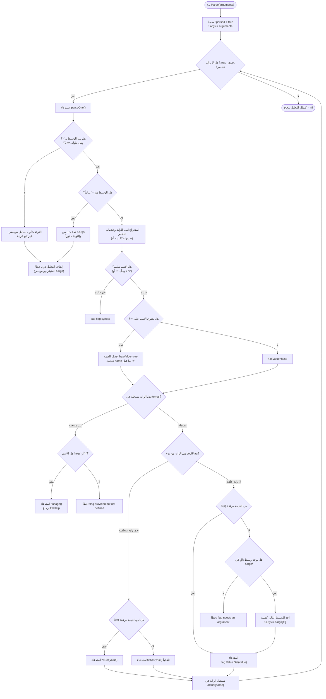
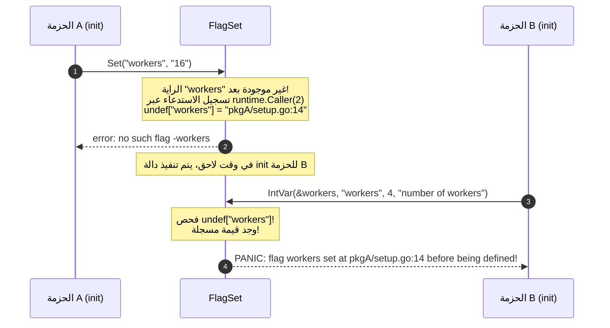

# 04. خوارزمية التحليل وآلة الحالة (Parsing Pipeline & State Machine)

تعتمد حزمة `flag` على خوارزمية تحليل محددة (Deterministic Finite State Machine) تتسم بالسرعة العالية وانعدام التخصيصات العشوائية للذاكرة. تتميز هذه الخوارزمية بأنها تقوم بتحليل وسائط سطر الأوامر شريحة بعد شريحة وبشكل تسلسلي مباشر، متوقفة عند أول وسيط لا يمثل راية صريحة.

---

## 🧭 مخطط مسار التحليل الشامل (Parsing Pipeline)



---

## 1. قواعد الصياغة المدعومة (Command-Line Syntax Rules)

تفرض الحزمة قواعد دقيقة على بنية وسائط سطر الأوامر:

### الأنماط المسموحة:
1. **`-flag` أو `--flag`:**
   - الشرطة الفردية والشرطة المزدوجة متطابقتان تماماً في التأثير.
   - إذا كانت الراية منطقية (Boolean)، تُضبط قيمتها فوراً على `true`.
   - إذا لم تكن منطقية، يجب أن يكون الوسيط التالي هو قيمتها.

2. **`-flag=x` أو `--flag=x`:**
   - صياغة موحدة تصلح لكافة أنواع الرايات (سواء كانت نصوصاً، أرقاماً، أو قيماً منطقية).
   - تُعتبر هذه الصياغة هي **الأسلوب الوحيد المسموح به لإطفاء الرايات المنطقية**:
     ```bash
     mytool -verbose=false
     mytool --debug=0
     ```

3. **`-flag x` أو `--flag x`:**
   - مسموح فقط للرايات غير المنطقية (Non-boolean flags).
   - يتم قراءة `x` من الوسيط التالي واستهلاكه من الشريحة.

4. **الفاصل الحاسم القاطع `--` (Terminator):**
   - عند مواجهة الوسيط `--` منفرداً، يتوقف المحلل فوراً عن معالجة الرايات.
   - تُعتبر كافة الوسائط اللاحقة بعد `--` معاملات موضعية (Positional Arguments)، حتى لو بدأت بشرطة:
     ```bash
     mytool -v -- -file-named-like-a-flag.txt
     ```
     هنا سيتم تفعيل الراية `-v`، ثم يتوقف المحلل عند `--`، ويصبح الملف `-file-named-like-a-flag.txt` أول معامل في `flag.Args()`.

5. **الشرطة المنفردة `-` (Standard Input / Non-flag Argument):**
   - لا تعتبر الحزمة الشرطة المنفردة `-` راية، بل تعاملها كمعامل موضعي عادي غير تابع لراية.
   - هذا الاصطلاح مخصص عالمياً لتمثيل الدفق القياسي (Standard Input `stdin`) في بيئات Unix.

---

## 2. التحليل التفصيلي لدالة `parseOne()` في الشفرة المصدرية

الدالة `parseOne()` هي الوحدة التنفيذية الصغرى في محرك التحليل، حيث تقوم بمعالجة راية واحدة فقط في كل دورة:

```go
func (f *FlagSet) parseOne() (bool, error) {
    if len(f.args) == 0 {
        return false, nil // انتهت الوسائط
    }
    s := f.args[0]
    if len(s) < 2 || s[0] != '-' {
        return false, nil // ليس راية، وصلنا لأول معامل موضعي!
    }
    numMinuses := 1
    if s[1] == '-' {
        numMinuses++
        if len(s) == 2 { // الوسيط هو "--" منفرداً
            f.args = f.args[1:] // حذف الفاصل
            return false, nil   // التوقف الفوري عن معالجة الرايات
        }
    }
    name := s[numMinuses:]
    if len(name) == 0 || name[0] == '-' || name[0] == '=' {
        return false, f.failf("bad flag syntax: %s", s)
    }
```

### استخراج الاسم والقيمة:
```go
    f.args = f.args[1:]
    hasValue := false
    value := ""
    for i := 1; i < len(name); i++ { // علامة = لا يمكن أن تكون الحرف الأول
        if name[i] == '=' {
            value = name[i+1:]
            hasValue = true
            name = name[0:i]
            break
        }
    }
```

### معالجة الرايات المجهولة وطلب المساعدة:
```go
    flag, ok := f.formal[name]
    if !ok {
        if name == "help" || name == "h" { // استثناء ذكي لرسائل المساعدة
            f.usage()
            return false, ErrHelp
        }
        return false, f.failf("flag provided but not defined: -%s", name)
    }
```

> [!NOTE]
> **ذكاء معالجة المساعدة:** إذا طلب المستخدم `-h` أو `-help` ولم يكن المبرمج قد عرّف راية صريحة بهذا الاسم، تلتقط الحزمة هذا الاستدعاء تلقائياً وتطبع رسالة المساعدة وتعيد `ErrHelp`. أما إذا قام المبرمج بتعريف راية خاصة اسمها `h`، فإنها ستكون موجودة في `f.formal` وتُعامل كراية عادية تماماً!

### معالجة نوع الراية والقيمة:
```go
    if fv, ok := flag.Value.(boolFlag); ok && fv.IsBoolFlag() {
        if hasValue {
            if err := fv.Set(value); err != nil {
                return false, f.failf("invalid boolean value %q for -%s: %v", value, name, err)
            }
        } else {
            if err := fv.Set("true"); err != nil {
                return false, f.failf("invalid boolean flag %s: %v", name, err)
            }
        }
    } else {
        // الرايات غير المنطقية تتطلب حتماً قيمة
        if !hasValue && len(f.args) > 0 {
            hasValue = true
            value, f.args = f.args[0], f.args[1:] // استهلاك الوسيط التالي
        }
        if !hasValue {
            return false, f.failf("flag needs an argument: -%s", name)
        }
        if err := flag.Value.Set(value); err != nil {
            return false, f.failf("invalid value %q for flag -%s: %v", value, name, err)
        }
    }

    if f.actual == nil {
        f.actual = make(map[string]*Flag)
    }
    f.actual[name] = flag
    return true, nil
```

---

## 3. دورة حياة حلقة التحليل: دالة `Parse()`

تتولى دالة `Parse` تنفيذ الحلقة الرئيسية والتفاعل مع سياسة الأخطاء:

```go
func (f *FlagSet) Parse(arguments []string) error {
    f.parsed = true
    f.args = arguments
    for {
        seen, err := f.parseOne()
        if seen {
            continue // تمت معالجة راية بنجاح، انتقل للوسيط التالي
        }
        if err == nil {
            break // توقف طبيعي (وصلنا لمعامل موضعي أو نفدت الوسائط)
        }
        // معالجة الخطأ وفق السياسة المحددة
        switch f.errorHandling {
        case ContinueOnError:
            return err
        case ExitOnError:
            if err == ErrHelp {
                os.Exit(0) // الخروج بنجاح في حال طلب المساعدة
            }
            os.Exit(2)     // الخروج برمز خطأ 2 في حال فشل الصياغة
        case PanicOnError:
            panic(err)
        }
    }
    return nil
}
```

---

## 4. ميكانيكية الحماية الاستباقية ضد أخطاء التهيئة (Issue 57411)

من أذكى الميزات الهندسية التي أُضيفت إلى حزمة `flag` هي حماية المطور ضد أخطاء ترتيب استدعاءات `init()` وتعديل الرايات قبل إنشائها.



### كيف كُتب هذا المنطق في Go؟

1. **في دالة `set()` عند استدعاء راية غير موجودة:**
   ```go
   _, file, line, ok := runtime.Caller(2)
   if !ok {
       file = "?"
       line = 0
   }
   if f.undef == nil {
       f.undef = map[string]string{}
   }
   f.undef[name] = fmt.Sprintf("%s:%d", file, line)
   return fmt.Errorf("no such flag -%v", name)
   ```

2. **في دالة `Var()` عند تعريف الراية لاحقاً:**
   ```go
   if pos := f.undef[name]; pos != "" {
       panic(fmt.Sprintf("flag %s set at %s before being defined", name, pos))
   }
   ```

### لماذا هذا القرار حاسم؟
لأنه بدون هذا الهلع الصريح (Panic)، كان الخطأ يمر صامتاً، ويستمر البرنامج في العمل بالقيم الافتراضية متجاهلاً الإعدادات، مما كان يتسبب في سلوكيات كارثية يصعب تعقبها في بيئات الإنتاج المعقدة.
