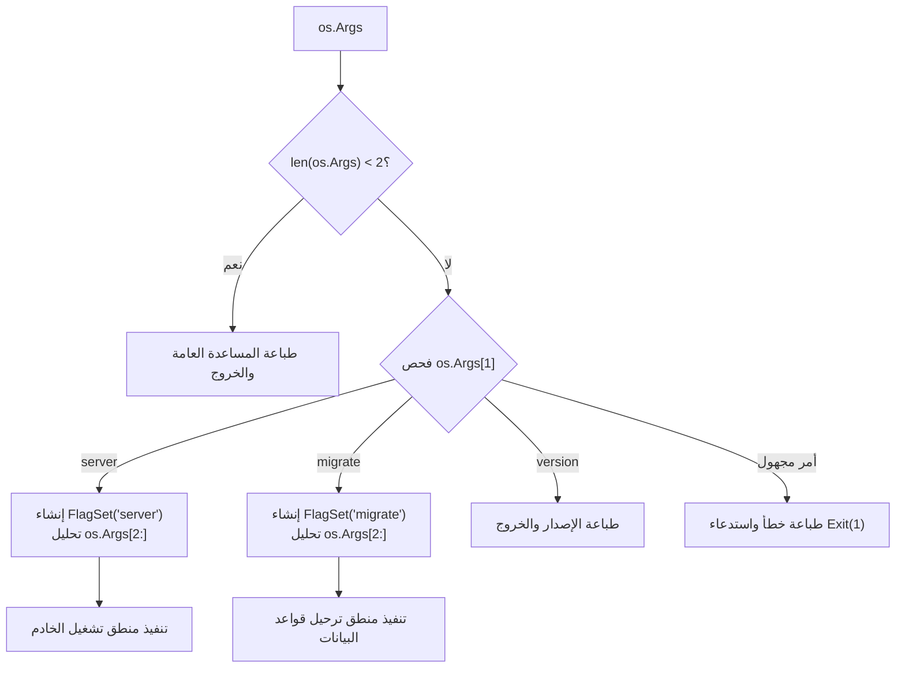

# 06. الأنماط المتقدمة وهندسة الأوامر الفرعية (Subcommands & Advanced Patterns)

تتيح حزمة `flag` بناء أدوات سطر أوامر احترافية وشديدة التعقيد دون الحاجة لأي مكتبات خارجية، وذلك عند فهم كيفية توظيف التجريدات المتقدمة مثل `FlagSet` المتعدد، والواجهات المخصصة `flag.Value`، ونمط حقن المخرجات لاختبار البرمجيات.

---

## 1. هندسة الأوامر الفرعية (Subcommands Architecture)

تعتمد الأدوات الحديثة (مثل `git`, `docker`, `kubectl`) على معمارية الأوامر الهرمية (Hierarchical Subcommands). يمكن بناء هذا النموذج بأعلى درجات النقاء البرمجي عبر إنشاء `*FlagSet` مخصص لكل أمر فرعي.



### نموذج تطبيقي إنتاجي كامل:

```go
package main

import (
	"errors"
	"flag"
	"fmt"
	"os"
	"time"
)

type Config struct {
	// خيارات عامة أو مخصصة
}

func main() {
	if len(os.Args) < 2 {
		printGlobalUsage()
		os.Exit(1)
	}

	command := os.Args[1]
	args := os.Args[2:]

	var err error
	switch command {
	case "server":
		err = runServerCommand(args)
	case "migrate":
		err = runMigrateCommand(args)
	case "help", "-h", "--help":
		printGlobalUsage()
		return
	default:
		fmt.Fprintf(os.Stderr, "خطأ: أمر غير معروف %q\n\n", command)
		printGlobalUsage()
		os.Exit(1)
	}

	if err != nil {
		if errors.Is(err, flag.ErrHelp) {
			return // تم طلب المساعدة بالفعل وطباعتها
		}
		fmt.Fprintf(os.Stderr, "فشل التنفيذ: %v\n", err)
		os.Exit(1)
	}
}

func printGlobalUsage() {
	fmt.Fprintf(os.Stderr, `تطبيق إدارة الخدمات السحابية

الاستخدام:
  myapp <command> [flags]

الأوامر المتاحة:
  server    تشغيل خادم الويب ومعالجة الطلبات
  migrate   تنفيذ ترحيلات وتحديثات قاعدة البيانات

استخدم "myapp <command> -help" لمعرفة رايات كل أمر.
`)
}

func runServerCommand(args []string) error {
	fs := flag.NewFlagSet("server", flag.ContinueOnError)
	
	host := fs.String("host", "127.0.0.1", "عنوان IP للاستماع")
	port := fs.Int("port", 8080, "منفذ خادم الويب")
	timeout := fs.Duration("timeout", 30*time.Second, "مهلة إيقاف الخادم")

	if err := fs.Parse(args); err != nil {
		return err
	}

	fmt.Printf("بدء تشغيل الخادم على %s:%d (المهلة: %v)...\n", *host, *port, *timeout)
	return nil
}

func runMigrateCommand(args []string) error {
	fs := flag.NewFlagSet("migrate", flag.ContinueOnError)
	
	dsn := fs.String("dsn", "", "`مسار الاتصال` بقاعدة البيانات (إلزامي)")
	steps := fs.Int("steps", 0, "عدد خطوات الترحيل (0 يعني الكل)")

	if err := fs.Parse(args); err != nil {
		return err
	}

	if *dsn == "" {
		fs.Usage()
		return errors.New("يجب تحديد مسار الاتصال عبر -dsn")
	}

	fmt.Printf("جاري ترحيل قاعدة البيانات: %s (الخطوات: %d)...\n", *dsn, *steps)
	return nil
}
```

---

## 2. بناء أنواع بيانات مخصصة عبر `flag.Value`

### النمط الأول: الرايات المتكررة (Slice / Repeatable Flags)
عند الرغبة في قبول الراية عدة مرات لتجميع قائمة قيم (مثل `-tag backend -tag v2`):

```go
type StringSliceFlag []string

func (s *StringSliceFlag) String() string {
	if s == nil {
		return ""
	}
	return fmt.Sprintf("%v", []string(*s))
}

func (s *StringSliceFlag) Set(val string) error {
	*s = append(*s, val)
	return nil
}

// الاستخدام:
var tags StringSliceFlag
flag.Var(&tags, "tag", "وسم تصنيف (يمكن تكرار الراية عدة مرات)")
```

---

### النمط الثاني: رايات الخرائط والمفاتيح (Key-Value / Map Flags)
لقراءة إعدادات بصيغة `key=value` (مثل `-env DB_USER=postgres -env DB_PASS=secret`):

```go
type MapFlag map[string]string

func (m MapFlag) String() string {
	return fmt.Sprintf("%v", map[string]string(m))
}

func (m MapFlag) Set(val string) error {
	parts := strings.SplitN(val, "=", 2)
	if len(parts) != 2 {
		return fmt.Errorf("الصيغة غير صالحة %q، يجب أن تكون Key=Value", val)
	}
	key := strings.TrimSpace(parts[0])
	value := strings.TrimSpace(parts[1])
	if key == "" {
		return errors.New("لا يمكن أن يكون المفتاح فارغاً")
	}
	m[key] = value
	return nil
}

// الاستخدام:
envVars := make(MapFlag)
flag.Var(envVars, "env", "متغير بيئة بصيغة KEY=VALUE")
```

---

### النمط الثالث: الخيارات المحددة مسبقاً (Validated Enums)
لقبول خيارات محددة حصراً والتحقق منها مباشرة أثناء التحليل:

```go
type LogLevel string

const (
	LevelDebug LogLevel = "debug"
	LevelInfo  LogLevel = "info"
	LevelWarn  LogLevel = "warn"
	LevelError LogLevel = "error"
)

type LevelFlag struct {
	Level *LogLevel
}

func (l LevelFlag) String() string {
	if l.Level != nil {
		return string(*l.Level)
	}
	return string(LevelInfo)
}

func (l LevelFlag) Set(s string) error {
	switch LogLevel(strings.ToLower(s)) {
	case LevelDebug, LevelInfo, LevelWarn, LevelError:
		*l.Level = LogLevel(strings.ToLower(s))
		return nil
	default:
		return fmt.Errorf("مستوى تسجيل غير صالح %q (الخيارات المسموحة: debug, info, warn, error)", s)
	}
}

// الاستخدام:
currentLevel := LevelInfo
flag.Var(LevelFlag{&currentLevel}, "log-level", "مستوى تسجيل الأحداث (debug, info, warn, error)")
```

---

## 3. التكامل الاحترافي مع `flag.TextVar`

توفر دالة `flag.TextVar` (في Go 1.19+) تكاملاً مباشراً مع أي نوع يطبق `encoding.TextUnmarshaler`. من أشهر التطبيقات استخدام حزمة `net/netip` الحديثة ذات الأداء الفائق:

```go
import (
	"flag"
	"fmt"
	"net/netip"
)

func main() {
	var prefix netip.Prefix
	defaultPrefix := netip.MustParsePrefix("192.168.1.0/24")

	flag.TextVar(&prefix, "subnet", &defaultPrefix, "نطاق الشبكة الفرعية المسموح")
	flag.Parse()

	fmt.Printf("الشبكة المعتمدة: %s\n", prefix)
}
```

---

## 4. استراتيجيات اختبار أدوات سطر الأوامر (Unit Testing CLI)

أكبر معضلة تواجه المطورين عند اختبار كود يعتمد على `flag` هي أن الحزمة في وضعها الافتراضي تستدعي `os.Exit(2)` عند الخطأ، مما يؤدي إلى **قتل عملية الاختبار (`go test`) بالكامل**!

### القواعد الذهبية لاختبار الرايات:
1. **تجنب الكائن العام `flag.CommandLine` في دوال العمليات:** اجعل دوالك تستقبل `*flag.FlagSet` أو مصفوفة الوسائط كمعامل صريح.
2. **استخدم `flag.ContinueOnError` دائماً في الاختبارات:** لمنع استدعاء `os.Exit`.
3. **اعزل مجرى الإخراج عبر `fs.SetOutput`:** لمنع تلويث مخرجات الاختبار، ولاختبار رسائل الخطأ نصياً.

### كود اختباري نموذجي:

```go
package main

import (
	"bytes"
	"strings"
	"testing"
)

func TestServerFlagSet(t *testing.T) {
	tests := []struct {
		name        string
		args        []string
		wantPort    int
		wantErr     bool
		errContains string
	}{
		{
			name:     "قيم افتراضية صحيحة",
			args:     []string{},
			wantPort: 8080,
			wantErr:  false,
		},
		{
			name:     "تحديد منفذ مخصص",
			args:     []string{"-port", "9000"},
			wantPort: 9000,
			wantErr:  false,
		},
		{
			name:        "منفذ غير صالح (نصي)",
			args:        []string{"-port", "abc"},
			wantErr:     true,
			errContains: "parse error",
		},
		{
			name:        "طلب المساعدة",
			args:        []string{"-help"},
			wantErr:     true,
			errContains: "help requested",
		},
	}

	for _, tt := range tests {
		t.Run(tt.name, func(t *testing.T) {
			fs := flag.NewFlagSet("test", flag.ContinueOnError)
			var buf bytes.Buffer
			fs.SetOutput(&buf) // كتم المخرجات وتوجيهها للذاكرة

			port := fs.Int("port", 8080, "port to listen")
			err := fs.Parse(tt.args)

			if (err != nil) != tt.wantErr {
				t.Fatalf("Parse() error = %v, wantErr = %v", err, tt.wantErr)
			}

			if tt.wantErr && !strings.Contains(err.Error(), tt.errContains) {
				t.Errorf("error %q does not contain %q", err.Error(), tt.errContains)
			}

			if !tt.wantErr && *port != tt.wantPort {
				t.Errorf("port = %d, want %d", *port, tt.wantPort)
			}
		})
	}
}
```
