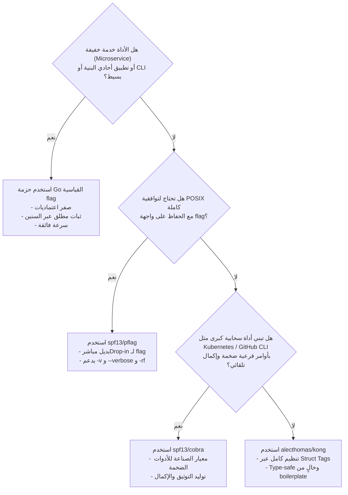

# 07. أفضل الممارسات، المحاذير الأمنية، ومقارنة البدائل (Best Practices & Comparisons)

تعتبر حزمة `flag` الخيار القياسي الأكثر موثوقية وأماناً في بيئة Go. ومع ذلك، فإن الاستخدام الاحترافي في أنظمة الإنتاج الضخمة يتطلب فهماً عميقاً لأفضل الممارسات المعمارية، وتجنب العثرات الأمنية، ومعرفة الحدود التصميمية للحزمة ومقارنتها بالبدائل الشهيرة في مجتمع Go مثل Cobra و pflag.

---

## 1. أفضل الممارسات المعمارية في بيئات الإنتاج (Production Best Practices)

### أ. هرمية التهيئة للتطبيقات الحديثة (The 12-Factor Config Hierarchy)
في معمارية التطبيقات الحديثة السحابية (Cloud-Native & 12-Factor Apps)، تتبع إدارة الإعدادات هرمية صارمة للأسبقية:

```
[الأعلى أسبقية: رايات سطر الأوامر Flags]
               ▲
[المستوى الثاني: متغيرات البيئة Environment Variables]
               ▲
[المستوى الثالث: ملفات الإعداد Configuration Files]
               ▲
[الأدنى أسبقية: القيم الافتراضية البرمجية Code Defaults]
```

#### كيف تكتشف ما إذا كان المستخدم قد مرر الراية فعلياً؟
باستخدام دالة `fs.Visit()` أو فحص خريطة `actual`، يمكنك التحقق بدقة مما إذا كانت الراية قد حُددت صراحة في سطر الأوامر لتجاوز متغيرات البيئة:

```go
// تعيين القيمة من متغير البيئة أولاً إذا وجد
if envVal := os.Getenv("APP_PORT"); envVal != "" {
    if p, err := strconv.Atoi(envVal); err == nil {
        port = p
    }
}

// دالة Visit تمر فقط على الرايات التي تم إدخالها صراحة في سطر الأوامر
fs.Visit(func(f *flag.Flag) {
    if f.Name == "port" {
        // قام المستخدم بتمرير -port صراحة، لذا تتفوق قيمته على متغير البيئة
    }
})
```

---

### ب. تجنب تلويث النطاق العام (Avoiding Global State Pollution)
أكبر خطأ يقع فيه مطورو المكتبات هو تعريف رايات عامة عبر `flag.String()` أو `flag.Int()` داخل دوال `init()` في حزم وسيطة أو مكتبات مشتركة:
- **العواقب:** تظهر هذه الرايات فجأة داخل رسائل مساعدة التطبيق النهائي `CommandLine`، وتتسبب في تضارب في الأسماء (Flag Name Collisions) وتطلق هلعاً (`panic: flag redefined`).
- **القاعدة الذهبية:** **لا تعرّف أبداً رايات في دوال `init()` داخل المكتبات المشتركة.** احصر تعريف الرايات دائماً في حزمة `main` فقط، أو وفّر دوالاً تستقبل `*flag.FlagSet` كمعامل صريح.

---

### ج. المحاذير الأمنية وحماية البيانات الحساسة (Security Considerations)

> [!CAUTION]
> **تحذير أمني شديد الأهمية:**
> إياك وتمرير كلمات المرور، أو مفاتيح التشفير، أو رموز المصادقة (API Tokens) كرايات في سطر الأوامر مثل `-password=secret`!

#### لماذا؟
1. **الظهور في جدول العمليات العام:** في أنظمة Linux/Unix، تكون وسائط سطر الأوامر لكافة العمليات مقروءة لأي مستخدم أو عملية أخرى على الخادم عبر أمر `ps aux` أو قراءة الملف `/proc/<PID>/cmdline`.
2. **التسريب في سجلات القذيفة:** تُسجل الأوامر بالكامل في ملفات تاريخ الأوامر (`~/.bash_history` أو `~/.zsh_history`).
3. **التسريب في سجلات CI/CD:** تقوم منصات الأتمتة (مثل GitHub Actions أو Jenkins) بطباعة سطر تنفيذ الأوامر بالكامل في السجلات العامة.

#### الحلول البديلة الآمنة:
- قراءة البيانات الحساسة عبر متغيرات البيئة (`os.Getenv`).
- قراءة الأسرار عبر ملفات معزولة الصلاحيات (`-secret-file=/etc/certs/key.pem`).
- قراءة كلمات المرور تفاعلياً من الـ Terminal بدون إظهار الحروف عبر `golang.org/x/term.ReadPassword`.

---

## 2. القيود المعمارية لحزمة `flag` (Architectural Limitations)

صُممت الحزمة لتكون بسيطة وخفيفة، وترتب على ذلك بعض الحدود التصميمية المقصودة:

1. **عدم دعم دمج الرايات القصيرة (No Flag Clustering):**
   - لا يمكن كتابة `-rf` لتعني `-r -f`. يجب كتابتها منفصلة دائماً.
2. **عدم التمييز بين الخيارات الطويلة والقصيرة:**
   - الحزمة لا توفر ربطاً ثنائياً للراية (Alias) مثل توفير `-v` و `--verbose` تلقائياً لنفس المتغير، بل يتطلب ذلك تسجيل الرايتين لنفس المتغير يدوياً:
     ```go
     flag.BoolVar(&verbose, "v", false, "verbose output")
     flag.BoolVar(&verbose, "verbose", false, "verbose output")
     ```
3. **انعدام الإكمال التلقائي التلقائي (No Shell Autocompletion):**
   - لا تدعم الحزمة توليد سكربتات الإكمال التلقائي لقذائف Bash أو Zsh أو Fish.
4. **توقف التحليل عند أول معامل غير راية:**
   - إذا كتبت: `mytool arg1 -flag`، فإن `-flag` ستُعتبر معامل موضعي ولن يتم تحليلها كراية لأنها أتت بعد `arg1`.

---

## 3. مقارنة شاملة مع البدائل في بيئة Go

| المعيار الهندسي | `flag` (Standard Library) | `spf13/pflag` | `spf13/cobra` | `urfave/cli` | `alecthomas/kong` |
| :--- | :--- | :--- | :--- | :--- | :--- |
| **الاعتماديات الخارجية** | **صفر (Zero Dependencies)** | خارجية | خارجية (تعتمد pflag) | خارجية | خارجية |
| **أسلوب التوصيف** | برمجي إجرائي (Imperative) | برمجي إجرائي | كائني هيكلي (Commands) | كائني هيكلي | توصيفي عبر Struct Tags |
| **معيار الصياغة** | Plan 9 / Go Style | POSIX/GNU Compliant | POSIX/GNU Compliant | POSIX/GNU Compliant | POSIX/GNU Compliant |
| **دمج الرايات القصيرة (`-rf`)**| ❌ غير مدعوم | ✅ مدعوم | ✅ مدعوم | ✅ مدعوم | ✅ مدعوم |
| **الأوامر الفرعية المتداخلة**| يدوي عبر `FlagSet` | يدوي | ✅ شجرة أوامر متكاملة | ✅ شجرة أوامر متكاملة | ✅ عبر الهياكل المتداخلة |
| **الإكمال التلقائي للـ Shell** | ❌ غير مدعوم | ❌ غير مدعوم | ✅ مدمج وقوي جداً | ✅ مدعوم | ✅ مدعوم |
| **توليد التوثيق (Man/Markdown)**| ❌ يطبع المساعدة فقط | ❌ غير مدعوم | ✅ يولد صفحات Man و MD | ✅ مدعوم | ✅ مدعوم |
| **الأداء واستهلاك الذاكرة**| **الأسرع والأقل استهلاكاً** | سريع جداً | استهلاك أعلى | استهلاك متوسط | سريع |

---

## 4. مصفوفة اتخاذ القرار الهندسي (Decision Matrix)



### متى تختار حزمة `flag` القياسية؟
1. **في خدمات الويب والبنى التحتية (Microservices & Daemons):** حيث لا تحتاج إلا لرايات بسيطة مثل `-port`, `-config`, `-env`.
2. **في الأدوات المساعدة داخل الشركات (Internal Tooling):** حيث الاستقرار وسرعة البناء وصغر حجم الملف التنفيذي هو الأولوية.
3. **في الحزم التي يجب أن تبقى خالية من أي اعتماديات خارجية (Zero External Dependencies).**
