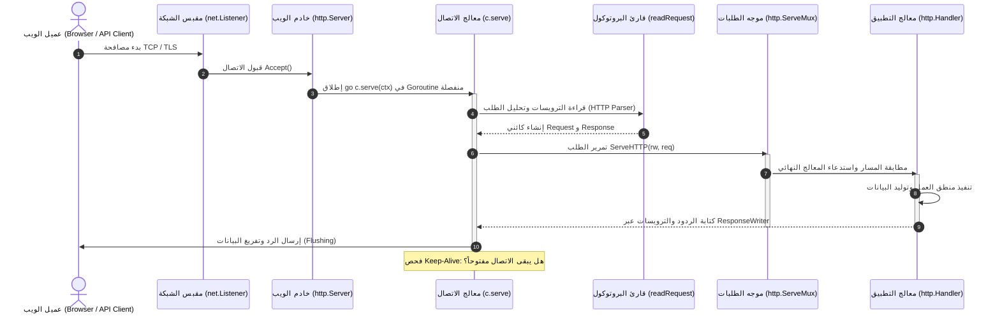

# 01. الفلسفة المعمارية ومبررات وجود حزمة `net/http`

تعتبر حزمة `net/http` في لغة Go حجر الزاوية الذي بُنيت عليه ثورة الخدمات الخلفية (Backend Services) والأنظمة السحابية الموزعة (Cloud-Native & Microservices) الحديثة. منذ صدور الإصدار الأول للغة وحتى أحدث إصداراتها (Go 1.24 / Go 1.27)، تميزت هذه الحزمة بأنها ليست مجرد مكتبة تجريدية للبروتوكول، بل هي **خادم وعميل إنتاجي متكامل وفائق الأداء (Production-Grade HTTP Server & Client)** يعتمد مباشرة على النموذج التزامني الفريد للغة Go.

---

## ⏳ السياق التاريخي ونشأة الحزمة

في لغات البرمجة التقليدية (مثل C/C++, Java, Python, Ruby)، كانت معمارية خوادم الويب تنقسم إلى مدرستين:

1. **نموذج خيط لكل اتصال (Thread-per-Connection):**
   - يقوم الخادم بإنشاء خيط نظام تشغيل (OS Thread) لكل اتصال وارد.
   - **المشكلة:** يستهلك خيط نظام التشغيل ما بين 1MB إلى 8MB من الذاكرة (Stack Space)، كما أن التبديل بين الخيوط (Context Switching) يستهلك قدراً هائلاً من دورات المعالج، مما يجعل الخادم ينهار عند الوصول إلى بضعة آلاف من الاتصالات المتزامنة (معضلة C10K).

2. **نموذج الحلقات غير الحاجبة وحلقات الأحداث (Event-Driven / Reactor Pattern):**
   - مثل Nginx أو Node.js، حيث يدير خيط واحد (أو عدد قليل من الخيوط) آلاف الاتصالات باستخدام إشعارات النظام (`epoll`, `kqueue`).
   - **المشكلة:** يتطلب هذا النموذج برمجة غير خطية تعتمد على نداءات العودة (Callbacks)، أو وعود غير متزامنة (Async/Await State Machines)، مما يزيد من تعقيد الشيفرة، ويجعل تصحيح الأخطاء (Debugging) واستخراج التتبع (Stack Traces) كابوساً هندسياً، مع خطر تجميد الخادم كاملاً إذا تم حظر الحلقة البرمجية بعملية حسابية واحدة.

### ولادة `net/http` في Go

صمم مهندسو Go (وعلى رأسهم Rob Pike و Brad Fitzpatrick) حزمة `net/http` لتقديم نموذج ثالث يجمع بين ميزتي النموذجين السابقين:
> **اكتب برمجتك بشكل خطي وحاجب وتتابعي بسيط (Sequential Blocking Style)، ودع مُجدول Go والمكتبة القياسية يديران ملايين الاتصالات في الخلفية بنموذج أحداث غير حاجب عبر المقابس الخفيفة (Goroutines & Netpoller).**

---

## 🛑 المشاكل الجوهرية التي تعالجها حزمة `net/http`

### 1. سد الفجوة بين مقابس TCP الخام وبروتوكول التطبيق (Bridging Raw Sockets to Application Layer)

بروتوكول HTTP ليس سوى تدفق نصوص وتنسيقات عبر اتصال TCP موثوق. التعامل المباشر مع مقابس `net.Conn` يفرض على المطور:

- قراءة وتجميع حزم البيانات المجزأة (TCP Packet Fragmentation).
- تحليل أسطر الطلبات (Request Line) والترويسات (Headers) بدقة متناهية وفق مواصفات RFCs.
- معالجة أنواع الترميز المختلفة (Content-Length مقابل Chunked Transfer Encoding).
- إدارة خطوط أنابيب الاتصال (HTTP Pipelining) والترقية لبروتوكولات أخرى (WebSockets عبر Hijacking).

**الحل عبر `net/http`:**
تقوم الحزمة بتغليف هذه التعقيدات بالكامل خلف كائنات مهيكلة ونظيفة: `http.Request` و `http.Response`، مع معالجة ذاتية صارمة ومحمية من الثغرات الأمنية (مثل Smuggling و Header Injection).

---

### 2. نموذج معالجة الاتصالات المتزامنة (Goroutine-Per-Connection Architecture)

بدلاً من تخصيص خيط نظام تشغيل ثقيل، يقوم خادم Go بإطلاق **Goroutine منفصلة** لكل اتصال شبكي فور قبوله من المقبس (`net.Listener`):

```text
                        ┌──────────────────┐
                        │   net.Listener   │
                        └────────┬─────────┘
                                 │ Accept()
                                 ▼
                     ┌───────────────────────┐
                     │   Listener Loop       │
                     │  (Main Server Loop)   │
                     └──────────┬────────────┘
                                │
        ┌───────────────────────┼───────────────────────┐
        │ go c.serve(ctx)       │ go c.serve(ctx)       │ go c.serve(ctx)
        ▼                       ▼                       ▼
┌───────────────┐       ┌───────────────┐       ┌───────────────┐
│  Goroutine 1  │       │  Goroutine 2  │       │  Goroutine 3  │
│ Connection #1 │       │ Connection #2 │       │ Connection #3 │
│  (HTTP/1.1)   │       │   (HTTP/2)    │       │  (Keep-Alive) │
└───────────────┘       └───────────────┘       └───────────────┘
```

- تبدأ الـ Goroutine بذاكرة ضئيلة جداً (تقارب 2KB وتتوسع ديناميكياً).
- يُعزل كل طلب تماماً عن الطلبات الأخرى؛ فإذا واجه معالج معين تعليقاً في قاعدة بيانات، لا تتأثر باقي الطلبات قيد المعالجة.
- تستغل الحزمة `netpoller` الخاص بلغة Go، لتحويل كافة عمليات القراءة والكتابة الشبكية الحاجبة إلى عمليات غير حاجة على مستوى النظام (I/O Multiplexing عبر `epoll` على لينكس).

---

### 3. الترقية الشفافة والتكامل التام بين بروتوكولات HTTP/1.1 و HTTP/2 و HTTP/3

في معظم المنظومات البرمجية، يتطلب التبديل إلى HTTP/2 تثبيت طبقات وسيطة (Reverse Proxies) أو إعادة كتابة المعالجات للتعامل مع الإطارات (Frames) والتدفقات المعددة (Multiplexed Streams).

**الحل عبر `net/http`:**

- **دعم مدمج وشفاف:** بمجرد تشغيل خادم آمن عبر `ListenAndServeTLS` أو استخدام عميل آمن عبر HTTPS، تفاوض حزمة `net/http` تلقائياً عبر ALPN (Application-Layer Protocol Negotiation) لاستخدام HTTP/2.
- **واجهة برمجية موحدة:** نفس واجهة `http.Handler` ودوال `http.ResponseWriter` و `http.Request` تعمل بسلاسة تامة وبنفس الشيفرة سواء كان البروتوكول المتفاوض عليه هو HTTP/1.1 أو HTTP/2.
- **تخصيص البروتوكولات (Go 1.24+):** إمكانية تحديد بروتوكولات معينة عبر الحقل `Protocols` في الخادم أو العميل، مع دعم تشغيل HTTP/2 غير المشفر (h2c).

---

### 4. كفاءة الذاكرة عبر النموذج الدفاق (Streaming vs Buffering)

تتعامل الخوادم الحديثة مع تدفقات بيانات ضخمة (رفع ملفات، بث مقاطع الفيديو، تدفق أحداث الخادم Server-Sent Events). إذا قامت المكتبة بقراءة كامل محتوى الطلب أو الرد في الذاكرة (In-Memory Buffer) قبل تمريره للتطبيق، فسيؤدي ذلك إلى استنزاف الذاكرة وانهيار الخادم (OOM Crash).

**الحل عبر `net/http`:**

- جسم الطلب (`r.Body`) وجسم الرد (`resp.Body`) عبارة عن واجهات تدفق متسلسلة (`io.ReadCloser`).
- تدفق البيانات يتم مباشرة من مقبس الشبكة إلى المعالج عبر مخازن مؤقتة يعاد استخدامها (`sync.Pool` لتقليل ضغط Garbage Collection).
- دعم إرسال البيانات المباشر للعميل على دفعات دون انتظار اكتمال المعالجة عبر واجهة `http.Flusher` أو الأداة الأحدث `http.ResponseController`.

---

### 5. دورة الحياة المحكومة بالسياق (Context-Aware Lifecycle & Cancellation)

قبل تكامل حزمة `context` في صلب `net/http`، كان انقطاع اتصال العميل يترك الخادم يواصل عمليات المعالجة الباهظة في قواعد البيانات والخدمات السحابية.

**الحل عبر `net/http`:**

- يرتبط كل `http.Request` بسياق حياة ينتهي تلقائياً عند انقطاع الاتصال:

  ```go
  ctx := r.Context()
  ```

- إذا أغلق العميل المتصفح أو انقطع اتصاله، تُغلق القناة `<-ctx.Done()` فوراً، مما يمكن كافة العمليات الفرعية المشتقة (مثل استعلامات SQL عبر `database/sql` أو طلبات gRPC) من التوقف الشلالي الفوري وتحرير الموارد.

---

## 🏛️ الفلسفة التصميمية والمعمارية (Architectural Philosophy)

ترتكز معمارية حزمة `net/http` على مبادئ هندسية صارمة تجعلها مرجعاً في هندسة البرمجيات:

### 1. بساطة الواجهة والتجريد المقتصد (Minimal Interface Abstraction)

جوهر خادم الويب في Go يختزله تعريف واحد مدهش:

```go
type Handler interface {
    ServeHTTP(ResponseWriter, *Request)
}
```

بهذه الواجهة الوحيدة التي لا تحتوي سوى دالة واحدة، يمكنك بناء كل شيء: من موجه طلبات بسيط إلى وسائط معقدة (Middlewares)، أو بوابات عبور ميكروية (API Gateways)، أو خوادم ملفات ثابتة. هذا التجريد البسيط مكن المجتمع البرمجي من بناء منظومة هائلة من المكتبات دون الحاجة إلى أطر عمل ثقيلة.

### 2. التماثل بين العميل والخادم (Client/Server Symmetry)

تصمم الحزمة كلاً من العميل والخادم كطرفين متناظرين لنفس البروتوكول:

- الخادم يقرأ `Request` ويكتب على `ResponseWriter`.
- العميل ينشئ `Request` ويرسله عبر كائن `RoundTripper` ليتلقى `Response`.
- كلاهما يتشارك نفس تمثيل الترويسات (`http.Header`)، والكوكيز (`http.Cookie`)، وحالات البروتوكول (`http.Status...`).

### 3. خلو المعالجات من الحالة وتعدد المسارات الآمن (Stateless & Concurrency-Safe)

كافة مكونات الخادم الافتراضية مصممة لتكون آمنة خيطياً (Goroutine-Safe):

- يُطلب من مطور التطبيق ألا يخزن أي حالة خاصة بطلب معين داخل هيكل المعالج نفسه ما لم تكن محمية بأقفال.
- البيانات الخاصة بالطلب تمرر عبر معلمات دالة `ServeHTTP` أو تُحمل بأمان داخل سياق الطلب `r.Context()`.

### 4. التكوين الافتراضي المحكم مع القابلية القصوى للتخصيص (Sensible Defaults & Full Extensibility)

توفر الحزمة كائنات افتراضية تعمل بضغطة زر واحدة للمبتدئين (`http.DefaultClient`, `http.DefaultServeMux`, `http.ListenAndServe`)، ولكنها في الوقت نفسه توفر هياكل كاملة تتيح للمهندس المحترف التحكم في أدق التفاصيل:

- تخصيص مجمع الاتصالات (Connection Pooling) وحدود الخمول عبر `http.Transport`.
- ضبط المهل الزمنية الصارمة للمنع من هجمات Slowloris عبر `http.Server`.
- التوجيه المتقدم والفرز عبر `http.ServeMux` الحديث في Go 1.22+.
- حماية الهجمات العابرة للمواقع عبر `http.CrossOriginProtection` المضاف حديثاً في Go 1.24+/1.27.

---

## 🗺️ رحلة الطلب من مقبس الشبكة إلى المعالج البرمجي

يوضح الرسم التالي التدفق المعماري الشامل لكيفية استقبال ومعالجة طلب HTTP داخل الخادم:



---

## 📌 ملخص الفصل

حزمة `net/http` ليست مجرد تطبيق بروتوكولي بسيط، بل هي **تحفة معمارية في تصميم الأنظمة الموزعة**. نجحت الحزمة في إقصاء التعقيد التزامني، ووفرت إنتاجية هائلة، وجعلت من لغة Go الخيار الأول عالمياً لبناء البنى التحتية السحابية (مثل Kubernetes و Docker و Terraform) والخدمات فائقة الأداء.
