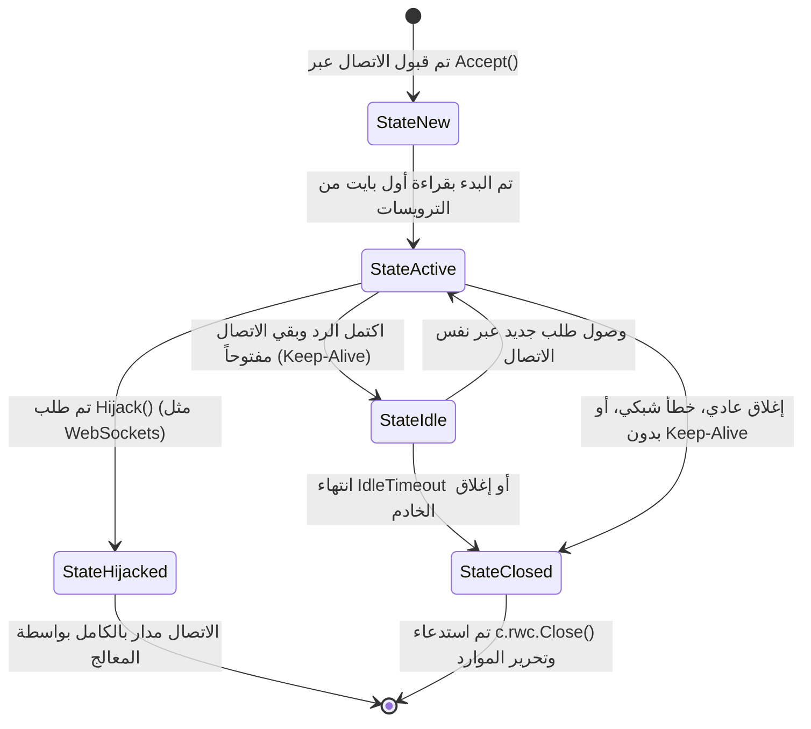

# 03. معمارية الخادم ودورة حياة الاتصال في `net/http`

يقدم خادم HTTP في لغة Go (`http.Server`) معمارية هجينة تجمع بين السهولة الفائقة والصلابة الهندسية الصارمة. في هذا الفصل، سنقوم بتشريح دقيق لهيكل الخادم، وكيفية تنفيذه للحلقة الرئيسية لقبول المقابس، وحالات الاتصال، واستراتيجيات الإيقاف السلس (Graceful Shutdown)، وقواعد ضبط المهل الزمنية في البيئات الإنتاجية.

---

## 🏛️ تشريح هيكل الخادم: `http.Server`

يُعرّف الهيكل الأساسي في ملف [`/usr/local/go/src/net/http/server.go`](file:///usr/local/go/src/net/http/server.go):

```go
type Server struct {
    Addr                         string
    Handler                      Handler
    DisableGeneralOptionsHandler bool
    TLSConfig                    *tls.Config
    ReadTimeout                  time.Duration
    ReadHeaderTimeout            time.Duration
    WriteTimeout                 time.Duration
    IdleTimeout                  time.Duration
    MaxHeaderBytes               int
    TLSNextProto                 map[string]func(*Server, *tls.Conn, Handler)
    ConnState                    func(net.Conn, ConnState)
    ErrorLog                     *log.Logger
    BaseContext                  func(net.Listener) context.Context
    ConnContext                  func(ctx context.Context, c net.Conn) context.Context
    HTTP2                        *HTTP2Config
    Protocols                    *Protocols
}
```

### تحليل الحقول المعمارية بالتفصيل

| الحقل | النوع | الوظيفة الهندسية والأهمية الإنتاجية |
| :--- | :--- | :--- |
| **`Addr`** | `string` | عنوان TCP والمنفذ المراد الاستماع عليه (مثل `":8080"` أو `"127.0.0.1:443"`). إذا ترك فارغاً يُفترض منفذ HTTP القياسي (`:80`). |
| **`Handler`** | `Handler` | الموجه الرئيسي للطلبات الواردة. إذا كان `nil`، يستخدم الخادم الموجه العام التلقائي `http.DefaultServeMux`. |
| **`ReadHeaderTimeout`** | `time.Duration` | أقصى مدة مسموح بها للعميل لإرسال سطر الطلب وترويساته. **هذا أهم حقل للحماية من هجمات Slowloris.** |
| **`ReadTimeout`** | `time.Duration` | أقصى مدة لقراءة الطلب كاملاً، متضمناً قراءة جسم الطلب (`Body`). |
| **`WriteTimeout`** | `time.Duration` | أقصى مدة لكتابة استجابة الخادم كاملة للعميل. تبدأ من لحظة الانتهاء من قراءة الترويسات. |
| **`IdleTimeout`** | `time.Duration` | الحد الأقصى لبقاء اتصال Keep-Alive مفتوحاً وخاملاً بانتظار وصول طلب تالٍ. |
| **`MaxHeaderBytes`** | `int` | أقصى حجم بالبايت مسموح به لقراءة ترويسات الطلب. الافتراضي هو 1 ميغابايت (`1 << 20`). |
| **`ConnState`** | `func(net.Conn, ConnState)` | دالة استدعاء خلفية ترصد تحول حالات الاتصال، وتُستخدم لبناء مقاييس المراقبة الحية (Metrics & Telemetry). |
| **`BaseContext`** | `func(net.Listener) context.Context` | تسمح بتوفير سياق أساسي مشترك (Base Context) ترث منه كافة اتصالات الخادم. |
| **`ConnContext`** | `func(ctx context.Context, c net.Conn) context.Context` | تسمح بحقن بيانات خاصة بالاتصال الفردي (مثل عنوان الـ IP المشتق) داخل سياق الطلب. |
| **`Protocols`** | `*Protocols` | ميزة حديثة (Go 1.24+) لتحديد البروتوكولات المقبولة صراحة، مثل السماح بـ HTTP/2 غير المشفر (`UnencryptedHTTP2` / h2c). |
| **`HTTP2`** | `*HTTP2Config` | ضبط الإعدادات الدقيقة لبروتوكول HTTP/2 المدمج في الخادم. |

---

## 🚀 الدوال العامة لتشغيل الخادم

توفر الحزمة أربع دوال رئيسية لتشغيل الخادم، تنقسم إلى دوال عامة مريحة، وأساليب ملموسة تابعة لكائن `Server`:

### 1. دوال التشغيل العامة السريعة (Convenience Helpers)
- `http.ListenAndServe(addr string, handler Handler) error`: تشغل خادم HTTP عادي على المقبس المحدد.
- `http.ListenAndServeTLS(addr, certFile, keyFile string, handler Handler) error`: تشغل خادم HTTPS مشفر بعد تحميل ملفات الشهادة والمفتاح الخاص.

### 2. دوال التشغيل المرنة مع مقابس مسبقة الربط (Pre-bound Listeners)
- `(s *Server) Serve(l net.Listener) error`: تقبل اتصالات واردة على مقبس جاهز تم فتحه مسبقاً عبر `net.Listen("tcp", addr)`.
- `(s *Server) ServeTLS(l net.Listener, certFile, keyFile string) error`: تقبل اتصالات مشفرة عبر مقبس موجود.

> [!TIP]
> في البيئات السحابية والأنظمة الصارمة، يُفضل دائماً استخدام `s.Serve(l)` مع فتح المقبس يدوياً عبر `net.Listen`. هذا يضمن الإخفاق السريع (Fail-Fast) الفوري إذا كان المنفذ محجوزاً قبل بدء تشغيل سائر مكونات التطبيق.

---

## 🔄 الدورة الحياتية للاتصال الداخلي (`conn.serve`)

عندما يستقبل الخادم اتصالاً جديداً عبر `Listener.Accept()`، تبدأ دورة حياة محكمة تُدار بالكامل في ملف `server.go` عبر الدالة الداخلية غير المصدّرة:
```go
go c.serve(connCtx)
```



### تفصيل حالات الاتصال: `ConnState`

```go
type ConnState int

const (
    StateNew ConnState = iota
    StateActive
    StateIdle
    StateHijacked
    StateClosed
)
```

1. **`StateNew` (اتصال جديد):** تم قبول مقبس الـ TCP للتو، ولكن لم يتم استقبال أي بايت بعد.
2. **`StateActive` (نشط):** بدأ العميل في إرسال الترويسات أو جسم الطلب، أو أن الخادم بصدد كتابة الرد.
3. **`StateIdle` (خامل):** أنهى الخادم معالجة الطلب، وأرسل كامل الرد، والاتصال لا يزال مفتوحاً بانتظار الطلب التالي استناداً لميزة `Keep-Alive`.
4. **`StateHijacked` (مختطف):** تم استدعاء `Hijack()` وانتقلت إدارة المقبس بالكامل للمعالج التطبيقي (مثل WebSocket). يتوقف خادم HTTP القياسي عن مراقبة هذا الاتصال نهائياً.
5. **`StateClosed` (مغلق):** تم إنهاء وإغلاق مقبس الـ TCP وتحرير كافة الموارد والمخازن المؤقتة.

---

## 🛡️ استعادة الانهيارات وميزة `ErrAbortHandler`

### كيف يحمي الخادم نفسه من الانهيار التام؟
إذا حدث خطأ غير معالج داخل دالة المعالج واستدعى `panic()`، فإن خادم Go **لا ينهار كلياً**، بل يحتوي على آلية تعافٍ ذكية داخل دالة الاتصال:

```go
defer func() {
    if err := recover(); err != nil && err != ErrAbortHandler {
        const size = 64 << 10
        buf := make([]byte, size)
        buf = buf[:runtime.Stack(buf, false)]
        c.server.logf("http: panic serving %v: %v\n%s", c.remoteAddr, err, buf)
        c.close()
    }
}()
```

### خطأ الإجهاض الصامت: `http.ErrAbortHandler`
في بعض الأحيان، يحتاج المطور لقطع معالجة الطلب وإنهائه فوراً من داخل طبقة وسيطة عميقة دون إرسال أي رد إضافي ودون تلويث سجلات الخادم بطباعة الـ Stack Trace:
```go
panic(http.ErrAbortHandler)
```
يتعرف الخادم على هذه القيمة الخاصة (`ErrAbortHandler`) ويعلم أن الإجهاض كان متعمداً ومقصوداً، فيغلق الاتصال بهدوء دون تسجيل أي خطأ في الـ Logger.

---

## 🛑 الإيقاف السلس واستنزاف الاتصالات (`Graceful Shutdown`)

يعد إيقاف الخادم دون إسقاط اتصالات العملاء النشطة (Zero-Downtime Rolling Deployments) من أهم التحديات في هندسة النظم. توفر الحزمة طريقتين للإغلاق:

### 1. الإغلاق القسري المباشر: `(s *Server) Close() error`
- يغلق مقابس الاستماع (`Listeners`) فوراً.
- يغلق كافة الاتصالات النشطة والخاملة في اللحظة نفسها.
- يؤدي إلى انقطاع فجائي للطلبات قيد المعالجة (Connection Reset by Peer).

---

### 2. الإيقاف السلس الذكي: `(s *Server) Shutdown(ctx context.Context) error`

تنفذ دالة `Shutdown` خوارزمية هندسية دقيقة تتكون من المراحل التالية:

```text
1. ضبط علم الإغلاق (s.inShutdown = true)
    لمنع قبول أي طلبات جديدة.
                    │
                    ▼
2. إغلاق مقابس الاستماع (ln.Close())
   تتحرر المنافذ فوراً وتفشل أي محاولات اتصال جديدة.
                    │
                    ▼
3. تشغيل دوال الإشعار المسجلة
   تنفيذ كافة الدوال المسجلة مسبقاً عبر RegisterOnShutdown() بالتوازي.
                    │
                    ▼
4. إغلاق كافة الاتصالات الخاملة (Close Idle Connections)
   إنهاء فوري لاتصالات Keep-Alive التي لا تعالج طلباً حالياً.
                    │
                    ▼
5. استنزاف الاتصالات النشطة (Drain Loop with Exponential Backoff & Jitter)
   ينتظر الخادم اكتمال معالجة الطلبات النشطة عبر حلقة فحص متزايدة المهلة
   تبدأ من 1ms وتتضاعف حتى 500ms مع إضافة عشوائية (Jitter).
                    │
                    ▼
6. الخروج عند الصفر أو انتهاء مهلة السياق (Context Timeout)
   إذا انتهى وقت ctx قبل اكتمال الطلبات، يُعاد ctx.Err() وتُقفل المقابس المتبقية.
```

### مثال تطبيقي نموذجي للإيقاف السلس
```go
func RunServer(server *http.Server) error {
    serverErrors := make(chan error, 1)
    go func() {
        log.Printf("بدء تشغيل الخادم على %s", server.Addr)
        serverErrors <- server.ListenAndServe()
    }()

    shutdown := make(chan os.Signal, 1)
    signal.Notify(shutdown, os.Interrupt, syscall.SIGTERM)

    select {
    case err := <-serverErrors:
        return fmt.Errorf("خطأ فادح في تشغيل الخادم: %w", err)

    case sig := <-shutdown:
        log.Printf("استقبال إشارة الإيقاف %v - بدء الإغلاق السلس...", sig)

        ctx, cancel := context.WithTimeout(context.Background(), 15*time.Second)
        defer cancel()

        if err := server.Shutdown(ctx); err != nil {
            server.Close() // إغلاق قسري إذا تجاوزت المدة 15 ثانية
            return fmt.Errorf("فشل الإيقاف السلس: %w", err)
        }
        log.Println("تم إيقاف الخادم واستنزاف كافة الاتصالات بسلام.")
    }
    return nil
}
```

---

## 🔒 الإعدادات الإنتاجية المحصنة (Production Hardening)

> [!CAUTION]
> **الخطر القاتل في القيم الافتراضية:**
> القيمة الصفرية (`time.Duration(0)`) في حقول المهل الزمنية تعني **عدم وجود مهلة إطلاقاً (Infinite Timeout)**!
> تشغيل خادم في الإنتاج عبر `http.ListenAndServe(":8080", handler)` يجعله عرضة بنسبة 100% لهجمات حجب الخدمة (Slowloris DoS)، حيث يقوم المهاجم بفتح آلاف الاتصالات وإرسال بايت واحد كل دقيقة، مما يشغل كافة الـ Goroutines وموارد النظام حتى ينهار الخادم!

### جدول ضبط المهل الإنتاجية الموصى بها

| المتغير | القيمة الموصى بها | الهدف والوقاية |
| :--- | :--- | :--- |
| **`ReadHeaderTimeout`** | `2s` إلى `5s` | القضاء النهائي على هجمات Slowloris. |
| **`ReadTimeout`** | `10s` إلى `30s` | حماية الخادم من العملاء البطيئين أثناء رفع البيانات الكبيرة. |
| **`WriteTimeout`** | `15s` إلى `60s` | منع بقاء الاتصال معلقاً إذا توقف العميل عن قراءة الرد. |
| **`IdleTimeout`** | `60s` إلى `120s` | إعادة تدوير اتصالات Keep-Alive الخاملة وتفريغ الذاكرة. |
| **`MaxHeaderBytes`** | `1 << 20` (1MB) | منع استهلاك الذاكرة عبر ترويسات ضخمة خبيثة. |

### قالب هيكل الخادم الإنتاجي المثالي
```go
srv := &http.Server{
    Addr:              ":8443",
    Handler:           mux,
    ReadHeaderTimeout: 5 * time.Second,
    ReadTimeout:       15 * time.Second,
    WriteTimeout:      30 * time.Second,
    IdleTimeout:       120 * time.Second,
    MaxHeaderBytes:    1 << 20, // 1 Megabyte
}
```
