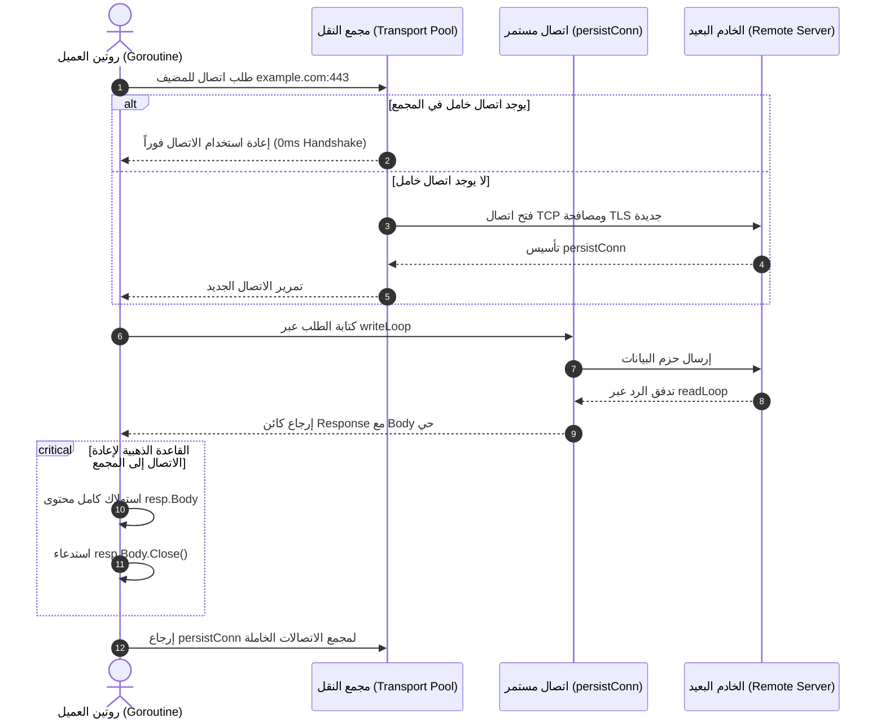

# 05. معمارية العميل وطبقة النقل الشبكي (`Client` & `Transport`)

تمتلك لغة Go واحداً من أكفأ وأقوى عملاء الـ HTTP في لغات البرمجة الحديثة. ومع ذلك، فإن بساطة واجهة الاستخدام السطحية تُخفي تحتها منظومة شبكية بالغة التعقيد لإدارة الاتصالات المجمعة (Connection Pooling)، ومصافحات TLS، والترقيات التلقائية لبروتوكول HTTP/2.

---

## 🏛️ المعمارية ثنائية الطبقات (Dual-Layer Architecture)

ينقسم عميل الويب في حزمة `net/http` بدقة متناهية إلى طبقتين هندسيتين منفصلتين:

```text
 ┌────────────────────────────────────────────────────────┐
 │                      http.Client                       │
 │  (الطبقة العليا: إدارة الأعمال والجلسات والمهل الشاملة)     │
 │   • إدارة المهل الكلية للطلب (Timeout)                  │
 │   • تتبع سياسات إعادة التوجيه (CheckRedirect)          │
 │   • إدارة الكوكيز وحفظ الجلسات (CookieJar)              │
 └───────────────────────────┬────────────────────────────┘
                             │ RoundTrip(req)
                             ▼
 ┌────────────────────────────────────────────────────────┐
 │                     http.Transport                     │
 │  (الطبقة السفلى: النقل الشبكي وإدارة مقابس الاتصال)        │
 │   • فتح مقابس TCP وتشفير TLS (DialContext)             │
 │   • مجمع الاتصالات الخاملة (Connection Pooling)        │
 │   • التفاوض التلقائي على البروتوكول (ALPN HTTP/2)      │
 │   • ضغط وفك ضغط البيانات (Gzip Decompression)           │
 │   • توجيه البيانات عبر الوكلاء (Proxies)               │
 └────────────────────────────────────────────────────────┘
```

---

## 1. تشريح هيكل العميل: `http.Client`

يُعرّف الهيكل في ملف [`/usr/local/go/src/net/http/client.go`](file:///usr/local/go/src/net/http/client.go):

```go
type Client struct {
    Transport     RoundTripper
    CheckRedirect func(req *Request, via []*Request) error
    Jar           CookieJar
    Timeout       time.Duration
}
```

### تحليل الحقول الأساسية

- **`Transport RoundTripper`:** محرك النقل الأساسي. إذا كان `nil`، يستخدم العميل تلقائياً مجمع الاتصالات العام `http.DefaultTransport`.
- **`Timeout time.Duration`:** المهلة الزمنية الشاملة لكامل دورة حياة الطلب (End-to-End). تبدأ من لحظة بدء فتح الاتصال ومصافحة TLS، مروراً بكافة طلبات إعادة التوجيه، وحتى الانتهاء الكامل من قراءة جسم الرد (`resp.Body`). القيمة الصفرية تعني عدم وجود مهلة إطلاقاً.
- **`CheckRedirect`:** دالة مخصصة تتحكم في سلوك العميل عند استقبال رموز إعادة التوجيه (3xx). بشكل افتراضي، يتوقف العميل تلقائياً بعد 10 محاولات توجيه متتالية لمنع الحلقات اللانهائية.
  - للتحكم في التوجيه أو منعه نهائياً واسترجاع الرد الفعلي، تعيد الدالة الخطأ الخاص: `http.ErrUseLastResponse`.
- **`Jar CookieJar`:** كائن تخزين الكوكيز وتمريرها تلقائياً مع كل طلب يتطابق مع النطاق.

### الدوال والأساليب المتاحة على كائن العميل

| الأسلوب | الوظيفة |
| :--- | :--- |
| **`Do(req *Request) (*Response, error)`** | **المحرك الرئيسي والأساسي لكافة الطلبات.** يأخذ كائناً مهيأً بالكامل ويديره عبر طبقة النقل ويعيد الرد. |
| **`Get(url string) (*Response, error)`** | اختصار مريح لإرسال طلب `GET` سريع إلى الرابط المحدد. |
| **`Head(url string) (*Response, error)`** | إرسال طلب `HEAD` لاستطلاع ترويسات المورد دون تحميل جسمه. |
| **`Post(url, contentType string, body io.Reader)`** | إرسال طلب `POST` مع تحديد ترويسة نوع المحتوى ومصدر البيانات. |
| **`PostForm(url string, data url.Values)`** | إرسال طلب `POST` مشفر بتنسيق النماذج القياسي (`application/x-www-form-urlencoded`). |
| **`CloseIdleConnections()`** | إغلاق كافة الاتصالات الخاملة المحفوظة في مجمع النقل لتفريغ الذاكرة فوراً. |

> [!CAUTION]
> **الخطر القاتل لكائن `http.DefaultClient` والدوال العامة (`http.Get`):**
> الكائن الافتراضي `http.DefaultClient` يمتلك مهلة صفرية (`Timeout: 0`).
> إذا استخدمت `http.Get("https://api.external.com")` في خدمة إنتاجية وتوقفت الخدمة الخارجية أو بطأت في الاستجابة، ستظل الـ Goroutine معلقة إلى الأبد في الذاكرة. ومع تكرار الطلبات، يحدث تسريب هائل للـ Goroutines وتنهار الخدمة كلياً!
> **القاعدة الصارمة:** يُحظر استخدام `http.Get` أو `http.DefaultClient` في بيئات الإنتاج، ويجب دائماً إنشاء `&http.Client{}` بمهلة زمنية محددة.

---

## 2. تشريح طبقة النقل: `http.Transport`

يُعرّف الهيكل في ملف [`/usr/local/go/src/net/http/transport.go`](file:///usr/local/go/src/net/http/transport.go):

```go
type Transport struct {
    Proxy                  func(*Request) (*url.URL, error)
    DialContext            func(ctx context.Context, network, addr string) (net.Conn, error)
    DialTLSContext         func(ctx context.Context, network, addr string) (net.Conn, error)
    TLSClientConfig        *tls.Config
    TLSHandshakeTimeout    time.Duration
    DisableKeepAlives      bool
    DisableCompression     bool
    MaxIdleConns           int
    MaxIdleConnsPerHost    int
    MaxConnsPerHost        int
    IdleConnTimeout        time.Duration
    ResponseHeaderTimeout  time.Duration
    ExpectContinueTimeout  time.Duration
    ForceAttemptHTTP2      bool
    Protocols              *Protocols
    HTTP2                  *HTTP2Config
}
```

### الفخ الهندسي الأكثر شهرة: `DefaultMaxIdleConnsPerHost = 2`

في إعدادات `DefaultTransport` الافتراضية داخل Go:

```go
const DefaultMaxIdleConnsPerHost = 2
```

**الكارثة في معمارية الخدمات المصغرة (Microservices):**
إذا كان لديك خدمة Go ترسل 500 طلب متزامن في الثانية إلى خدمة خلفية واحدة محددة (مثل قاعدة بيانات أو خدمة دفع):

1. سيقوم `Transport` بفتح مئات الاتصالات لمعالجة الطلبات.
2. عند انتهاء كل طلب، يحاول العميل الاحتفاظ بالاتصال في مجمع الـ Keep-Alive لإعادة استخدامه.
3. يجد العميل أن الحد الأقصى المسموح به للمضيف الواحد هو **اتصالان اثنان فقط (`2`)**!
4. النتيجة: يقوم العميل فوراً بإغلاق الـ 498 اتصالاً المتبقية!
5. تتراكم آلاف مقابس الـ TCP في حالة `TIME_WAIT` على مستوى نظام التشغيل، ويستهلك المعالج في مصافحات TCP و TLS جديدة لكل طلب، حتى تنهار منافذ النظام (Ephemeral Port Exhaustion)!

**الحل:** يجب دائماً رفع هذا المتغير في الأنظمة عالية الأحمال:

```go
customTransport := &http.Transport{
    MaxIdleConns:        1000,
    MaxIdleConnsPerHost: 200, // رفع الحد لمنع تفكيك الاتصالات المتكرر
    IdleConnTimeout:     90 * time.Second,
}
```

---

## 3. التشريح الداخلي لمجمع الاتصالات (`persistConn`)

تدير حزمة `net/http` الاتصالات الخاملة عبر كائن داخلي غير مصدّر يُدعى `persistConn`.



### القاعدة الجوهرية: سر إغلاق `resp.Body.Close()`
>
> **إذا لم تقم بقراءة كامل محتوى `resp.Body` حتى النهاية (`io.EOF`) واستدعاء `.Close()`، فإن اتصال الـ TCP الأساسي لن يعود إلى مجمع الـ Keep-Alive، بل سيتم إغلاقه وإسقاطه نهائياً!**

السبب الهندسي: لكي يكون الاتصال آمناً لإرسال طلب جديد، يجب ألا يحتوي تدفق المقبس على أي بايت متبقٍ من الرد السابق. فإذا أهمل المبرمج استهلاك الجسم، تضطر حزمة `net/http` لقتل الاتصال تجنباً لتداخل البيانات.

---

## 4. إدارة المهل الزمنية والإلغاء عبر `context.Context`

الطريقة القياسية والوحيدة المقبولة هندسياً لإرسال طلبات العميل في Go الحديثة هي دمج السياق:

```go
func fetchUserData(ctx context.Context, userID string) (*User, error) {
    // 1. تحديد مهلة مخصصة أو استخدام سياق الطلب الأصلي
    reqCtx, cancel := context.WithTimeout(ctx, 3*time.Second)
    defer cancel()

    req, err := http.NewRequestWithContext(reqCtx, http.MethodGet, "https://api.example.com/users/"+userID, nil)
    if err != nil {
        return nil, err
    }

    req.Header.Set("Accept", "application/json")
    req.Header.Set("User-Agent", "MyProductionService/1.0")

    resp, err := httpClient.Do(req)
    if err != nil {
        return nil, fmt.Errorf("فشل استدعاء الخدمة: %w", err)
    }
    defer resp.Body.Close()

    if resp.StatusCode != http.StatusOK {
        return nil, fmt.Errorf("استجابة غير متوقعة: %d", resp.StatusCode)
    }

    var user User
    if err := json.NewDecoder(resp.Body).Decode(&user); err != nil {
        return nil, err
    }
    return &user, nil
}
```

---

## 5. تكوين العميل الإنتاجي الكامل (Production-Ready Client Template)

```go
func NewProductionHTTPClient() *http.Client {
    transport := &http.Transport{
        Proxy: http.ProxyFromEnvironment, // احترام متغيرات البيئة HTTP_PROXY
        DialContext: (&net.Dialer{
            Timeout:   5 * time.Second,  // مهلة تأسيس اتصال TCP
            KeepAlive: 30 * time.Second, // نبضات فحص صحة المقبس
        }).DialContext,
        ForceAttemptHTTP2:     true,             // تفعيل HTTP/2 التلقائي عبر TLS
        MaxIdleConns:          500,              // سعة المجمع الإجمالية
        MaxIdleConnsPerHost:   100,              // سعة المجمع لكل خادم فردي
        MaxConnsPerHost:       0,                // غير محدود (أو حدده حسب سعة خوادمك)
        IdleConnTimeout:       90 * time.Second, // مهلة تفريغ الاتصال الخامل
        TLSHandshakeTimeout:   5 * time.Second,  // أقصى مدة لمصافحة التشفير
        ExpectContinueTimeout: 1 * time.Second,
        ResponseHeaderTimeout: 10 * time.Second, // أقصى مدة لانتظار الترويسات من الخادم
    }

    return &http.Client{
        Transport: transport,
        Timeout:   15 * time.Second, // مهلة إجمالية للطلب من البداية للنهاية
    }
}
```
