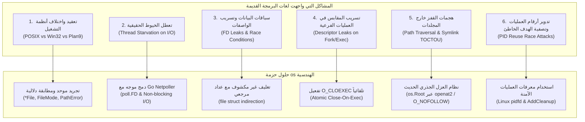
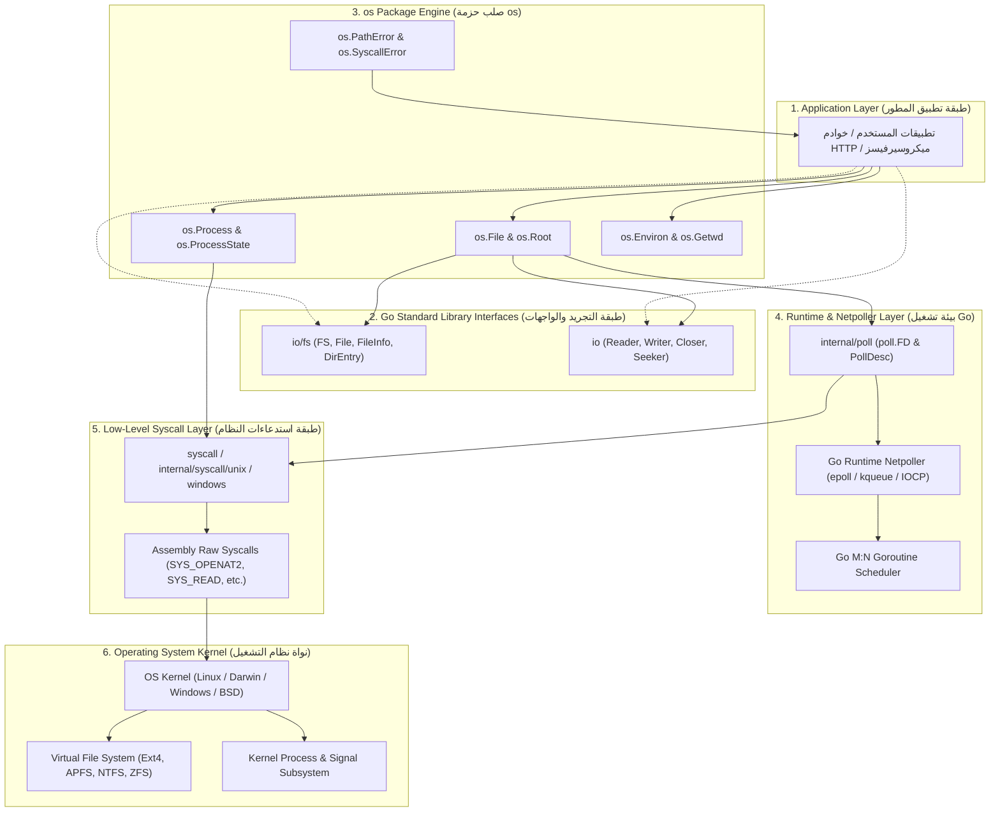

# 01. الفلسفة المعمارية ومبررات وجود حزمة `os`

تعتبر حزمة `os` (Operating System) العمود الفقري لنظام التشغيل التجريدي في لغة Go. تمثل هذه الحزمة حلقة الوصل الحيوية بين بيئة تشغيل Go ذات التزامن الهائل (M:N Goroutines Scheduler) وبين نواة نظام التشغيل الحقيقي (OS Kernel) وموارده الصلبة: ملفات، مسارات، عمليات، أنابيب، وبيئة عمل برمجية.

---

## ⏳ السياق التاريخي والفلسفة التصميمية (Design Philosophy)

عندما بدأ تصميم لغة Go عام 2007 على يد **Ken Thompson** (أحد آباء نظام Unix ومخترع لغة B ومبرمج أول مفسر C) و**Rob Pike** (مبتكر UTF-8 ونظام Plan 9) و**Robert Griesemer**، كانت لديهم رؤية فلسفية واضحة للتعامل مع نظم التشغيل:

> **"نظام Unix قدّم أعظم وأبسط نموذج تجريدي للبرمجة (كل شيء عبارة عن تيار بايتات أو ملف Everything is a file)، لكن نظم التشغيل الحديثة تشعبت في واجهاتها البرمجية وأصبحت معقدة ومليئة بالفروقات الشاذة (Idiosyncrasies). مهمة حزمة `os` هي تقديم واجهة يونكسية موحدة (Unix-like interface)، ولكن بأسلوب معالجة أخطاء أصيل بلغة Go (Go-like error handling)."**

### المبادئ المعمارية الثلاثة لحزمة `os`:

1. **واجهة موحدة عبر كافة أنظمة التشغيل (Uniform Cross-Platform Abstraction):**
   سواء كان تطبيقك يعمل على Linux أو macOS أو Windows أو FreeBSD أو OpenBSD أو Plan 9 أو WASI (WebAssembly)، فإن قراءة ملف، أو فتح مجلد، أو التعامل مع متغيرات البيئة يتم بنفس التوقيع البرمجي تماماً، وتتولى الحزمة ترجمة المفاهيم داخلياً (مثلاً: ترجمة `O_RDWR` إلى `GENERIC_READ | GENERIC_WRITE` في Windows Win32 API).

2. **معالجة أخطاء غنية ودلالية (Rich Semantic Error Handling):**
   في C/POSIX التقليدي، تعود دوال النظام بـ `-1` وتضع رقماً مبهماً في متغير عام اسمه `errno` (مثل `ENOENT` أو `EACCES`). في حزمة `os`، تعود الدوال بنوع `error` حقيقي يحتوي على سياق المشكلة والمسار الذي فشل ونوع العملية عبر هياكل بيانات مخصصة مثل `*os.PathError` و `*os.LinkError` و `*os.SyscallError`، مما يسمح بفحصها برمجياً عبر `errors.Is` و `errors.As`.

3. **التكامل العضوي مع مجدول Go ومراقب الشبكة (Runtime Netpoller Integration):**
   الملف في Go ليس مجرد واصف ملفات تقليدي (`int fd`) كما في لغة C، بل هو كائن متقدم مدمج مع نظام استطلاع الشبكات `internal/poll`، مما يتيح للأنابيب (Pipes) والمقابس (Sockets) الانتظار غير التعطيلي (Non-blocking I/O) وتجميد الـ Goroutines بذكاء دون استهلاك خيوط المعالجة الفعلية للنظام (OS Threads).

---

## 🛑 المشاكل الجوهرية الست التي تحلها حزمة `os`



---

### 1. معضلة تباين واجهات نظم التشغيل (Cross-Platform Disparity)

#### المشكلة
- في أنظمة POSIX (Linux/macOS): الملف يُفتح عبر `open(2)`، والمجلد يُقرأ عبر `opendir(3)/readdir(3)`، والمسارات تُفصل بـ `/`، والتصاريح تتبع نمط الأذونات الثمانية (مثل `0755` و `rwxr-xr-x`).
- في نظام Windows: الملفات تُفتح عبر `CreateFileW` وتعود بمقبض `HANDLE`، والمجلدات تُمسح عبر `FindFirstFileW/FindNextFileW`، والمسارات تُفصل بـ `\`، ونظام الأذونات يعتمد على قوائم التحكم بالوصول (ACLs)، وتوجد أجهزة محجوزة تاريخية مثل `CON` و `PRN` و `NUL`.
- في نظام Plan 9: كل مورد هو ملف نصي يُدار عبر بروتوكول 9P.

#### الحل في Go
صممت حزمة `os` واجهة موحدة تماماً:
- هيكل `*os.File` يمثل ملفاً أو مجلداً أو أنبوباً أو جهازاً على أي نظام تشغيل.
- نوع `FileMode` يحمل الأذونات والأنواع بتنسيق قياسي مستقل عن المعمارية.
- دوال المجلدات مثل `ReadDir` تقدم واجهة ثابتة تلتقط خصائص الملفات دون إجبار المطور على كتابة وسوم بناء مخصصة (`//go:build`) لكل نظام تشغيل.

---

### 2. معضلة خنق خيوط النظام أثناء عمليات الإدخال والإخراج (Thread Starvation)

#### المشكلة
في لغات مثل C و Python و Java التقليدية، عندما يستدعي البرنامج عملية `read()` على أنبوب أو مقبس أو طرفية (Terminal)، يُعلق خيط النظام (`pthread`) بالكامل في وضع الانتظار (Kernel Sleep). بما أن خيوط النظام باهظة الثمن (تستهلك ذاكرة 1MB إلى 8MB لكل خيط ومحدودة بالآلاف فقط)، فإن تعليق خيط لكل عميل يؤدي إلى انهيار الخادم تحت الضغط العالي.

#### الحل في Go
تحتوي حزمة `os` على طبقة تجريد داخلية `internal/poll.FD`:
- عند فتح الأنابيب (`os.Pipe`) والطرفيات والمقابس، تضع الحزمة واصف الملف في الوضع غير التعطيلي (`O_NONBLOCK`).
- عندما تستدعي Goroutine دالة `f.Read()`، إذا لم تكن البيانات جاهزة (`EAGAIN` أو `EWOULDBLOCK`)، فإن Go لا تُعلق خيط المعالج، بل تُسجل واصف الملف في **Netpoller** الخاص بنواة النظام (`epoll` في Linux، أو `kqueue` في macOS/BSD، أو `IOCP` في Windows).
- يتم تجميد الـ Goroutine فقط ونقل خيط المعالج الفيزيائي فوراً لتشغيل Goroutine أخرى! بمجرد وصول البيانات، يوقظ الـ Netpoller الـ Goroutine المعلقة لتستأنف عملها بشفافية مطلقة.

---

### 3. معضلة سباقات البيانات وتسريب واصفات الملفات (FD Leaks & Race Conditions)

#### المشكلة
في التطبيقات المتزامنة، إذا كانت هناك Goroutine تقرأ من ملف بينما قامت Goroutine أخرى بإغلاق الملف (`Close()`) في نفس اللحظة:
- في الأنظمة التقليدية، قد يتم إغلاق الـ FD ثم يعيد نظام التشغيل تخصيص نفس رقم الـ FD لمقبس شبكة أو ملف سري فتحه خيط آخر.
- النتيجة: تستمر الـ Goroutine الأولى في القراءة أو الكتابة وتظن أنها تتحدث مع الملف القديم، بينما هي في الحقيقة تعبث ببيانات مقبس الشبكة الجديد، مما يسبب تسريباً أمنياً خطيراً أو تلفاً صامتاً للبيانات (Silent Data Corruption).

#### الحل في Go
يعتمد `*os.File` على هيكل تغليف داخلي دقيق:

```go
type File struct {
    *file // مؤشر غير مكشوف لمستوى غير مباشر
}

type file struct {
    pfd         poll.FD
    name        string
    dirinfo     atomic.Pointer[dirInfo]
    nonblock    bool
    stdoutOrErr bool
    appendMode  bool
    inRoot      bool
}
```

- المستوى الإضافي من التغليف (`*file`) يضمن عدم قدرة كود العميل الخارجي على تعديل واصف الملف مباشرة.
- يستخدم `poll.FD` داخلياً عداداً مرجعياً ذرياً (`reference count`). إذا تم استدعاء `Close()` بينما توجد عمليات `Read` جارية، فإن الـ FD لا يُغلق فعلياً لدى النواة إلا بعد خروج آخر عملية قراءة جارية، مما يمنع سباقات إعادة تدوير الـ FD قطعياً.

---

### 4. تسريب واصفات الملفات في العمليات المشتقة (FD Leaks on Fork/Exec)

#### المشكلة
في أنظمة Unix، عندما يستدعي البرنامج دالة `fork()` لإنشاء عملية فرعية ثم `exec()` لتشغيل برنامج خارجي، فإن جميع واصفات الملفات المفتوحة في العملية الأم تورث تلقائياً إلى العملية الابنة ما لم يتم وسمها صراحةً براية الإغلاق عند التنفيذ (`FD_CLOEXEC`). إذا فتح تطبيقك ملف شهادة سرية أو اتصال قاعدة بيانات، ثم أطلق عملية خارجية مساعدة (مثل `grep` أو `ffmpeg`)، تستطيع تلك العملية التجسس على الملف السري أو قفله.

#### الحل في Go
في حزمة `os`، تفتح جميع الملفات والأنابيب والمقابس افتراضياً وبشكل ذري متزامن براية `O_CLOEXEC` (أو `F_DUPFD_CLOEXEC` / `syscall.CloseOnExec`):
- يضمن ذلك عدم تسريب أي مقبس أو واصف ملف مفتوح للعمليات الفرعية إطلاقاً ما لم يطلب المطور ذلك صراحة عبر حزمة `os/exec`.

---

### 5. هجمات القفز وتجاوز المسارات (Path Traversal & Symlink TOCTOU)

#### المشكلة
عند بناء خوادم ويب أو تطبيقات تتيح للمستخدمين رفع ملفات أو فك ضغط أرشيفات (ZIP/TAR)، كثيراً ما يحاول المهاجمون تمرير مسارات خبيثة مثل:
`../../../../etc/passwd` أو إنشاء روابط رمزية (`symlinks`) تشير إلى ملفات حساسة في النظام.
تطهير النصوص البرمجية عبر دوال مثل `filepath.Clean` غير كافٍ هندسياً؛ لأن المهاجم يمكنه استبدال مجلد برابط رمزي في الميكروثانية الفاصلة بين فحص المسار وفتحه، وهي الثغرة المعروفة باسم:
**TOCTOU (Time-of-Check to Time-of-Use)**.

#### الحل الثوري في Go 1.24+ عبر `os.Root`
قدمت لغة Go حديثاً نظام العزل الجذري الشامل `os.Root`:
- يفتح المجلد المستهدف كواصف مجلد جذري مقفل.
- على Linux، يستخدم استدعاء النواة الحديث `openat2` مع رايات الأمان الصارمة:
  `RESOLVE_BENEATH | RESOLVE_NO_MAGICLINKS`.
- النواة نفسها هي التي تمنع أي عملية فتح أو كتابة أو قراءة من الهروب خارج حدود المجلد الجذري، مما يقضي على ثغرات الـ Zip Slip والقفز المجلدي على مستوى عتاد النواة!

---

### 6. معضلة تدوير أرقام العمليات والقتل الخاطئ (PID Reuse Race Attacks)

#### المشكلة
في أنظمة التشغيل، تملك العمليات أرقام تعريفية محدودة (PID من 1 إلى 32768 أو أكثر بقليل). إذا أنهت عملية فرعية عملها وأغلقت، قد يقوم نظام التشغيل فوراً بإعادة تخصيص نفس الـ PID لبرنامج نظام حساس آخر (مثل قاعدة بيانات أو سيرفر أمني).
إذا حاول برنامجك بعد جزء من الثانية إرسال إشارة قتل (`p.Kill()`) أو إنهاء، فبدلاً من قتل العملية المنتهية، سيقوم البرنامج بقتل العملية البريئة الجديدة!

#### الحل الحديث في Go عبر `pidfd`
في إصدارات Go الحديثة على Linux (نواة 5.3 وما بعدها):
- لا تعتمد حزمة `os.Process` على مجرد رقم الـ `PID` العددي، بل تستخدم **`pidfd`** (Process File Descriptor).
- يمثل `pidfd` مقبضاً حصرياً ومباشراً للعملية لا يتأثر بإعادة تدوير الـ PID.
- إرسال الإشارات يتم عبر `pidfd_send_signal`، ومراقبة الانتهاء تتم عبر `waitid(P_PIDFD)`. إذا انتهت العملية، يفشل المقبض بأمان دون إيذاء أي عملية أخرى في النظام.

---

## 🏛️ الهيكل المعماري الطبقي لحزمة `os` (Layered Architecture)

يوضح المخطط التالي كيفية تموضع حزمة `os` كجسر وسيط فائق الكفاءة بين كود التطبيق المكتوب بـ Go ونواة نظام التشغيل:



---

## 🎯 ملخص الفصل وخارطة التوثيق

تحقق حزمة `os` التوازن المثالي بين:
1. **الأمان المطلق:** ضد سباقات البيانات، وتسريب الواصفات، وثغرات المسارات.
2. **الأداء الفائق:** عبر دمج الإدخال/الإخراج مع الـ Netpoller وتفعيل نقل البيانات بدون نسخ (Zero-Copy) كـ `sendfile` و `copy_file_range`.
3. **البساطة والاتساق:** بتقديم واجهة برمجية موحدة تخفي كل تعقيدات نواة الأنظمة المختلفة خلف أنواع نظيفة ومرنة.

في الفصول القادمة، سنشرح بالتفصيل الممل كافة الواجهات، والأنواع، والدوال، وميكانيكا النواة خطوة بخطوة.
