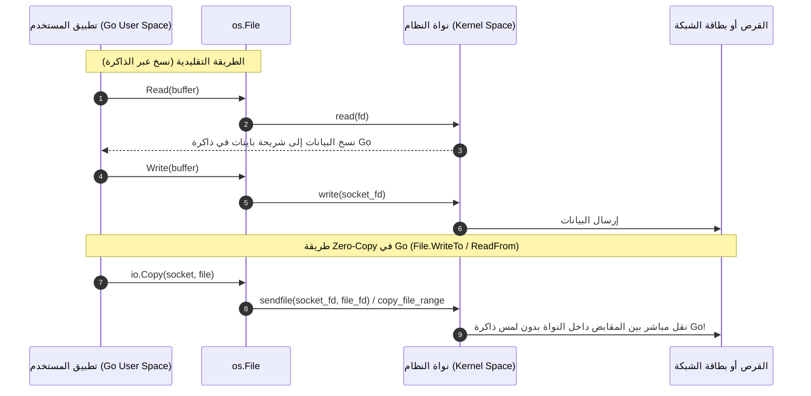

# 03. عمليات الملفات وهندسة الإدخال والإخراج (File Operations & I/O Engine)

يمثل كائن `*os.File` الركيزة الأساسية للتعامل مع تدفقات البايتات في Go. يدمج هذا الكائن بين بساطة واجهات `io.Reader` و `io.Writer` وبين القوة القصوى لنواة نظام التشغيل، بما يشمل استدعاءات النقل بدون نسخ (Zero-Copy) والتسجيل في مراقب الشبكة (Netpoller).

---

## 🛠️ 1. دوال إنشاء وفتح الملفات (Constructors & Openers)

### أ. دالة `os.Open`
```go
func Open(name string) (*File, error)
```
- **السلوك:** تفتح الملف المحدد بوضعية القراءة فقط (`O_RDONLY`).
- **التنفيذ الداخلي:** تكافئ تماماً استدعاء `OpenFile(name, O_RDONLY, 0)`.
- **الاستخدام الشائع:** قراءة ملفات الإعدادات، المستندات، والصور.

### ب. دالة `os.Create`
```go
func Create(name string) (*File, error)
```
- **السلوك:** تنشئ ملفاً جديداً أو تُفرغ محتواه القديم بالكامل وتفتحه للقراءة والكتابة.
- **التنفيذ الداخلي:** تكافئ استدعاء:
  ```go
  OpenFile(name, O_RDWR|O_CREATE|O_TRUNC, 0666)
  ```
  *(ملاحظة: الصلاحية `0666` تخضع دائماً لقناع المستخدم `umask` في نظام التشغيل، وغالباً ما ينتج عنها فعلياً `0644`).*

### ج. دالة `os.OpenFile` (محرك الفتح الشامل)
```go
func OpenFile(name string, flag int, perm FileMode) (*File, error)
```
الدالة المركزية التي تتصل بنواة النظام مباشرة عبر `open(2)` في Unix أو `CreateFileW` في Windows:
- **الرايات (`flag`):** دمج منطقي بين ثوابت `O_RDONLY`, `O_WRONLY`, `O_RDWR`, `O_APPEND`, `O_CREATE`, `O_EXCL`, `O_SYNC`, `O_TRUNC`.
- **الأمان الذاتي (`O_CLOEXEC`):** تضيف Go داخلياً وبشكل إلزامي راية `syscall.O_CLOEXEC` لضمان عدم تسريب واصف الملف للعمليات الفرعية (`subprocesses`).
- **تحويل الأنماط غير التعطيلية:** إذا كان الملف عبارة عن أنبوب (Pipe) أو جهاز طرفي، يتم فتحه بوضعية `O_NONBLOCK` لتسجيله في الـ Netpoller.

### د. دالة `os.NewFile`
```go
func NewFile(fd uintptr, name string) *File
```
- **السلوك:** تحويل واصف ملف خام (`uintptr`) أو مقبض نظام موجود مسبقاً إلى كائن `*os.File` رفيع المستوى.
- **التكامل الداخلي:** تقوم بتهيئة هيكل `poll.FD` الداخلي، وربطه بالمُنهي النهائي لجامع القمامة. إذا كان الـ `fd` غير صالح (أقل من 0)، تعود بقيمة `nil`.

### هـ. دالة `os.CreateTemp` (إنشاء الملفات المؤقتة بأمان ذري)
```go
func CreateTemp(dir, pattern string) (*File, error)
```
- **المعضلة الأمنية:** إنشاء ملف مؤقت باسم متوقع يعرض النظام لهجمات الروابط الرمزية (Symlink Hijacking).
- **الحل الهندسي في Go:**
  - تستخدم مولد أرقام عشوائية داخلي عالي الأداء من بيئة التشغيل (`runtime.rand`).
  - تستبدل الرمز `*` في النمط بسلسلة أرقام عشوائية.
  - تفتح الملف بالرايات الصارمة: `O_RDWR | O_CREATE | O_EXCL` وبأذونات `0600` (للمستخدم المالك فقط).
  - راية `O_EXCL` تجعل النواة تفشل فوراً إذا كان الملف موجوداً بالفعل، مما يمنع أي سباق، وتعيد المحاولة تلقائياً حتى 10,000 مرة قبل إرجاع الخطأ.

---

## 📖 2. عمليات القراءة والكتابة والتموضع (Core I/O Methods)

### أ. القراءة المتدفقة `Read`
```go
func (f *File) Read(b []byte) (n int, err error)
```
- تقرأ بحد أقصى `len(b)` بايت من الملف وتخزنها في الشريحة.
- تحرك مؤشر الموضع في الملف بمقدار `n`.
- عند الوصول لنهاية الملف، تعود بـ `io.EOF`.

### ب. القراءة في موضع محدد `ReadAt` (Thread-Safe Concurrent Reads)
```go
func (f *File) ReadAt(b []byte, off int64) (n int, err error)
```
- **الميكانيكا العميقة:** تستخدم استدعاء النظام `pread(2)` بدلاً من `read(2)`.
- **الميزة الكبرى:** **آمنة تماماً للاستخدام المتزامن عبر مئات الـ Goroutines في نفس اللحظة!** لا تغير مؤشر موضع الملف العام (`file offset`). إذا كنت تبني محرك قاعدة بيانات أو تقرأ أجزاء ملف ضخم بالتوازي، استخدم `ReadAt` حصراً.

### ج. الكتابة المتدفقة `Write` و `WriteString`
```go
func (f *File) Write(b []byte) (n int, err error)
func (f *File) WriteString(s string) (n int, err error)
```
- تكتب البايتات أو النصوص في الموضع الحالي، وتحدث مؤشر الإزاحة بمقدار `n`.
- إذا لم تتم كتابة كامل البيانات، تعود بخطأ غير فارغ يوضح سبب التوقف.

### د. الكتابة في موضع محدد `WriteAt` (Concurrent Writes)
```go
func (f *File) WriteAt(b []byte, off int64) (n int, err error)
```
- تستخدم استدعاء `pwrite(2)` لكتابة بيانات في إزاحة معينة دون التأثير على مؤشر الملف المشترك وبأمان خيطي كامل.

### هـ. تغيير موضع المؤشر `Seek`
```go
func (f *File) Seek(offset int64, whence int) (ret int64, err error)
```
- تحريك مؤشر القراءة/الكتابة داخل الملف:
  - `io.SeekStart`: نسبة إلى بداية الملف (0).
  - `io.SeekCurrent`: نسبة إلى الموقع الحالي.
  - `io.SeekEnd`: نسبة إلى نهاية الملف (مثلاً `-10` تعني قبل النهاية بـ 10 بايت).

---

## ⚡ 3. تسريع النقل بدون نسخ (Zero-Copy Acceleration)

تتضمن لغة Go تحسينات عبقرية في صلب `*os.File` لتجاوز طبقة المستخدم وتفويض النقل إلى نواة النظام مباشرة عند استخدام دوال مثل `io.Copy(dst, src)`.



### أ. الدالة `(f *File) ReadFrom(r io.Reader)`
عندما يكون الهدف ملفاً محلياً ويتم النسخ من ملف آخر أو أنبوب:
1. **`copy_file_range(2)`:** في أنظمة Linux، إذا كان المصدر ملفاً آخر، تفوض Go العملية للنواة لنسخ كتل البيانات مباشرة بين واصفي الملفين داخل نظام الملفات دون تحميل بايت واحد في ذاكرة الوصول العشوائي للبرنامج!
2. **`splice(2)`:** إذا كان المصدر أنبوباً، تستخدم Go تقنية ربط الأنابيب في النواة.
3. إذا فشلت تقنيات النواة أو كان الملف مفتوحاً بوضعية الإلحاق `O_APPEND`، تتراجع Go بسلاسة إلى النسخ عبر شريحة تخزين مؤقت (`buffer`).

### ب. الدالة `(f *File) WriteTo(w io.Writer)`
عندما يكون المصدر ملفاً ويتم الإرسال إلى مقبس شبكة (`*net.TCPConn` أو Unix Socket):
- تكتشف Go نوع الهدف عبر استدعاء `SyscallConn()`.
- تستدعي استدعاء النواة الخارق **`sendfile(2)`**.
- تُرسل صفحات الذاكرة المؤقتة للقرص (Page Cache) مباشرة إلى طابور بطاقة الشبكة (NIC Ring Buffer)، مما يوفر استهلاك المعالج ويحقق أعلى معدل نقل بيانات ممكن (Line-Rate Throughput).

---

## 💾 4. المزامنة والتحكم في الحجم (Sync & Truncate)

### أ. مزامنة البيانات مع القرص `Sync` (fsync)
```go
func (f *File) Sync() error
```
- **المشكلة:** عند تنفيذ `Write`، لا يقوم نظام التشغيل بكتابة البيانات على القرص الصلب فوراً، بل يحتفظ بها في الذاكرة المؤقتة للنواة (`Page Cache / Dirty Pages`). إذا انقطعت الكهرباء أو تعطل الجهاز، تُفقد البيانات!
- **الحل:** تستدعي `Sync()` استدعاء النظام `fsync(2)` في Unix أو `FlushFileBuffers` في Windows، مما يُجبر متحكم القرص على كتابة كافة البيانات والتعديلات الوصفية على وسيط التخزين الفيزيائي فوراً.

### ب. تقليص أو توسيع الحجم `Truncate`
```go
func (f *File) Truncate(size int64) error
func Truncate(name string, size int64) error
```
- تضبط حجم الملف ليصبح `size` بايت بدقة.
- إذا كان الملف أكبر من `size`، يتم بتر البيانات الزائدة.
- إذا كان الملف أصغر، يتم ملء المساحة المتبقية بأصفار (`null bytes / sparse file`).

---

## ⏱️ 5. المهل الزمنية والتكامل مع مراقب الشبكة (Deadlines)

```go
func (f *File) SetDeadline(t time.Time) error
func (f *File) SetReadDeadline(t time.Time) error
func (f *File) SetWriteDeadline(t time.Time) error
```

### أي الملفات تدعم المهل الزمنية؟
- **الأنابيب (Pipes)، أجهزة الـ FIFO، ومقابس الشبكة والطرفيات:** تدعم المهل الزمنية بالكامل؛ لأنها مسجلة في الـ Netpoller في وضع غير تعطيلي (`non-blocking`). إذا انتهت المهلة المحددة، تفشل عملية القراءة أو الكتابة بخطأ يغلف `os.ErrDeadlineExceeded`.
- **ملفات الأقراص العادية (Regular Files):** **لا تدعم المهل الزمنية إطلاقاً!**
  - السبب: في أنظمة التشغيل، عمليات قراءة الأقراص العادية تعطل الخيط دائماً ولا تتوافق مع آليات `epoll/kqueue` غير التعطيلية.
  - النتيجة: استدعاء `SetDeadline` على ملف قرص عادي يعود دائماً بخطأ:
    ```go
    os.ErrNoDeadline // "file type does not support deadline"
    ```

---

## 🔌 6. الوصول الخام واستدعاءات النظام (Raw System Access)

### أ. الدالة `(f *File) Fd() uintptr` والمحاذير القاتلة
```go
func (f *File) Fd() uintptr
```
تعود برقم واصف الملف (`int fd`) في أنظمة Unix أو مقبض `HANDLE` في Windows.
> [!WARNING]
> **محاذير خطيرة عند استخدام `Fd()`:**
> 1. بمجرد استدعاء `f.Fd()`، تقوم Go بإعادة واصف الملف إلى **الوضع التعطيلي (Blocking Mode)** لأسباب التوافق التاريخي مع مكتبات C.
> 2. نتيجة لذلك: **تتوقف دوال `SetDeadline` عن العمل نهائياً على هذا الملف!**
> 3. في Windows، يتم فك ارتباط الملف مع منفذ إتمام الإدخال/الإخراج (`IOCP`).
> 4. لا تغلق الـ `fd` بنفسك عبر استدعاءات خارجية؛ لأن إغلاق `f.Close()` لاحقاً قد يغلق ملفاً آخر غير ذي صلة.

### ب. البديل الآمن والحديث: `(f *File) SyscallConn()`
```go
func (f *File) SyscallConn() (syscall.RawConn, error)
```
هو الأسلوب الاحترافي الموصى به لتنفيذ استدعاءات نظام مخصصة (`ioctl`, `fcntl`, `getsockopt`) دون إفساد تكامل الملف مع بيئة تشغيل Go:
```go
rawConn, err := file.SyscallConn()
if err != nil {
    return err
}

err = rawConn.Control(func(fd uintptr) {
    // نفذ استدعاء النظام هنا بأمان تام
    syscall.Fcntl(int(fd), syscall.F_SETLK, ...)
})
```

---

## 🚪 7. إغلاق الملفات ودورة الحياة `Close`

```go
func (f *File) Close() error
```

### كيف يضمن `Close` السلامة الخيطية ومنع الانهيار؟
1. يتحقق من صحة الملف؛ وإذا كان مغلقاً مسبقاً يعود بـ `os.ErrClosed`.
2. يستدعي `pfd.Close()` التابع لـ `internal/poll`.
3. يستخدم العداد المرجعي الداخلي: إذا كانت هناك Goroutine أخرى تقرأ حالياً من الملف، يتم وسم الملف كمغلق وإلغاء تسجيله من الـ Netpoller لإيقاظ تلك الـ Goroutine فوراً بخطأ `ErrClosed`.
4. لا يُغلق الـ FD فعلياً في النواة إلا بعد مغادرة آخر عملية إدخال/إخراج جارية، مما يقضي على أي سباق بيانات في إعادة تدوير المقابض.
5. يلغي المُنهي النهائي (`runtime.SetFinalizer(f.file, nil)`).

---

## 🚀 8. الدوال السريعة الشائعة (High-Level Utilities)

### أ. الدالة `os.ReadFile`
```go
func ReadFile(name string) ([]byte, error)
```
- تفتح الملف وتقرأ محتواه بالكامل في مصفوفة بايتات دفعة واحدة وتغلقه تلقائياً.
- **التحسين الذكي للحجم:** تفحص حجم الملف عبر `Stat()` وتقوم بحجز شريحة ذاكرة (`make([]byte, 0, size+1)`) بحجم الملف مسبقاً لتجنب إعادة تخصيص الذاكرة المتكررة.
- إذا كان حجم الملف صفراً (مثل ملفات `/proc/cpuinfo` أو `/sys`), تبدأ بسعة افتراضية وتتوسع ديناميكياً.

### ب. الدالة `os.WriteFile`
```go
func WriteFile(name string, data []byte, perm FileMode) error
```
- تكتب البيانات في الملف دفعة واحدة وتغلقه:
  ```go
  OpenFile(name, O_WRONLY|O_CREATE|O_TRUNC, perm)
  ```
- إذا كان الملف موجوداً مسبقاً، تحذف محتواه القديم وتستبدله بالبيانات الجديدة.
