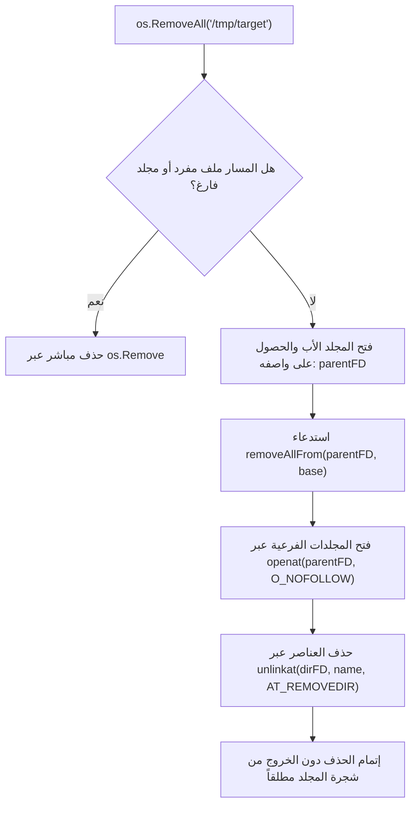
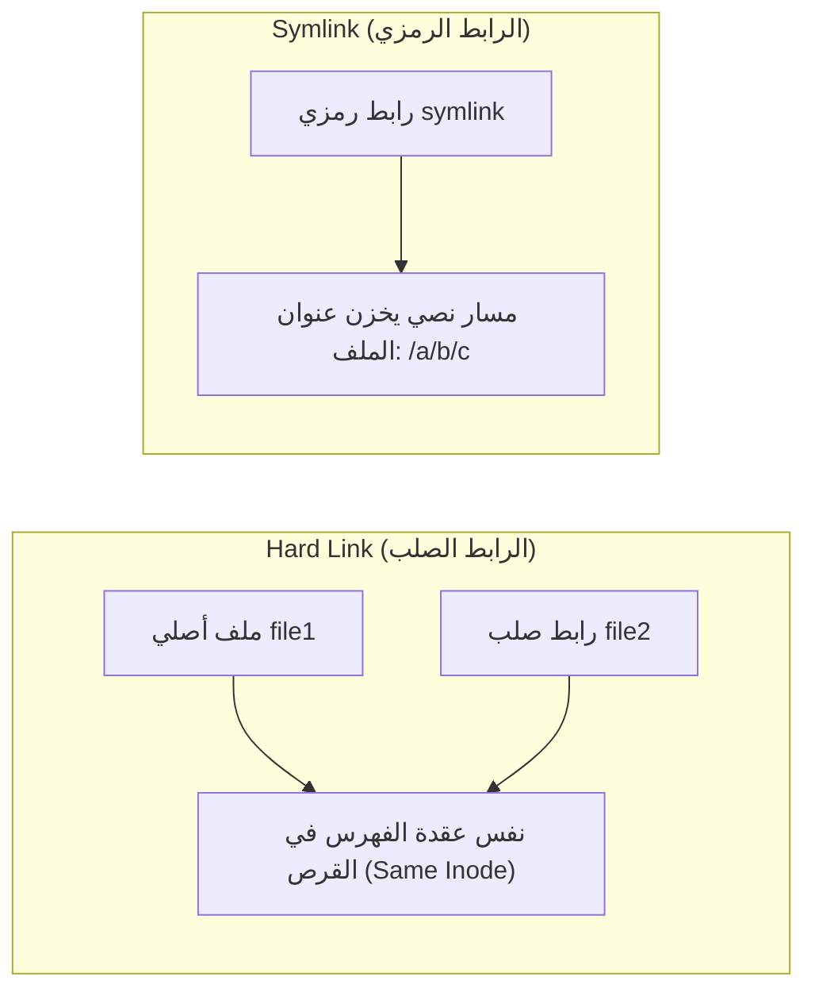

# 04. إدارة المجلدات ونظام الملفات والمسارات (Filesystem & Directory Management)

تتولى حزمة `os` تقديم واجهات برمجية شاملة للتعامل مع هيكلية شجرة الملفات، إنشاء المجلدات وحذفها، الروابط الصلبة والرمزية، وقراءة محتويات المجلدات بأعلى أداء خوارزمي ممكن، فضلاً عن التكامل مع معايير مسارات المستخدم الحديثة (XDG Specifications).

---

## 📁 1. إنشاء وحذف المجلدات والملفات (Directory Lifecycle)

### أ. الدالة `os.Mkdir`
```go
func Mkdir(name string, perm FileMode) error
```
- تنشئ مجلداً واحداً بالمسار المحدد وصلاحيات الوصول `perm` (تخضع لقناع `umask`).
- تفشل إذا كان المجلد موجوداً مسبقاً، أو إذا كانت المجلدات الأب في المسار غير موجودة (`PathError`).

### ب. الدالة `os.MkdirAll` (الإنشاء التكراري الشامل)
```go
func MkdirAll(path string, perm FileMode) error
```
- تنشئ مسار المجلد بالكامل مع كافة المجلدات الآباء غير الموجودة على غرار أمر `mkdir -p` في Unix.
- **خاصية التكرار الآمن (Idempotent):** إذا كان المجلد أو أي من آبائه موجوداً بالفعل، لا تعود الدالة بأي خطأ بل تواصل عملها بنجاح.

### ج. الدالة `os.MkdirTemp`
```go
func MkdirTemp(dir, pattern string) (string, error)
```
- تنشئ مجلداً مؤقتاً فريداً بأذونات حصرية صارمة `0700` (للمستخدم المالك فقط).
- تعتمد على توليد أرقام عشوائية ذرية من بيئة التشغيل لضمان عدم حدوث تضارب في الأسماء عند استدعائها بالتوازي من آلاف الـ Goroutines.

### د. الدالة `os.Remove`
```go
func Remove(name string) error
```
- تحذف ملفاً واحداً أو مجلداً **فارغاً** عبر استدعاء النواة `unlink(2)` للملفات أو `rmdir(2)` للمجلدات.

---

## 🛡️ 2. الحذف الشامل `RemoveAll` وهندسة الأمان ضد سباقات الروابط

```go
func RemoveAll(path string) error
```

تحذف المسار المحدد وكافة الملفات والمجلدات المتفرعة تحته تكرارياً (Recursive Deletion على غرار `rm -rf`).

### المعضلة الأمنية الكارثية في الحذف التكراري التقليدي
في التطبيقات القديمة، كان الحذف التكراري يتم عبر قراءة أسماء المجلدات وبناء مسارات نصية واستدعاء `Remove` عليها:
```text
Remove("/tmp/cache/subdir/file.txt")
```
**الهجوم:** إذا استطاع مهاجم أو عملية خبيثة في النظام استبدال مجلد `/tmp/cache/subdir` برابط رمزي يشير إلى `/etc` أو `/var` في اللحظة الفاصلة بين قراءة المجلد وحذفه، فسيقوم برنامجك الذي يملك صلاحيات عالية بحذف كامل ملفات النظام الحساسة! وهي ثغرة سباق فاحشة تُعرف بـ **Symlink Race Condition**.

### الحل الهندسي الذري في Go (`removeall_at.go`)
لا تستخدم Go مسارات نصية مطلقاً أثناء الحذف التكراري، بل تعتمد على استدعاءات النواة النسبية المعتمدة على واصفات الملفات (`*at syscalls`):



1. تفتح Go المجلد الأب أولاً لتحصل على واصف ملف حقيقي في النواة (`parentFD`).
2. تتم كافة عمليات التنقل والحذف اللاحقة عبر استدعاءات:
   - `openat(dirfd, name, O_NOFOLLOW)`: يمنع تتبع أي روابط رمزية خارج الشجرة.
   - `unlinkat(dirfd, name, flag)`: يحذف الملفات والمجلدات نسبة لواصف المجلد الأصلي مباشرة في النواة.
3. بفضل هذا التصميم، حتى لو تلاعب مهاجم بالروابط الرمزية بالتزامن مع الحذف، فإن النواة تحذف الرابط الرمزي نفسه فقط دون الدخول إلى الهدف المشير إليه.

---

## ⚡ 3. قراءة المجلدات وهندسة الذاكرة التخزينية (Directory Reading)

### أ. الدالة الحديثة فائقة السرعة `os.ReadDir`
```go
func ReadDir(name string) ([]DirEntry, error)
```
- تقرأ محتويات المجلد المحدد بالكامل وتعود بشريحة مرتبة أبجدياً من نوع `[]DirEntry`.
- **لماذا هي الخيار القياسي اليوم؟**
  - تقتصر على قراءة بيانات المجلد في استدعاء نظام واحد (`getdents64`).
  - تعود بأنواع خفيفة جداً تتيح معرفة نوع الملف (`IsDir()`, `Type()`) دون إجراء استدعاء `stat()` لكل ملف على حدة.

### ب. دوال قراءة المجلدات عبر المقبض `*os.File`
إذا قمت بفتح مجلد كملف عبر `f, err := os.Open("/path/to/dir")`، تتوفر لك الدوال التالية:

```go
func (f *File) ReadDir(n int) ([]DirEntry, error)
func (f *File) Readdir(n int) ([]FileInfo, error)
func (f *File) Readdirnames(n int) (names []string, err error)
```

#### دلالة المعامل `n`:
- **إذا كان `n <= 0`:** تقرأ الدالة **كافة عناصر المجلد** دفعة واحدة في شريحة واحدة حتى النهاية وتعود بـ `nil` عند النجاح.
- **إذا كان `n > 0`:** تقرأ الدالة بحد أقصى `n` عنصراً فقط في كل استدعاء. عند الوصول لنهاية المجلد، تعود الدالة بـ `io.EOF`. تُستخدم هذه التقنية في قراءة المجلدات المليونية لتجنب استهلاك الذاكرة عبر التصفح المقطعي (Pagination / Chunking).

### ج. الكواليس الداخلية: التخزين المؤقت وحوض الذاكرة `sync.Pool`
تستخدم Go داخل `dir_unix.go` هيكلاً تخزينياً ذكياً:
```go
type dirInfo struct {
    mu   sync.Mutex
    buf  *[]byte // حيز ذاكرة بحجم 8192 بايت
    nbuf int
    bufp int
}

var dirBufPool = sync.Pool{
    New: func() any {
        buf := make([]byte, 8192)
        return &buf
    },
}
```
عند استدعاء قراءة مجلد، تستعير Go شريحة ذاكرة جاهزة من `dirBufPool` بحجم `8KB`، وتملؤها ببيانات النواة القادمة من `getdents64`، وتقوم بتحليل البايتات دون تخصيص ذاكرة إضافية لكل دورة، ثم تعيد الشريحة للحوض عند الانتهاء، مما يحقق صفراً من إجهاد جامع القمامة (Zero Allocations Overhead).

---

## 🔗 4. الروابط الصلبة والرمزية (Hard Links & Symlinks)



### أ. الرابط الصلب `os.Link`
```go
func Link(oldname, newname string) error
```
- تنشئ اسماً إضافياً (`Hard Link`) يشير إلى نفس عقدة الفهرسة (`Inode`) على نفس نظام الملفات.
- تعديل محتوى أحدهما يظهر في الآخر فوراً، وحذف أحدهما لا يحذف البيانات طالما بقي رابط آخر يشير إلى نفس الـ Inode.

### ب. الرابط الرمزي `os.Symlink`
```go
func Symlink(oldname, newname string) error
```
- تنشئ ملفاً صغيراً خاصاً يحتوي مسار الملف المستهدف (`Symbolic Link`).
- يمكن أن يشير إلى ملفات على وسائط تخزين وأقراص مختلفة، ويمكن أن يشير إلى مجلدات، ويمكن أن يصبح معطلاً (`Broken Link`) إذا حُذف الملف الأصلي.

### ج. قراءة وجهة الرابط `os.Readlink`
```go
func Readlink(name string) (string, error)
```
- تعود بالمسار النصي الخام الذي يشير إليه الرابط الرمزي دون تتبعه.

---

## 🔍 5. البيانات الوصفية ومقارنة الملفات (Metadata & Comparison)

### أ. الفرق بين `os.Stat` و `os.Lstat`
```go
func Stat(name string) (FileInfo, error)
func Lstat(name string) (FileInfo, error)
```
- **`os.Stat`:** تفحص الملف وتتبع الروابط الرمزية (`Follows Symlinks`). إذا كان الملف رابطاً رمزياً، تعود بخصائص الملف النهائي المستهدف.
- **`os.Lstat`:** **لا تتبع الروابط الرمزية (`Does NOT follow Symlinks`)**. إذا كان المسار رابطاً رمزياً، تعود بخصائص الرابط الرمزي نفسه (نوعه `ModeSymlink` وحجمه هو طول نص المسار).

### ب. المقارنة الصارمة للملفات `os.SameFile`
```go
func SameFile(fi1, fi2 FileInfo) bool
```
- **المشكلة:** المقارنة بالاسم النصي غير دقيقة؛ فقد يكون لملف واحد اسمان مختلفان بسبب الروابط الصلبة أو المسارات النسبية والمطلقة.
- **الحل:** تفحص `SameFile` البيانات الوصفية للنواة (`sys`):
  - في Unix: تقارن رقم الجهاز ورقم الـ Inode (`fi1.Dev == fi2.Dev && fi1.Ino == fi2.Ino`).
  - في Windows: تقارن المعرف الفريد للملف والرقم التسلسلي لوحدة التخزين (`FileIndex` و `VolumeSerialNumber`).
  - إذا تطابقا، تؤكد الدالة قطعياً أنهما نفس الملف على القرص.

---

## 👮 6. الأذونات والملكيات والتوقيتات (Permissions & Times)

### أ. تعديل الأذونات `Chmod`
```go
func Chmod(name string, mode FileMode) error
func (f *File) Chmod(mode FileMode) error
```
- تعدل أذونات الملف (مثل `0644` أو `0755`).
- في Windows: يدعم النظام بت القراءة فقط فقط (`0200` للمستخدم المالك للكتابة، وأي قيمة أخرى تعتبر قراءة فقط).

### ب. تعديل الملكيات `Chown` و `Lchown`
```go
func Chown(name string, uid, gid int) error
func Lchown(name string, uid, gid int) error
func (f *File) Chown(uid, gid int) error
```
- تعدل معرف المستخدم المالك (`uid`) ومعرف المجموعة (`gid`).
- `Lchown` تطبق التعديل على الرابط الرمزي نفسه دون تتبعه.
- على أنظمة Windows تعود بخطأ `syscall.EWINDOWS` لعدم وجود مكافئ مطابق.

### ج. تعديل توقيتات الوصول والتعديل `Chtimes`
```go
func Chtimes(name string, atime time.Time, mtime time.Time) error
```
- تعدل وقت آخر وصول (`Access Time - atime`) ووقت آخر تعديل للمحتوى (`Modification Time - mtime`) بدقة النانو ثانية.

---

## 🧭 7. مجلد العمل الحالي والمسارات القياسية (Paths & Standards)

### أ. مجلد العمل والتنقل `Getwd` و `Chdir`
```go
func Getwd() (dir string, err error)
func Chdir(dir string) error
func (f *File) Chdir() error
```
- **`Getwd()`:** تعود بالمسار المطلق لمجلد العمل الحالي للبرنامج. تفحص متغير البيئة `$PWD` أولاً وتتأكد من مطابقته لـ Inode المجلد الحالي، وإذا وجدته غير متطابق تستدعي `getcwd(2)` من النواة.
- **`Chdir(dir)`:** تغير مجلد العمل الحالي للعملية بالكامل.
- **`f.Chdir()`:** تغير مجلد العمل باستخدام واصف ملف مجلد مفتوح مسبقاً (`fchdir(2)`).

### ب. المسارات القياسية ومواصفات XDG
توفر Go دوال معيارية تجلب المسارات النظامية الخاصة بكل مستخدم حسب معايير نظام التشغيل:

```go
func TempDir() string
func UserHomeDir() (string, error)
func UserCacheDir() (string, error)
func UserConfigDir() (string, error)
```

| الدالة | Linux / BSD | macOS (Darwin) | Windows |
| :--- | :--- | :--- | :--- |
| **`TempDir`** | `$TMPDIR` أو `/tmp` | `$TMPDIR` أو `/tmp` | `%TMP%` أو `%TEMP%` |
| **`UserHomeDir`** | `$HOME` | `$HOME` (`/Users/name`) | `%USERPROFILE%` |
| **`UserCacheDir`** | `$XDG_CACHE_HOME` أو `~/.cache` | `~/Library/Caches` | `%LocalAppData%` |
| **`UserConfigDir`** | `$XDG_CONFIG_HOME` أو `~/.config` | `~/Library/Application Support` | `%AppData%` |

---

## 🔄 8. التكامل المعياري الحديث ونظام الأنابيب (Modern Abstractions)

### أ. واجهة نظام الملفات `os.DirFS`
```go
func DirFS(dir string) fs.FS
```
- تُرجع واجهة `fs.FS` لشجرة المجلدات المتفرعة من `dir`.
- تتيح تمرير المجلدات المحلية للدوال التي تقبل واجهة `fs.FS` المجردة (مثل `html/template.ParseFS`).

### ب. نسخ أنظمة الملفات بالكامل `os.CopyFS` (Go 1.23+)
```go
func CopyFS(dir string, fsys fs.FS) error
```
- تنسخ شجرة ملفات كاملة من أي كائن يطبق `fs.FS` (مثل ملف مضمن `embed.FS` أو أرشيف مضغوط) إلى مجلد محلي على القرص الصلب.
- تحافظ على هيكلية المجلدات، الروابط الرمزية، وأذونات الملفات بدقة وأمان.

### ج. إنشاء الأنابيب المتزامنة `os.Pipe`
```go
func Pipe() (r *File, w *File, err error)
```
- تنشئ أنبوب اتصال داخلي أحادي الاتجاه بين نقطتين عبر استدعاء النواة `pipe2(2)`.
- يُستخدم للاتصال الفوري بين الـ Goroutines أو توجيه مدخلات ومخرجات العمليات الفرعية بأداء يقارب سرعة الذاكرة دون الحاجة لكتابة أي ملف مؤقت على القرص.
