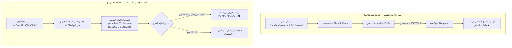

# 05. نظام العزل الجذري وصناديق الحماية `os.Root` (Directory Sandboxing Engine)

يُعد تقديم هيكل `os.Root` في إصدار **Go 1.24** أحد أضخم التحولات الأمنية والمعمارية في تاريخ المكتبة القياسية للغة Go. جاء هذا النظام ليضع حداً نهائياً لواحد من أقدم وأخطر أصناف الثغرات الأمنية في تاريخ هندسة البرمجيات: ثغرات تجاوز المسارات (Path Traversal) وهجمات الروابط الرمزية المتزامنة (Symlink TOCTOU Attacks).

---

## 🛑 1. نموذج التهديد الأمني ولماذا تفشل الحلول التقليدية؟

### أ. ثغرة القفز المجلدي وتفكيك الأرشيف (Zip Slip Vulnerability)
عندما يقوم خادم ويب باستقبال ملف أرشيف (ZIP أو TAR) ويفك ضغطه، قد تحتوي ملفات الأرشيف على أسماء مسارات خبيثة مثل:
`../../../../etc/cron.d/backdoor` أو `subfolder/../../../../root/.ssh/authorized_keys`.

### ب. خرافة تطهير المسارات البرمجية عبر النصوص (`filepath.Clean`)
اعتاد المطورون لعقود على كتابة دوال فحص نصية ساذجة:
```go
// ❌ كود خطير وغير آمن هندسياً!
cleanPath := filepath.Clean(filepath.Join(rootDir, userInput))
if !strings.HasPrefix(cleanPath, rootDir) {
    return errors.New("محاولة اختراق!")
}
f, err := os.Open(cleanPath)
```

#### لماذا هذا الكود كارثي أمنياً؟
1. **الروابط الرمزية المتداخلة (Symlinks):** قد يكون المسار يبدو نصياً وكأنه داخل `rootDir` (مثلاً `/app/data/uploads/avatar.png`)، ولكن مجلد `uploads` أو الملف نفسه عبارة عن رابط رمزي يشير إلى `/etc/shadow`!
2. **سباق التوقيت (TOCTOU - Time-Of-Check to Time-Of-Use):**
   حتى لو قمت بفحص المسار والتأكد من أنه ملف عادي، يمكن لمهاجم يملك وصولاً متزامناً للنظام استبدال المجلد برابط رمزي في **الفيمتوثانية الفاصلة** بين تنفيذ سطر الفحص وسطر `os.Open` الفعلي!

---

## 🏛️ 2. الفلسفة المعمارية لنظام `os.Root`: العزل على مستوى النواة

بدلاً من معالجة النصوص البرمجية في طبقة المستخدم (User Space)، ينقل `os.Root` مسؤولية حماية الحدود إلى **نواة نظام التشغيل مباشرة (Kernel Enforced Boundaries)**:



### التقنيات منخفضة المستوى المستخدمة:
1. **في أنظمة Linux الحديثة (Kernel 5.6+):**
   تستخدم Go استدعاء النظام الثوري **`openat2(2)`** مع الرايات الصارمة:
   - `RESOLVE_BENEATH`: تمنع النواة قطعياً أي خطوة من خطوات تحليل المسار من الخروج عن واصف المجلد المفتوح، سواء عبر `..` أو عبر روابط رمزية.
   - `RESOLVE_NO_MAGICLINKS`: تمنع تتبع الروابط السحرية في مسارات النظام الافتراضية مثل `/proc/self/fd/`.
2. **في الأنظمة الأخرى (macOS / BSD / Linux القديم):**
   تطبق Go خوارزمية محاكاة عبقرية `doInRoot`: تقسم المسار إلى أجزائه وتتنقل خطوة بخطوة باستخدام `openat` مع راية `O_NOFOLLOW` الصارمة، وتفحص عقدة الفهرس (`Inode`) في كل وثبة للتأكد من عدم مغادرة الحدود، وبحد أقصى 8 روابط رمزية (`rootMaxSymlinks = 8`).

---

## 📦 3. إنشاء وإدارة الجذر `os.Root`

### أ. الدالة `os.OpenRoot`
```go
func OpenRoot(name string) (*Root, error)
```
- تفتح المجلد المحدد وتثبته كصندوق حماية جذري (`Root Sandbox`).
- تحتفظ بنسخة من واصف الملف الحقيقي للنواة (`dirfd`).
- **تتبع تغيير الموضع (Rename Resilience):** إذا تم نقل المجلد أو تغيير اسمه في نظام التشغيل لاحقاً، فإن كائن `Root` يظل مرتبطاً بنفس المجلد في موقعه الجديد؛ لأنه يحتفظ بواصف ملف النواة الفيزيائي وليس مجرد اسم نصي!

### ب. الدالة السريعة `os.OpenInRoot`
```go
func OpenInRoot(dir, name string) (*File, error)
```
- اختصار سريع وآمن يكافئ فتح جذر مؤقت للمجلد `dir` ثم فتح الملف `name` بداخله وإغلاق الجذر فوراً.

### ج. إغلاق الجذر وتتبع المراجع `Close`
```go
func (r *Root) Close() error
```
- يعتمد هيكل `root` الداخلي على قفل متزامن وعداد مرجعي (`refs`):
  ```go
  type root struct {
      name   string
      mu     sync.Mutex
      fd     sysfdType
      refs   int
      closed bool
  }
  ```
- عند استدعاء `Close()`، إذا كانت هناك عمليات جارية تستخدم واصف المجلد، يتم وضع علامة الإغلاق، ولا يتم استدعاء `syscall.Close(fd)` فعلياً في النواة إلا عندما تنتهي آخر عملية من فك حجز المرجع (`decref`)، مما يمنع تعطل العمليات المتزامنة.

---

## 🛠️ 4. الدوال والعمليات المنفذة تحت نطاق `os.Root`

توفر واجهة `*os.Root` كافة العمليات الأساسية المعتادة على الملفات، مع ضمان تطبيق قاعدة العزل على كل منها:

### أ. فتح وإنشاء الملفات المعزولة
- `(r *Root) Open(name string) (*File, error)`: فتح ملف للقراءة فقط تحت الجذر.
- `(r *Root) Create(name string) (*File, error)`: إنشاء ملف للكتابة والقراءة تحت الجذر.
- `(r *Root) OpenFile(name string, flag int, perm FileMode) (*File, error)`: فتح ملف بكافة الرايات المخصصة داخل الجذر.

### ب. التجذير المتداخل (Nested Sandboxing)
- `(r *Root) OpenRoot(name string) (*Root, error)`:
  - تتيح إنشاء صندوق حماية فرعي مشتق ومحصور داخل مجلد فرعي تابع للجذر الحالي!
  - لا يمكن للصندوق الفرعي بأي حال من الأحوال الوصول إلى الصندوق الأب.

### ج. إدارة المجلدات وحذفها بأمان
- `(r *Root) Mkdir(name string, perm FileMode) error`
- `(r *Root) MkdirAll(name string, perm FileMode) error`
- `(r *Root) Remove(name string) error`
- `(r *Root) RemoveAll(name string) error`: حذف تكراري محصور قطعياً داخل حدود الجذر دون أي إمكانية للهروب.

### د. القراءة والكتابة السريعة
- `(r *Root) ReadFile(name string) ([]byte, error)`: قراءة محتوى ملف كامل تحت الجذر.
- `(r *Root) WriteFile(name string, data []byte, perm FileMode) error`: كتابة ملف كامل تحت الجذر.

### هـ. الفحص والبيانات الوصفية
- `(r *Root) Stat(name string) (FileInfo, error)`: جلب خصائص ملف مع تتبع الروابط (بشرط ألا تشير لخارج الجذر).
- `(r *Root) Lstat(name string) (FileInfo, error)`: جلب خصائص الملف أو الرابط الرمزي نفسه دون تتبعه.

### و. الروابط وإعادة التسمية
- `(r *Root) Readlink(name string) (string, error)`
- `(r *Root) Rename(oldname, newname string) error`: نقل أو إعادة تسمية ملف داخل حدود الجذر فقط.
- `(r *Root) Link(oldname, newname string) error`: إنشاء رابط صلب بين ملفين يقعان كلاهما داخل الجذر.
- `(r *Root) Symlink(oldname, newname string) error`: إنشاء رابط رمزي (يجب ألا يكون الرابط مساراً مطلقاً يشير لخارج الجذر).

### ز. الأذونات والملكيات والتوقيتات
- `(r *Root) Chmod(name string, mode FileMode) error`
- `(r *Root) Chown(name string, uid, gid int) error`
- `(r *Root) Lchown(name string, uid, gid int) error`
- `(r *Root) Chtimes(name string, atime, mtime time.Time) error`

### ح. التوافق مع واجهة `fs.FS`
- `(r *Root) FS() fs.FS`: تحويل كائن `Root` المعزول إلى واجهة نظام ملفات قياسية `fs.FS`، مما يسمح بتمريره لأي حزمة أو قالب يتوقع قراءة الملفات من شجرة مجردة.

---

## ⚠️ 5. القيود والاعتبارات الأمنية عبر الأنظمة (System Nuances)

على الرغم من قوة `os.Root`، يجب على المهندس إدراك الفروقات الدقيقة بين نظم التشغيل:

1. **الأسماء المحجوزة في نظام Windows:**
   - في Windows، لا يمكن استخدام أسماء الأجهزة التاريخية مثل `NUL` و `CON` و `COM1` و `LPT1` كملفات داخل الجذر.
2. **سباق تعديل الأذونات في Unix:**
   - دوال `Chmod`, `Chown`, و `Chtimes` على Unix: إذا قام طرف متزامن بتغيير الملف المستهدف من ملف عادي إلى رابط رمزي أثناء المعالجة، قد يتم تطبيق التعديل على الرابط بدلاً من الملف الأصلي.
3. **بيئة JavaScript و WebAssembly (Wasm):**
   - بيئة المتصفح ونظام ملفات JS لا يدعمان عمليات الحماية الذرية للنواة، وبالتالي يظل `Root` في Wasm عرضة لبعض سباقات TOCTOU.

---

## 💡 6. تطبيق عملي نموذجي: فك ضغط آمن ومحصن لأرشيف ZIP

يوضح المثال التالي كيف يُلغي `os.Root` كابوس ثغرات الـ Zip Slip بالكامل في أسطر معدودة:

```go
package main

import (
	"archive/zip"
	"io"
	"log"
	"os"
)

// ExtractZipSafely يفك ضغط الأرشيف داخل مجلد محدد بأمان مطلق
func ExtractZipSafely(zipPath, targetDir string) error {
	// 1. فتح مجلد الوجهة كصندوق حماية جذري
	root, err := os.OpenRoot(targetDir)
	if err != nil {
		return err
	}
	defer root.Close()

	reader, err := zip.OpenReader(zipPath)
	if err != nil {
		return err
	}
	defer reader.Close()

	for _, file := range reader.File {
		if file.FileInfo().IsDir() {
			// إنشاء المجلد بأمان تحت الجذر
			if err := root.MkdirAll(file.Name, 0755); err != nil {
				return err
			}
			continue
		}

		// محاولة فتح الملف تحت الجذر
		// إذا كان المسار يحتوي "../../etc/passwd"، ستفشله النواة فوراً!
		dstFile, err := root.OpenFile(file.Name, os.O_WRONLY|os.O_CREATE|os.O_TRUNC, file.Mode())
		if err != nil {
			log.Printf("تم إحباط محاولة هروب خارج الجذر للملف %s: %v", file.Name, err)
			return err
		}

		srcFile, err := file.Open()
		if err != nil {
			dstFile.Close()
			return err
		}

		_, err = io.Copy(dstFile, srcFile)
		srcFile.Close()
		dstFile.Close()
		if err != nil {
			return err
		}
	}

	return nil
}
```
> [!TIP]
> يمثل استخدام `os.Root` معيار الأمان الذهبي اليوم لأي خادم يتعامل مع ملفات المستخدمين، أو يفك ضغط الأرشيفات، أو يقدم خدمات الحاويات والبيئات المعزولة.
