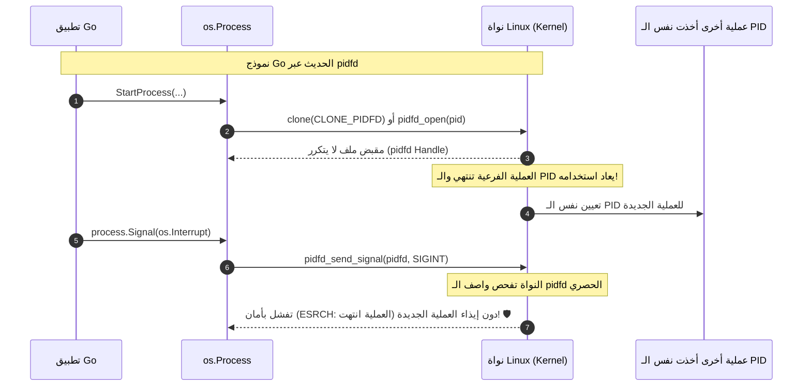

# 06. دورة حياة العمليات والبيئة النظامية (Process Lifecycle & OS Environment)

تُدير حزمة `os` التفاعل بين تطبيق Go وبيئة النظام المشغلة له، بدءاً من التحكم في العمليات الفرعية (Subprocesses)، وإرسال الإشارات، واستقصاء استهلاك الموارد، وصولاً إلى قراءة وتعديل متغيرات البيئة واستعلام الهوية الأمنية للمستخدم.

---

## ⚙️ 1. إنشاء وإدارة العمليات (Process Creation & Control)

### أ. الدالة الأساسية `os.StartProcess`
```go
func StartProcess(name string, argv []string, attr *ProcAttr) (*Process, error)
```
- **الموقع المعماري:** هي الدالة منخفضة المستوى (Low-level Primitive) التي تُبنى عليها حزمة `os/exec` بالكامل.
- **معامل السمات `*ProcAttr`:**
  - `Dir`: مجلد العمل الذي ستبدأ منه العملية.
  - `Env`: متغيرات البيئة الممررة بصيغة `["KEY=VALUE"]`.
  - `Files`: مصفوفة واصفات الملفات المرتبطة بالمجاري القياسية:
    - `Files[0]`: الدخل القياسي (Stdin).
    - `Files[1]`: الخرج القياسي (Stdout).
    - `Files[2]`: مجرى الأخطاء (Stderr).
  - `Sys`: خصائص النواة المتقدمة (`*syscall.SysProcAttr`) مثل عزل الحاويات (Namespaces)، وتغيير الجذر (Chroot)، ومجموعات العمليات (Process Groups).

### ب. العثور على عملية قائمة `os.FindProcess`
```go
func FindProcess(pid int) (*Process, error)
```
- تبحث عن عملية قائمة بواسطة رقم الـ `PID`.
- **ملاحظة لنظم Unix:** في أنظمة Unix، تعود الدالة دائماً بكائن `*Process` دون خطأ حتى لو لم تكن العملية موجودة، ويتم اكتشاف عدم وجودها لاحقاً عند محاولة إرسال إشارة إليها (حيث تعود بخطأ `ESRCH`). في Windows، تفحص الدالة صحة المقبض فوراً عبر استدعاء `OpenProcess`.

---

## 🛡️ 2. ثورة مقبض العمليات في Linux وعلاج سباق الـ PID (`pidfd`)

### المعضلة التاريخية في أنظمة Unix: سباق إعادة تدوير أرقام العمليات (PID Reuse Race)
تعتمد أنظمة Unix على أرقام معرفات العمليات (PIDs) وهي أرقام صحيحة محدودة المدى (مثلاً حتى 32768).
1. يطلق برنامجك عملية فرعية برقم `PID = 5000`.
2. تنتهي العملية 5000 وتغلق.
3. يقوم نظام التشغيل فوراً بإعادة تخصيص `PID = 5000` لبرنامج نظام مهم جداً (مثل قاعدة بيانات خادم الإنتاج).
4. يحاول برنامج Go الخاص بك إرسال إشارة إيقاف: `process.Kill()`.
5. **الكارثة:** بدلاً من إنهاء العملية السابقة، يقوم البرنامج بقتل قاعدة البيانات!

### الحل الثوري في Go الحديثة: اعتماد `pidfd` (Linux Kernel 5.3+)
في نسخ Go الحديثة، لا تعتمد حزمة `os` على رقم الـ PID العددي الأعمى، بل تستخدم **`pidfd` (Process File Descriptor)**:



- يتم إطلاق العمليات براية `CLONE_PIDFD`.
- مراقبة حالة الانتهاء تتم عبر استدعاء النواة الموجه `waitid(P_PIDFD)`.
- ترتبط المقابض بآلية التنظيف الجديدة في محرك Go (`runtime.AddCleanup`) لضمان عدم تسريب المقابض عند زوال مراجع العملية من الذاكرة.

---

## 🎛️ 3. التحكم في دورة حياة العملية ومراقبتها (Process Methods)

### أ. دوال كائن `*os.Process`
- `(p *Process) Signal(sig Signal) error`: إرسال إشارة معينة إلى العملية.
- `(p *Process) Kill() error`: إيقاف العملية فوراً (إرسال `SIGKILL` في Unix، أو استدعاء `TerminateProcess` في Windows).
- `(p *Process) Release() error`: تحرير مقبض العملية في نظام التشغيل والتخلي عن مراقبتها دون انتظار انتهائها.
- `(p *Process) Wait() (*ProcessState, error)`:
  - تُعلق الـ Goroutine في انتظار انتهاء العملية وخروجها.
  - تعود بتقرير مفصل من نوع `*ProcessState`.
  - تحرر موارد العملية نهائياً من جدول العمليات بالنواة (تمنع تشكل العمليات الشبحية Zombie Processes).
- `(p *Process) WithHandle(f func(handle uintptr)) error`: تنفيذ استدعاء مخصص ومحمي بمقبض العملية الخام لنظام التشغيل.

---

## 📊 4. تقرير حالة انتهاء العملية واستقصاء الموارد (`ProcessState`)

عند خروج العملية، يحمل كائن `*ProcessState` سجلاً دقيقاً لكيفية ومبررات خروجها:

```go
func (p *ProcessState) ExitCode() int
func (p *ProcessState) Exited() bool
func (p *ProcessState) Success() bool
func (p *ProcessState) Pid() int
func (p *ProcessState) UserTime() time.Duration
func (p *ProcessState) SystemTime() time.Duration
func (p *ProcessState) Sys() any
func (p *ProcessState) SysUsage() any
func (p *ProcessState) String() string
```

### تفاصيل الدوال:
- **`ExitCode()`:**
  - `0`: انتهت بنجاح.
  - `1..255`: كود الخطأ الذي أعادته العملية.
  - `-1`: إذا لم تخرج العملية بشكل طبيعي بل قُتلت بإشارة خارجية (`killed by signal`).
- **`Success()`:** تعود بـ `true` إذا وفقط إذا كان رمز الخروج يساوي `0`.
- **`Exited()`:** تعود بـ `true` إذا انتهت العملية بشكل طبيعي.
- **`UserTime()` و `SystemTime()`:** حساب الزمن الذي أمضته العملية داخل كود المستخدم أو داخل استدعاءات النواة، وهو أمر جوهري لمراقبة استهلاك المعالج وتتبع تكلفة المهام (Profiling & Benchmarking).
- **`SysUsage()`:** تعود ببنية `*syscall.Rusage` التي تحتوي على تفاصيل عتادية عميقة:
  - الحد الأقصى للذاكرة المستخدمة (`ru_maxrss`).
  - عدد إخفاقات الصفحات بالذاكرة (`ru_majflt / ru_minflt`).
  - عدد عمليات تبديل السياق الإجبارية والاختيارية (`ru_nivcsw / ru_nvcsw`).

---

## 🌍 5. إدارة متغيرات البيئة (Environment Subsystem)

### أ. الدالة الآمنة `LookupEnv` مقابل `Getenv`
```go
func Getenv(key string) string
func LookupEnv(key string) (string, bool)
```
> [!IMPORTANT]
> **الفرق الجوهري الحرج بين `Getenv` و `LookupEnv`:**
> إذا كان متغير البيئة مضبوطاً على نص فارغ: `export DB_PASSWORD=""`
> - `os.Getenv("DB_PASSWORD")` تعود بـ `""`.
> - وإذا كان المتغير غير موجود إطلاقاً في النظام، تعود أيضاً بـ `""`! (لا يمكنك التمييز بين القيمة الفارغة والمتغير الغائب).
> - **`os.LookupEnv("DB_PASSWORD")`** تحل هذه المعضلة: تعود بـ `("", true)` إذا كان مضبوطاً على نص فارغ، وتعود بـ `("", false)` إذا كان المتغير غير موجود. استخدم دائماً `LookupEnv` في ملفات التكوين والخدمات الحساسة!

### ب. تعديل وتفريغ البيئة
- `Setenv(key, value string) error`: ضبط قيمة متغير بيئة جديد للعملية الحالية وأبنائها المشتقين منها لاحقاً.
- `Unsetenv(key string) error`: حذف متغير بيئة محدد.
- `Clearenv()`: حذف كافة متغيرات البيئة للعملية بالكامل.
- `Environ() []string`: تعود بنسخة منفصلة من كافة متغيرات البيئة على شكل مصفوفة نصوص بصيغة `"KEY=VALUE"`.

### ج. تمديد النصوص والتعويض الذكي (Expansion)
```go
func Expand(s string, mapping func(string) string) string
func ExpandEnv(s string) string
```
- **`ExpandEnv(s)`:** تستبدل كافة المتغيرات بصيغة `$VAR` أو `${VAR}` بقيمها الحقيقية من بيئة النظام.
- **`Expand(s, mapping)`:** تسمح بتمرير دالة تعويض مخصصة لمعالجة المتغيرات النصية بحرية.

---

## 🆔 6. خصائص الهوية وصلاحيات المستخدم (System Credentials)

توفر الحزمة دوال استعلام مباشرة لبطاقة هوية العملية داخل نظام التشغيل:

```go
func Getpid() int              // معرف العملية الحالية
func Getppid() int             // معرف العملية الأب (Parent PID)
func Getuid() int              // معرف المستخدم الحقيقي (Real UID)
func Geteuid() int             // معرف المستخدم الفعال (Effective UID)
func Getgid() int              // معرف المجموعة الحقيقي (Real GID)
func Getegid() int             // معرف المجموعة الفعال (Effective GID)
func Getgroups() ([]int, error)// معرفات كافة المجموعات الثانوية التي ينتمي إليها المستخدم
func Getpagesize() int         // حجم صفحة الذاكرة الافتراضية للنواة (غالباً 4096 بايت)
func Hostname() (string, error)// اسم الجهاز أو الحاوية المضيفة
func Executable() (string, error)// المسار المطلق للملف التنفيذي الجاري تشغيله حالياً
```

*(ملاحظة: في بيئة Windows، تعود دوال الـ UID والـ GID بالقيمة `-1` لعدم وجود تطابق بنيوي مع أرقام Unix).*

---

## 🛑 7. إنهاء البرنامج `os.Exit` والمخاطر الهندسية

```go
func Exit(code int)
```

تنهي تنفيذ البرنامج فوراً وتعيد رمز الخروج `code` لنظام التشغيل.

### التحليل الداخلي لما يحدث أثناء `os.Exit`:
1. تُخطر بيئة التشغيل عبر `runtime_beforeExit(code)`:
   - إذا كان فاحص السباقات مفعلاً (`-race`)، يُمنح فرصة لتسجيل أخطاء السباق.
   - إذا كانت ميزة قياس التغطية (`coverage`) مفعلة، يتم كتابة وحفظ ملفات التغطية على القرص.
2. تستدعي استدعاء النظام المباشر `syscall.Exit(code)`.

> [!CAUTION]
> **الخطر القاتل: `os.Exit` تتجاهل وتلغي كافة دوال `defer`!**
> عند استدعاء `os.Exit`، **لن يتم تنفيذ أي دالة مسجلة بـ `defer` في أي Goroutine على الإطلاق!**
> لن يتم إغلاق اتصالات قواعد البيانات، ولن يتم كتابة البيانات المخزنة مؤقتاً في الملفات (`Flush`)، ولن يتم تحرير أقفال الموارد.
> **القاعدة المعمارية:** لا تستدعِ `os.Exit` إلا في دالة `main()` حصراً، وبعد التأكد من عودة وتفريغ كافة الخدمات الفرعية بسلام.
