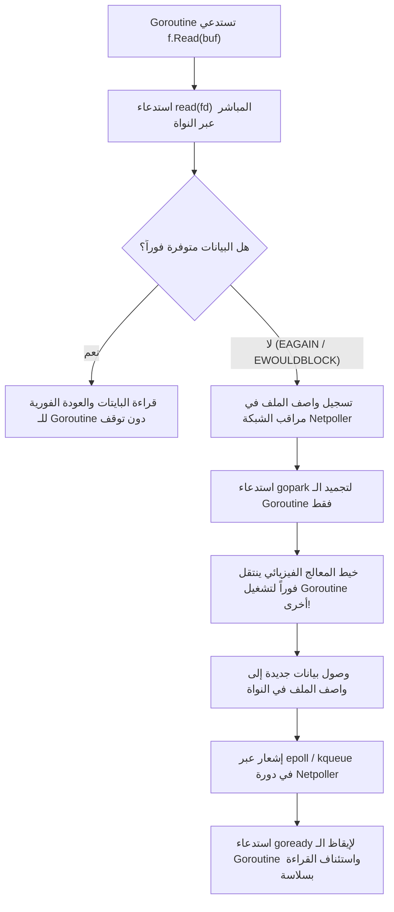
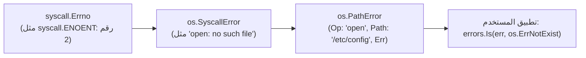

# 07. الكواليس العميقة وهندسة الأداء (Low-Level Internals & Performance Engine)

تخفي حزمة `os` تحت واجهتها الأنيقة ترسانة من أعقد التقنيات الهندسية لبيئات التشغيل منخفضة المستوى (Systems Programming). يستكشف هذا الفصل كيف تتعاون الحزمة مع نواة نظام التشغيل ومجدول Go لتحقيق أعلى مستويات الإنتاجية وبأقل قدر ممكن من استهلاك الموارد.

---

## ⚡ 1. مراقب الشبكة والتكامل مع بيئة التشغيل (Go Netpoller & `poll.FD`)

### المعضلة التاريخية
في لغات مثل C و Python و Java التقليدية، عندما يستدعي خيط معالجة (`Thread`) عملية قراءة `read()` على أنبوب أو مقبس أو منفذ تسلسلي خامل:
- يدخل خيط المعالجة بالكامل في حالة سبات عميق داخل النواة (`Kernel Blocked State`).
- استهلاك الذاكرة لكل خيط يتراوح بين 1MB إلى 8MB.
- لا يمكن للنظام التعامل مع أكثر من بضعة آلاف من العمليات المتزامنة قبل أن ينهار بفعل نفاد الذاكرة أو إنهاك مجدول النظام في تبديل السياق (`Context Switching Overhead`).

### الحل الهندسي في Go عبر `internal/poll.FD`
عند فتح أي ملف في أنظمة Unix، تضعه Go تلقائياً في **الوضع غير التعطيلي (`O_NONBLOCK`)** وتغلفه بهيكل `poll.FD`:



#### الاستثناء الجوهري: ملفات الأقراص العادية (Regular Files)
في معظم أنظمة التشغيل (بما فيها Linux POSIX القياسي)، لا تدعم ملفات الأقراص العادية آليات الاستطلاع غير التعطيلية (`epoll`).
- لذلك، تعامل Go ملفات الأقراص العادية كعمليات حتمية التعطيل (`Blocking I/O`).
- ولكن بفضل مجدول Go المتطور، إذا تعطل خيط معالج في استدعاء قرص بطيء، يكتشف خيط المراقبة الدوري (`sysmon`) هذا التعطل ويقوم بفصل المعالج المنطقي (`P`) وتخصيص خيط فيزيائي جديد لتشغيل بقية الـ Goroutines دون توقف التطبيق!

---

## 🛡️ 2. محرك استئناف استدعاءات النظام المنقطعة (`ignoringEINTR`)

في أنظمة Unix، عندما ينفذ برنامجك استدعاء نظام بطيء (مثل فتح ملف أو قراءة مقبس أو إعادة تسمية)، قد يُقاطع استدعاء النظام بوصول إشارة خارجية (مثل إشارات فحص الأداء أو تصحيح الأخطاء)، فتعود النواة فوراً بخطأ:
```text
EINTR (Interrupted system call)
```
في C، يجب على المبرمج كتابة حلقات تكرار يدوية مزعجة (`while (err == EINTR) ...`) حول كل استدعاء نظام في برنامجه.

### كيف تحل Go هذه المشكلة داخلياً؟
تحتوي ملفات `file_posix.go` على دوال عامة فائقة الذكاء:
```go
func ignoringEINTR(fn func() error) error {
    for {
        err := fn()
        if err != syscall.EINTR {
            return err
        }
    }
}

func ignoringEINTR2[T any](fn func() (T, error)) (T, error) {
    for {
        v, err := fn()
        if err != syscall.EINTR {
            return v, err
        }
    }
}
```
تُغلف Go كل عملية فتح (`Open`)، أو إعادة تسمية (`Rename`)، أو حذف (`Remove`) داخل هذه الحلقة التكرارية، مما يضمن أن كود تطبيقك لن يتلقى خطأ `EINTR` العشوائي أبداً!

---

## 🔒 3. المنع الذري لتسريب الواصفات (`Atomic Close-On-Exec`)

### خطر تسريب الواصفات (FD Leakage Across Fork/Exec)
إذا فتح تطبيقك ملفاً يحتوي على مفاتيح تشفير سرية، وفي نفس اللحظة قامت Goroutine أخرى بتشغيل أمر خارجي عبر `os/exec` (مثل تشغيل أمر `ls` أو `ffmpeg`):
- في أنظمة Unix التقليدية، ترث العملية الفرعية الجديدة نسخة مطابقة من كافة واصفات الملفات المفتوحة في العملية الأم!
- قد تظل العملية الفرعية محتفظة بالمقبض السري حتى بعد إغلاقه في برنامج Go.

### الحل في Go: تفعيل `O_CLOEXEC` ذرّياً
تضمن Go أن كل ملف يُفتح، أو مقبس يُنشأ، أو أنبوب يُدشن، يحمل الراية الذرية في النواة:
- في استدعاءات `open`: تمرير `syscall.O_CLOEXEC`.
- في استدعاءات `pipe`: استخدام `pipe2(..., syscall.O_CLOEXEC)`.
- في استدعاءات `dup`: استخدام `fcntl(fd, F_DUPFD_CLOEXEC, ...)`.
هذا التصميم الذري يقضي تماماً على أي نافذة زمنية يمكن أن تتسرب فيها المقابض للبرامج الخارجية.

---

## 🚀 4. ميكانيكا النقل الصفري في النواة (Zero-Copy Mechanics)

عند استدعاء `io.Copy(dst, src)`، تتنازل Go عن النسخ اليدوي التقليدي في الذاكرة لصالح ثلاث تقنيات جبارة على مستوى النواة:

| التقنية | استدعاء النواة | المسار والوسائط | الفائدة التقنية |
| :--- | :--- | :--- | :--- |
| **`copy_file_range`** | `copy_file_range(2)` | ملف محلي ──► ملف محلي | نسخ فوري لكتل البيانات داخل نظام الملفات دون تحميل بايت واحد في ذاكرة الرام للمستخدم. |
| **`sendfile`** | `sendfile(2)` | ملف محلي ──► مقبس شبكة | نقل صفحات الذاكرة من القرص (Page Cache) مباشرة إلى بطاقة الشبكة (NIC). |
| **`splice`** | `splice(2)` | أنبوب / مقبس ──► ملف | إعادة توجيه صفحات الذاكرة في النواة عبر ذاكرة الأنابيب التخزينية. |

### القيود الذكية التي تراعيها Go:
- **الملفات المفتوحة بوضعية `O_APPEND`:** لا تدعم استدعاءات `copy_file_range` أو `splice` وضعية الإلحاق على مستوى النواة في بعض إصدارات Linux، لذلك تتراجع Go تلقائياً وبأمان تام إلى القراءة والكتابة التخزينية العادية (`generic fallback`) دون أي تدخل من المبرمج.

---

## 🗂️ 5. تحسينات قراءة المجلدات الكبيرة (Directory Reading Optimization)

عند استدعاء `os.ReadDir(path)`:
1. **استدعاء `getdents64` المباشر:** تطلب Go من النواة تفريغ سجلات المجلد في حيز ذاكرة بحجم `8192` بايت مستعار من حوض الذاكرة السريعة `dirBufPool (sync.Pool)`.
2. **استخلاص النوع بدون فحص القرص:** في نظام Linux، يرجع استدعاء `getdents64` نوع الملف (`d_type`) مدمجاً في نفس السجل:
   - `DT_DIR`: مجلد.
   - `DT_REG`: ملف عادي.
   - `DT_LNK`: رابط رمزي.
3. **توفير ملايين استدعاءات النظام:** في اللغات الأخرى التي تجلب `FileInfo` كاملاً، يُجبر النظام على استدعاء `stat()` لكل ملف على حدة لقراءة حجمه وتاريخه. قراءة `os.ReadDir` تتجاوز كل ذلك، مما يجعل قراءة مجلد يحتوي على 100,000 ملف تستغرق بضعة أجزاء من الثانية بدلاً من ثوانٍ طويلة!

---

## 🩺 6. استراتيجية فك وتغليف الأخطاء (Error Unwrapping Anatomy)

عندما يفشل أي استدعاء نظام داخل حزمة `os`، يتم تغليف خطأ النواة العددي الخام (`syscall.Errno`) في هيكل ثلاثي الطبقات:



### كيف تعمل دوال الفحص التقليدية والحديثة؟
- **دالة `errors.Is(err, os.ErrNotExist)` (الأسلوب الموصى به):** تقوم بفك السلسلة تكرارياً عبر دالة `Unwrap()` حتى تصل إلى الخطأ الأصلي ومطابقته.
- **دوال الفحص المساعدة التاريخية:**
  ```go
  func IsExist(err error) bool
  func IsNotExist(err error) bool
  func IsPermission(err error) bool
  func IsTimeout(err error) bool
  ```
  تستخرج الدالة الخطأ التحتي عبر `underlyingError(err)` ثم تفحص ما إذا كان الخطأ هو `syscall.EEXIST` أو `syscall.ENOENT` أو `syscall.EACCES`.
